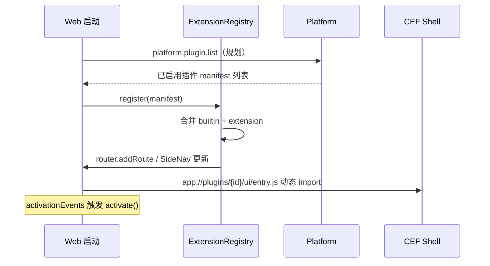

# 04 — 插件与扩展体系

> 版本：v0.1 · 日期：2026-07-03  
> 覆盖 **Layer 1 能力服务**、**Layer 2 Platform 注册**、**Layer 4 Web UI** 的可插拔模型

---

## 1. 定位

NiuMa 扩展分 **两级**，共用 manifest，职责不同：

| 级别 | 名称 | 类比 | 能做什么 |
|------|------|------|----------|
| **Module 插件** | 运维模块 | DBeaver Driver / JetBrains Plugin | 新模块路由、SideNav 入口、工作区 UI、可选后端 Service |
| **IDE 扩展** | 贡献点扩展 | VS Code Extension（子集） | commands、views、menus、keybindings；**不改 Shell 骨架** |

两者都通过 `plugins/<id>/manifest.json` 描述，Web 经 **Extension Registry** 统一注册。

---

## 2. 插件包结构

```
plugins/<plugin-id>/
├── manifest.json           # 元数据、权限、路由、contributions
├── ui/
│   ├── entry.ts            # ESM 入口（activate / deactivate）
│   └── ...                 # 模块 Vue 组件、资源
├── locale/                 # 可选：zh-CN.json / en-US.json
└── service-ref.yaml        # 可选：指向 services/ 下后端
```

### 2.1 manifest.json（示意）

```json
{
  "id": "com.niuma.db-postgres",
  "name": "PostgreSQL",
  "version": "1.0.0",
  "engine": { "niuma": "^0.1.0" },
  "source": "extension",
  "level": "L2",
  "permissions": ["db.connect", "credential.read"],
  "module": {
    "routePath": "/db-postgres",
    "labelKey": "nav.dbPostgres",
    "icon": "database",
    "order": 25,
    "uiEntry": "ui/entry.js"
  },
  "contributions": {
    "commands": [
      { "id": "db-postgres.newQuery", "title": "New SQL Query" }
    ],
    "views": [
      { "id": "db-postgres.schema", "title": "Schema", "location": "module-sidebar" }
    ]
  },
  "activationEvents": ["onRoute:/db-postgres"]
}
```

### 2.2 能力级别

| 级别 | Web UI | 后端 | 示例 |
|------|--------|------|------|
| **L1** | 有 | 无 | 格式化、计算器 |
| **L2** | 有 | 独立进程 + Named Pipe / UDS JSON | SSH、MySQL |
| **L3** | 有 | Native / 重量级 | Oracle、FFmpeg |

---

## 3. 生命周期



| 阶段 | 负责层 | 说明 |
|------|--------|------|
| 发现 | Platform | 扫描 `${INSTALL_DIR}/plugins/` + 用户目录 |
| 启用/禁用 | Platform | 写 SQLite `nm_plugin_*`，用户授权 |
| 加载 UI | Web | `ExtensionRegistry` 动态 `import()` |
| 加载后端 | Shell `ServiceManager` | 读 `service-ref.yaml` 启停进程 |
| 权限裁决 | Platform | 每次 `bridge.invoke` 前校验（规划） |

---

## 4. 边界（强制）

| 允许 | 禁止 |
|------|------|
| 在 `ModuleWorkspace` 挂载 UI | 修改 TopBar / SideNav / StatusBar 源码 |
| 注册 SideNav **项**（经 Registry） | 覆盖 Shell 路由 `/settings` |
| `bridge.invoke` 白名单方法 | 绕过桥接直连管道 / 读本地 DB |
| 使用 `@niuma/ui` | 引入 Element Plus / 业务层 reka-ui |
| 订阅 `niuma:event` | 任意执行 eval / 内联 script |

---

## 5. 与 VS Code 的差异

| VS Code | NiuMa |
|---------|-------|
| Extension Host 独立进程 | 第一阶段：ESM + 权限白名单；后期可选 Worker 隔离 |
| 上千 API | 受控 `niuma.*` 门面（见 [10-web-extension-system.md](./10-web-extension-system.md)） |
| 改任意 UI | 仅贡献点：commands / views / module 路由 |
| Marketplace | P4 规划 |

---

## 6. 分阶段落地

| 阶段 | 目标 |
|------|------|
| **P0（当前）** | 内置模块走 `ExtensionRegistry`；目录与类型就绪 |
| **P1** | `app://plugins/` 静态加载；example 插件跑通 |
| **P2** | Platform `plugin.list` / 权限 / 启用禁用 |
| **P3** | contributions：commands + CommandPalette |
| **P4** | 插件市场、签名、热更新 |

---

## 7. 相关文档

- [06-directory-structure.md](./06-directory-structure.md) — 仓库目录规划
- [10-web-extension-system.md](./10-web-extension-system.md) — Web Extension API 与 Registry
- [architecture.md §8](./architecture.md) — 总架构插件模型

---

## 8. 修订记录

| 版本 | 日期 | 说明 |
|------|------|------|
| v0.1 | 2026-07-03 | 初版：Module 插件 + IDE 扩展两级模型 |
