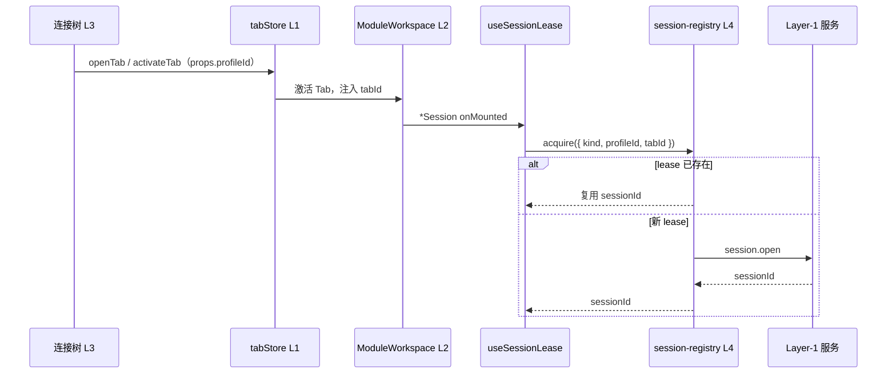
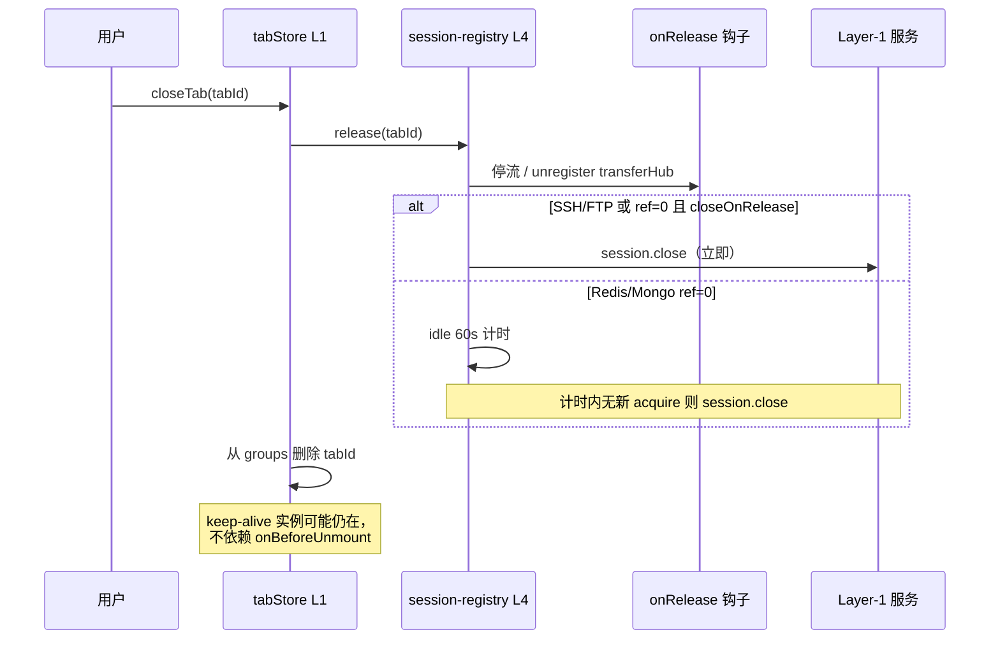
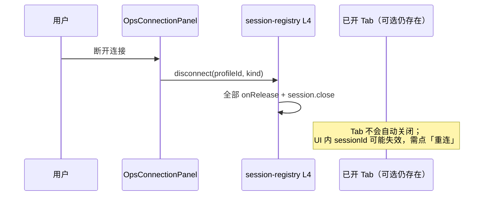

# 21 — 会话注册表（Session Registry）与 Tab 生命周期

> 版本：v0.4 · 日期：2026-07-10  
> 状态：**已实现（Phase 1–2）** — Web L4 Session Registry 已落地

---

## 0. Tab 管理架构总览

运维模块的「多 Tab」由 **四层职责** 组成；**只有第四层**触碰 Layer-1 物理连接。

```
┌─────────────────────────────────────────────────────────────────────────┐
│ L1  Tab Store（web/src/stores/tab.ts）                                   │
│     管什么：tabId、moduleId、title、props、编辑组、持久化 workspace.tabs   │
│     不管什么：session.open/close、Bridge、keep-alive 缓存内容              │
├─────────────────────────────────────────────────────────────────────────┤
│ L2  ModuleWorkspace + keep-alive（web/src/shell/workspace/）             │
│     管什么：每组只渲染「激活 Tab」的模块组件；切 Tab → deactivated 保活 UI  │
│     不管什么：连接树、物理会话；关闭 Tab 不保证触发组件 unmount            │
├─────────────────────────────────────────────────────────────────────────┤
│ L3  连接导航（useConnectionNavigation、TabBar、侧栏 connect）            │
│     管什么：profileId → openTab；MongoDB 同库表去重聚焦，其余协议每次新建 Tab   │
│     不管什么：sessionId 分配（由 L4 acquire 负责，L3 只传 props）          │
├─────────────────────────────────────────────────────────────────────────┤
│ L4  Session Registry（web/src/stores/session-registry.ts）             │
│     管什么：何时 session.open/close；Tab 与 sessionId 的借用/释放         │
│     挂钩点：tabStore.close* → release(tabId)；*Session → useSessionLease │
└─────────────────────────────────────────────────────────────────────────┘
         L1–L3 仅 Web UI 状态          L4 经 Bridge → platform → Layer-1
```

### 0.1 三层「标识」勿混淆

| 标识 | 层级 | 含义 | 示例 |
|------|------|------|------|
| **`profileId`** | Platform SQLite | 连接站点配置（长期存在） | `nm_connection_profile` 主键 |
| **`tabId`** | L1 Tab Store | 编辑器页签实例（UI 容器） | `WorkspaceTab.tabId` |
| **`sessionId`** | L4 → Layer-1 | 能力服务内物理会话 | `mongodb.session.open` 返回 |

关系：**一个 Tab 借用零或一条 `sessionId`**（按连接类型策略）；**一个 `profileId` 可对应多个 Tab**（分屏、不同 Redis DB）。

### 0.2 用户操作 → 各层行为（目标态）

| 用户操作 | L1 Tab Store | L2 keep-alive | L3 导航 | L4 Registry |
|----------|--------------|---------------|---------|-------------|
| 连接树双击站点 | `openTab` 或 `activateTab` | 挂载/激活 `*Session` | 去重见 [18 §7](./18-ops-connection-tree.md) | `acquire` |
| 切换到另一 Tab | `activateTab` | 旧 Tab `deactivated`，新 Tab `activated` | — | **不断线** |
| 关闭 Tab | `closeTab` 删条目 | 缓存实例待 GC；**不依赖 unmount** | — | **`release(tabId)`** |
| 分屏 `Ctrl+\` | `splitGroup` + `openTab`（复制 props） | 新 tabId 新实例 | — | 新 `acquire`（SSH 每 Tab 一会话） |
| 树右键「断开」 | Tab **不自动关闭** | — | — | `disconnect(profileId)` 立即断物理连接 |

### 0.3 与 [09 — App Shell §6](./09-web-app-shell.md) 的分工

| 文档 | 侧重 |
|------|------|
| **09 §6** | Tab **数据模型**、编辑组、持久化、`ModuleWorkspace` 渲染 |
| **18 §7** | 连接树 → Tab 的 **去重与 props**（`profileId` / `database`） |
| **本文 §0–§3** | Tab 与 **物理会话** 的生命周期策略（Registry） |

### 0.4 实现状态

| 层级 | 状态 |
|------|------|
| L1–L3 | ✅ 已实现 |
| L4 Session Registry | ✅ 已实现（`session-registry.ts` + `session-policy.ts` + `useSessionLease.ts`） |
| `closeTab` → `release` | ✅ 已接入 |
| 连接树已连接态 / 断开 | ✅ 已接入（`OpsConnectionPanel`） |

### 0.5 端到端时序（速查）

**打开连接（连接树双击）**



**关闭 Tab**



**显式断开（连接树右键）**



### 0.6 开发者约定（必须遵守）

| 场景 | ✅ 正确入口 | ❌ 禁止 |
|------|------------|---------|
| 模块 Session 拿 `sessionId` | `useSessionLease` → `acquireSession()` | 直接 `*Api.sessionOpen` |
| 关 Tab 断线 | `tabStore.close*` → `releaseMany` | `onBeforeUnmount` 里 `session.close` |
| 重连按钮 | `reconnectSession()` → `forceReconnect` | 手写 close + open |
| 树显式断开 | `sessionRegistry.disconnect(profileId)` | 在 Panel 里直接 `session.close` |
| 子资源（流/传输） | `SESSION_RELEASE_CLEANUP_KEY` 或 `buildOnRelease` | 假定 unmount 会清理 |
| 新增协议策略 | 只改 `session-policy.ts` | 在 `*Session.vue` 硬编码 idle/共享规则 |

模块对外入口：`@/modules/connection` 导出 `useSessionLease`、`SESSION_POLICY`（见 `connection/index.ts`）。

---

## 1. 背景：改造前的问题与现状

> **阅读提示**：§1 描述改造前的痛点；**当前实现**以 §0 与 §3 为准。

### 1.1 改造前（已解决）

| 问题 | 根因 | 现状 |
|------|------|------|
| 关 Tab 不断线 | `keep-alive` 不触发 `onBeforeUnmount`，`session.close` 漏调 | `tabStore.close*` → `release(tabId)` |
| 策略一刀切 | 各模块在 Session 内直接 open/close | `session-policy.ts` 按协议分流 |
| `sessionId` 归属不清 | 分散在各 `*Session.vue` 的 `ref` | 统一由 `session-registry` lease 管理 |
| 数据库关 Tab 即断 | 与 Navicat/DBeaver 预期不符 | Redis/Mongo **idle 60s** 后才 close |

### 1.2 仍保留的架构事实

| 事实 | 说明 |
|------|------|
| **`keep-alive` 保 UI** | 切换 Tab 不断线；关 Tab 不保证组件 unmount |
| **连接树去重** | 仅 MongoDB 同库/集合聚焦；SSH/FTP/Redis 每次新建 Tab（[18 §7](./18-ops-connection-tree.md)） |
| **`disconnect` 不关 Tab** | 物理连接已断，Tab 仍在；用户需「重连」或手动关 Tab |
| **hydrate 恢复 Tab** | 启动后首次进入 Session 会重新 `acquire`（与改造前一样要重新 open） |

### 1.3 目标行为（已实现）

| 类型 | 关编辑器 Tab | 切换 Tab（保活 UI） | 显式断开 |
|------|--------------|---------------------|----------|
| **MongoDB / Redis 等数据库** | 释放借用，**不立即断物理连接** | 保持连接 | 连接树「断开」或空闲超时 |
| **SSH / SFTP / FTP** | **立即释放会话** | 保持连接（切走不关） | 关 Tab 即断 |

---

## 2. 对原有架构的冲击评估

**结论：对 Layer 0–2 与 Bridge 契约冲击小；主要变更集中在 Web Layer 4。**

### 2.1 无冲击 / 保持不变

| 组件 | 说明 |
|------|------|
| **C++ Shell** | 不改路由、不改 IPC |
| **platform-core** | 不改 `capability_registry`、凭据注入、`platform.connection.*` |
| **Bridge 契约** | `{ns}.session.open` / `close` / `test` **签名不变**（见 [14 §5](./14-capability-connection-framework.md)） |
| **Layer-1 能力服务** | mongodb / redis / ssh / ftp 进程模型、IPC、事件通道 **不变** |
| **manifest** | 无需新增字段（Phase 1） |
| **`profileId` 站点模型** | SQLite `nm_connection_profile` 不变 |
| **连接树 Provider** | [18](./18-ops-connection-tree.md) 懒加载、资源子节点 **不变** |
| **`keep-alive` 工作区** | [09 §6](./09-web-app-shell.md) 多 Tab 保活 UI **保留**；仅改变「谁负责断线」 |

### 2.2 中等冲击（Web 内部重构）

| 区域 | 变更性质 | 说明 |
|------|----------|------|
| **`web/src/stores/`** | **新增** | `session-registry.ts`（或 `useSessionRegistry` Pinia store） |
| **`web/src/stores/tab.ts`** | **小改** | `closeTab` / `closeOthers` / `closeAll` / `closeGroup` 调用 `releaseMany` |
| **`*Session.vue`**（4 个模块） | **中改** | `useSessionLease`；移除 `onBeforeUnmount` 的 close |
| **`useConnectionNavigation`** | 不变 | 仍只 `openTab`；不预 acquire |
| **`OpsConnectionPanel`** | **小改** | 已连接态绿点、右键「断开连接」 |

### 2.3 可选冲击（Phase 2+，非必须）

| 区域 | 说明 |
|------|------|
| **Layer-1 `session.open` 幂等** | 服务端按 `profileId` 复用已有 `sessionId`；**非 Phase 1 范围** |
| **`mongodb.session.state` 等事件** | 连接丢失时 registry 统一收敛；可与现有 `eventpub` 对齐 |
| **Tab 持久化恢复** | 启动恢复 Tab 时需重新 `acquire`（今日亦需重新 `session.open`） |

### 2.4 冲击一览图

```
┌─ 无改动 ─────────────────────────────────────────────────────────┐
│  C++ Shell · platform-core · Bridge 契约 · services/* manifest   │
└──────────────────────────────────────────────────────────────────┘
                              │
                    Bridge 调用方式不变
                              ▼
┌─ Web 新增/调整 ──────────────────────────────────────────────────┐
│  SessionRegistry（新）                                            │
│    ├── tabStore.close* → release(tabId)     ← 修复关 Tab 不漏 close │
│    └── *Session.vue → acquire / 子资源清理                        │
│  keep-alive：仍只保 UI；连接生命周期上移到 Registry                  │
└──────────────────────────────────────────────────────────────────┘
```

---

## 3. 核心设计

### 3.1 三个概念分离

```
连接配置（profileId，SQLite）
        │
        ▼  session.open（Bridge，经 platform 凭据注入）
物理会话（sessionId，Layer-1 进程内）
        │
        ▼  acquire / release（Tab 借用，Web Registry）
编辑器 Tab（tabId，keep-alive 缓存 UI）
```

- **DBeaver**：JDBC Connection vs SQL Editor Tab  
- **Navicat**：左侧「已连接」vs 右侧查询/数据窗口  

NiuMa 对应：**Registry 管物理会话，Tab 管 UI 状态**。

### 3.2 SessionRegistry（Web Pinia Store）

**职责**：唯一决定何时 `session.open` / `session.close`；模块组件只消费 `sessionId`。

```ts
// 概念 API（非最终实现）
interface SessionLease {
  key: string           // 见 §3.3
  kind: ConnKind
  profileId: string
  sessionId: string
  tabIds: Set<string>   // 借用方
  lastUsedAt: number
}

acquire(opts: { kind, profileId, tabId, scope? }): Promise<{ sessionId }>
release(tabId: string): Promise<void>
disconnect(profileId: string, kind?: ConnKind): Promise<void>  // 用户显式断开
getStatus(profileId: string): 'disconnected' | 'connected' | 'connecting'
```

**规则**：

1. `acquire`：key 已存在 → `tabIds.add`，返回已有 `sessionId`；否则 `session.open` 后登记。
2. `release(tabId)`：从所有 lease 的 `tabIds` 移除该 tabId；某 lease `tabIds` 空 → 按策略 `session.close` 或进入 idle 计时。
3. **禁止**在 `*Session.vue` 的 `onBeforeUnmount` 里直接 `session.close`（SSH/FTP 也不例外）。

### 3.3 会话 Key 与策略表

| kind | session key | 多 Tab 共享 | 关 Tab 时 | ref=0 后 |
|------|-------------|-------------|-----------|----------|
| `ssh` | `ssh:{profileId}:{tabId}` | **否**（每 Tab 独立会话） | **立即 close** | — |
| `ftp` | `ftp:{profileId}:{tabId}` | **否** | **立即 close** | — |
| `redis` | `redis:{profileId}:db{database}` | 同 DB 共享 | release，**不立即 close** | idle 60s 后 close |
| `mongodb` | `mongodb:{profileId}` | **同站点共享** | release，**不立即 close** | idle 60s 后 close |

说明：

- **SSH / FTP**：`splitGroup` 复制 Tab 会产生第二个 `tabId` → 两条独立 `sessionId`（与今日「分屏=新实例」一致，且关 Tab 能正确断线）。
- **Redis**：不同 DB 不同物理连接（避免多 Tab 抢 `SELECT`）；与 [18 §7.2](./18-ops-connection-tree.md) 去重策略一致。
- **MongoDB**：同一 `mongo.Client` 可浏览多库，多 Tab 共享一条连接更省资源；Shell / Change Stream 仍挂在同一 `sessionId` 上，由 mongodb-service 内 per-session 限制约束。

```ts
// 策略表示例（配置化，非硬编码在组件内）
const SESSION_POLICY: Record<ConnKind, SessionPolicy> = {
  ssh:      { sharing: 'per_tab',  closeOnRelease: true },
  ftp:      { sharing: 'per_tab',  closeOnRelease: true },
  redis:    { sharing: 'scoped',   scope: 'database', idleMs: 60_000 },
  mongodb:  { sharing: 'per_profile', idleMs: 60_000 },
}
```

### 3.4 Tab 关闭挂钩（修复 keep-alive 漏洞）

在 `tabStore.closeTab`（及 `closeOthers` / `closeAll` / `closeGroup`）开头调用：

```ts
void useSessionRegistry().releaseMany(tabIds)
```

| 操作 | Registry | Layer-1 |
|------|----------|---------|
| 切换 Tab | 无 | 无 |
| 关闭 Tab | `release(tabId)` | 按策略 `session.close` |
| 关闭应用 | `releaseAll()` 或逐 Tab release | 全部 close |

**不依赖** `onBeforeUnmount` 触发断线。

### 3.5 子资源清理职责（谁停什么）

Registry 管 **物理连接**（`session.open/close`）；**会话内子资源**分三层清理：

| 子资源 | 模块 | Web 侧清理 | Layer-1 兜底 |
|--------|------|------------|--------------|
| Change Stream | MongoDB | `useMongoChangeStream` → `SESSION_RELEASE_CLEANUP_KEY` | `session.close` |
| MONITOR 流 | Redis | `useRedisMonitorStream` → `SESSION_RELEASE_CLEANUP_KEY` | `session.close` |
| 传输队列注册 | SSH / FTP | `buildOnRelease` → `transferHub.unregisterSession` | `session.close` |
| PTY / Shell | SSH / Mongo Shell | 服务端 `session.close` 级联 | ✅ |
| 终端 Tab 组 | SSH | 同上（per-session） | ✅ |

**调用顺序**（`release(tabId)` 内）：`onRelease` 钩子 → 从 lease 移除 tabId → 按策略 `session.close` 或 idle。

mongodb-service / ssh-service 在 `session.close` 内会级联清理子资源；Web 侧仍应在 `onRelease` 主动 stop 流式任务，避免 idle 等待期间服务端残留 MONITOR / Change Stream。

### 3.6 `disconnect` 与 Tab 的关系

| 操作 | 物理连接 | Tab 页签 | Session UI |
|------|----------|----------|------------|
| **关 Tab** | `release` → 按策略 close | 删除 | keep-alive 缓存，可能仍显示旧 sessionId |
| **树「断开」** | `disconnect` → 立即 close | **保留** | API 失败直至用户点「重连」 |
| **重连按钮** | `forceReconnect` | 保留 | 新 `sessionId` |

设计取舍：Navicat 式「断开连接」不强制关编辑器窗口；后续可选在 `disconnect` 后提示关 Tab 或自动 `closeTab`。

---

## 4. 与连接树、多 Tab 的关系

### 4.1 现有行为（保留）

[18 §7](./18-ops-connection-tree.md) / `useConnectionNavigation`：

- MongoDB：同 profile + 同库 + 同集合 → **聚焦**已有 Tab
- SSH / FTP / Redis：每次连接树操作 → **新建** Tab

「同站点多会话」：SSH/FTP/Redis 直接多次双击；MongoDB 需不同库/集合或分屏。

### 4.2 连接树状态（已实现）

| 状态 | 展示 | 判定 |
|------|------|------|
| 未连接 | 无绿点 | `!isProfileConnected(profileId, kind)` |
| 已连接 | 行尾绿点 | lease 有 tab 借用 **或** idle 倒计时进行中 |
| 右键「断开」 | `disconnect(profileId, kind)` | 立即 close；**不**自动关 Tab |

### 4.3 多 Tab 是否独立连接？

| 场景 | 是否独立 `sessionId` |
|------|----------------------|
| 不同 `profileId` | **是** |
| 同 profile，Redis 不同 DB | **是** |
| 同 profile，MongoDB 多 Tab | **否**（共享，除非未来显式「新建连接」） |
| 同 profile，SSH/FTP/Redis，树双击 | **是**（每次新建 Tab；SSH 每 Tab 一会话，Redis 同 DB 共享 lease） |
| 同 profile，MongoDB，树双击同库表 | **否**（聚焦已有 Tab） |

---

## 5. 分阶段实施

### Phase 1 — 最小可用 ✅

| 项 | 状态 |
|----|------|
| `session-registry.ts` + `session-policy.ts` | ✅ |
| `tab.ts` 关闭路径 → `releaseMany` | ✅ |
| SSH / FTP `useSessionLease` | ✅ |
| 关 Tab 后 `*-service.log` 有 `session.close` | ✅ 可验证 |

### Phase 2 — 数据库类策略 ✅

| 项 | 状态 |
|----|------|
| MongoDB `per_profile` + idle | ✅ |
| Redis `scoped` by database + idle | ✅ |
| 连接树已连接态、右键断开 | ✅ |

### Phase 3 — 体验增强（待做）

| 项 | 内容 |
|----|------|
| 空闲超时用户可配置 | `platform.settings` |
| `session.state` 事件驱动 registry | 服务端断线自动标记 `lost` |
| Layer-1 `session.open` 幂等 | 多 Web 窗或未来 CLI 共享 |

---

## 6. 文件落点（已实现）

| 路径 | 职责 |
|------|------|
| `web/src/stores/session-registry.ts` | L4 核心：acquire / release / disconnect |
| `web/src/modules/connection/session-policy.ts` | 协议策略与 session key |
| `web/src/modules/connection/useSessionLease.ts` | **Session 组件唯一入口** |
| `web/src/modules/connection/session-release.ts` | Pane 子资源清理 inject key |
| `web/src/stores/tab.ts` | L1；关闭时 `releaseMany` |
| `web/src/modules/ops/connection-nav/` | L3 策略类型、注册表、utils |
| `web/src/modules/ops/register-builtin-conn-kinds.ts` | 内置 kind 懒加载入口（`loadForm` / `load`） |
| `web/src/modules/ops/conn-kind-loaders.ts` | `ensureConnKind` / `ensureConnKindForm` |
| `web/src/modules/ops/composables/useConnectionNavigation.ts` | L3 薄编排（先 ensure 再查策略） |
| `web/src/modules/*/register-conn-full.ts` | 各协议完整自注册（含 `conn-nav-strategy`） |
| `web/src/modules/{ssh,ftp,redis,mongodb,mysql,vastbase}/conn-nav-strategy.ts` | 各协议 Tab 打开策略 |
| `web/src/modules/{ssh,ftp,redis,mongodb}/views/*Session.vue` | 调用 `useSessionLease` |
| `web/src/modules/ops/components/OpsConnectionPanel.vue` | 已连接态、断开菜单；协议业务不进面板 |

---

## 7. 风险与对策

| 风险 | 对策 |
|------|------|
| `release` 与 `keep-alive` 时序 | 以 `tabStore.closeTab` 为唯一入口，不依赖 unmount |
| Mongo 多 Tab 共享连接时的并发请求 | mongo-driver 客户端本身线程安全；子资源（Shell/Stream）仍 per-session 单例限制 |
| Redis 多 Tab 同 DB 误共享 | key 含 `database`；去重逻辑与 [18 §7.2](./18-ops-connection-tree.md) 一致 |
| idle 计时器泄漏 | `release` 时 `clearTimeout`；`disconnect` 强制清理 |
| Tab 恢复（hydrate） | 与今日相同：恢复后首次 `acquire` 重新 `session.open` |

---

## 8. 非目标（本设计不做）

- 不改变 Bridge / platform 路由模型  
- 不在 Phase 1 做服务端连接池  
- 不合并 SSH 与 FTP 的会话模型  
- 不取消 `keep-alive`（仅分离 UI 与连接生命周期）  
- 不实现 Navicat 式「连接向导」多步骤 UI  

---

## 9. 相关文档

| 文档 | 关系 |
|------|------|
| [14 — 能力连接框架](./14-capability-connection-framework.md) | Bridge `session.*` 契约不变 |
| [09 — Web App Shell](./09-web-app-shell.md) | Tab / keep-alive 行为保留 |
| [18 — 运维连接树](./18-ops-connection-tree.md) | 去重、Redis DB Tab、树聚焦 |
| [12 — FTP](./12-ftp-module.md) | 关 Tab 断 FTP 控制连接 |
| [16 — SSH / SFTP](./16-ssh-sftp-module.md) | 关 Tab 断 SSH 通道 |
| [19 — MongoDB](./19-mongodb-module.md) | 共享连接、Shell/Stream 子资源 |

---

## 10. 修订记录

| 版本 | 日期 | 说明 |
|------|------|------|
| v0.1 | 2026-07-10 | 初版：冲击评估、Registry 设计、分阶段路线、Navicat/DBeaver 对齐 |
| v0.2 | 2026-07-10 | 新增 §0 Tab 管理四层架构、操作矩阵、与 09/18 分工说明 |
| v0.3 | 2026-07-10 | Phase 1–2 实现：`session-registry.ts`、Tab 关闭 release、四模块 Session 迁移、连接树断开/已连接态 |
| v0.4 | 2026-07-10 | 清晰度优化：§0.5 时序图、§0.6 开发者约定、§1 改造前后对照、§3.5–3.6 子资源与 disconnect |
| v0.5 | 2026-07-10 | L3 拆分为 `connection-nav` 策略注册表 + 各模块 `conn-nav-strategy.ts` |
| v0.6 | 2026-07-20 | 内置协议改为 `register-builtin-conn-kinds` 懒加载；旧 `conn-nav-providers` 等入口已删除 |
