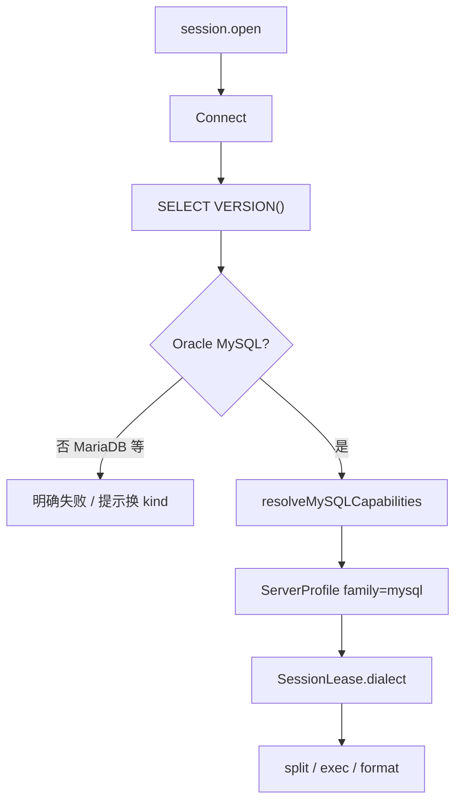

# 25 — MySQL 管理模块（Layer-1 能力服务 + Web 模块）

> 版本：v0.12 · 日期：2026-07-21  
> 状态：**P0–P4 全量常用集已落地**（含 **完整 Monitor**（实例/进程/锁）、**表设计器**、**CSV/SQL 导入导出**；可选 `mysql-tools` 外部组件占位；可视化仍低于 Vastbase 密度）  
> 范围：仅 **Oracle MySQL**（含 5.7 / 8.0+ 等**内部版本**差异）。**MariaDB 不在本服务**，见 [26 — MariaDB](./26-mariadb-module.md)。

> 关联（**共享框架，不含其它库实现**）：  
> [14 — 能力连接框架](./14-capability-connection-framework.md) · [18 — 运维连接树](./18-ops-connection-tree.md) · [21 — 会话注册表](./21-session-registry.md) · [23 — SQL 方言补全基调](./23-sql-dialect-completion.md) · [24 — AI 助手](./24-ai-assistant.md) · [26 — MariaDB](./26-mariadb-module.md)

---

## 0. 文档边界

| 写在本文 | 不写在本文 |
|----------|------------|
| `mysql-service`、`family: "mysql"`、MySQL 版本 Cap 表、树、连接参数 | **MariaDB**（独立 `mariadb-service` / kind） |
| MySQL 侧 Web 模块与对本 kind 的注册 | Vastbase / MongoDB / Oracle 等其它库实现 |
| 对本模块适用的共享契约用法（引用 [14]/[21]/[23]） | 在共享层硬编码多库业务分支 |

**与 MariaDB 的边界（硬约束）**：

- 用户选 **MySQL** 站点 → 只走 `mysql-service`；选 **MariaDB** → 只走 `mariadb-service`。  
- `mysql-service` **只处理 MySQL 发行版内部版本变化**（5.7 ↔ 8.0+、认证插件、JSON/CTE 等），用 Cap 表表达。  
- **禁止**在 `mysql-service` 内识别 / 兼容 / 特判 MariaDB（即便 wire 协议相近）；Probe 若发现 MariaDB 特征 → **明确失败**，提示改用 MariaDB 连接类型。  
- 两服务可共用编排层与驱动依赖，但 **进程、manifest、namespace、Web 模块、Cap 前缀分离**，避免差异越积越大后无法拆分。

**多库协作约定**：共享层只认 DialectFamily + CapabilitySet + 同名 RPC；各库实现落在各自模块文档与服务内。

---

## 1. 目标与范围

面向 **Oracle MySQL 5.7 / 8.0+**（及同族后续主版本）运维与开发：

- 连接站点、对象导航（`database → table`；可选 views / routines）
- SQL 查询执行与结果集浏览
- 元数据（列、索引、约束、DDL）
- 过程 / 函数模板与调用（**只读 Capability**，按 MySQL 版本 Probe 开关）

归属 `ops` / `data` 域；连接树与 `platform.connection.*` 走通用壳，**业务逻辑只在 `mysql-service` + `web/src/modules/mysql`**。

### 1.1 架构对齐（对标 Navicat / DBeaver）

| 能力层 | 参考 | NiuMa 做法 |
|--------|------|-----------|
| GUI / 对象树 / SQL | Navicat / DBeaver | Vue + Monaco + Go 能力服务 |
| 连接与查询 | MySQL wire | **Go + `go-sql-driver/mysql`** |
| 方言差异 | 客户端能力探测 | **DialectFamily + CapabilitySet**（契约见 [23](./23-sql-dialect-completion.md) 编排层；本表见 §2） |
| 安装包 | 独立客户端 | 仅 `niuma-mysql-service` Go 二进制 |

### 1.2 关键决策

| 维度 | 决策 | 理由 |
|------|------|------|
| 能力服务 | 独立 Layer-1 `mysql-service` | 长连接、取消查询、崩溃隔离 |
| 语言 | **Go（唯一）** | 与既有 Layer-1 服务一致 |
| 协议 kind | **`mysql`** | 连接树 / Session Registry；与 `mariadb` **分立** |
| Bridge namespace | **`mysql`** | `mysql.session.open` 等 |
| Dialect `family` | **`"mysql"`** | 仅本服务；MariaDB 用 `"mariadb"`（见 [26](./26-mariadb-module.md)） |
| 版本差异 | **仅 MySQL 主版本 Cap 表** | 5.7 / 8.0+ …；不做 MariaDB 行 |
| 会话策略 | **`per_profile` + idle** | 同站点多 Tab 共享；见 [21](./21-session-registry.md) |
| 凭据 | platform Vault 注入 | [14](./14-capability-connection-framework.md) |
| 调试 | **首期不做** | 不引入双连接调试状态机 |
| **禁止** | 本服务兼容 MariaDB；MCP 编进 platform | 差异分叉 / 仓库外部化规则 |

---

## 2. 产品模型：DialectFamily + CapabilitySet

`session.open` / `session.test` 返回（platform **整包透传**，禁止裁成仅 `sessionId`）：

```json
{
  "sessionId": "...",
  "dialect": {
    "family": "mysql",
    "version": "8.0.36",
    "versionNum": "80036",
    "sqlCompatibility": "",
    "capabilities": [
      "mysql.backtick_ident",
      "mysql.hash_comment",
      "mysql.backslash_escape",
      "format.mysql",
      "editor.mysql_monaco",
      "routine.create_procedure",
      "routine.create_function",
      "ddl.if_not_exists",
      "json.native_type"
    ]
  }
}
```

`family` / Cap 前缀仅服务 **MySQL**。MariaDB 有独立 `family: "mariadb"` 与 `mariadb.*` Cap，**不得**写入本服务默认集或 Probe 表。

### 2.1 Capability ID（本模块稳定字符串）

新增只加常量，**勿改已发布取值**。前缀：`mysql.*` / `routine.*` / `split.*` / `format.*` / `editor.*` / `ddl.*` / `auth.*`。

| Capability | 含义 | 5.7 默认 | 8.0+ 默认 | 启用阶段 |
|------------|------|----------|-----------|----------|
| `mysql.backtick_ident` | 标识符反引号 | ✓ | ✓ | P0 |
| `mysql.hash_comment` | `#` 行注释 | ✓ | ✓ | P0 |
| `mysql.backslash_escape` | 字符串反斜杠转义 | ✓ | ✓ | P0 |
| `format.mysql` | 格式化方言 `mysql` | ✓ | ✓ | P0 |
| `editor.builtin_sql` | Monaco 内置 `sql`（无 mysql Worker） | ✓ | ✓ | **P0 默认** |
| `editor.mysql_monaco` | Monaco `mysql` + sql-languages | — | — | **P1+**（语言包登记后） |
| `split.delimiter_blocks` | 拆句识别 `DELIMITER` / 过程体内 `;` | ✓ | ✓ | **已落地**（Web splitter + Query 批执行） |
| `routine.create_procedure` | `CREATE PROCEDURE` 模板 | ✓ | ✓ | P3 |
| `routine.create_function` | `CREATE FUNCTION` 模板 | ✓ | ✓ | P3 |
| `ddl.if_not_exists` | `CREATE … IF NOT EXISTS` | ✓ | ✓ | P2 |
| `json.native_type` | JSON 类型 / 函数 | 弱 | ✓ | P2 |
| `cte.window` | CTE / 窗口函数常用集 | 弱 | ✓ | 按需 |
| `role.grant` | 角色 / `GRANT` 模型 | — | ✓ | 按需 |
| `auth.caching_sha2` | 默认认证插件提示（8.0） | — | ✓ | P0 Probe |

**解析优先级（Web）**：Capability **优先** → 无 Cap 时用 `family === 'mysql'` 作词法回退（backticks / `#` / 反斜杠）。新增行为只加 Cap，不再扩散 `if (family === …)` 业务分支。

本模块 **默认集不含** 其它库的过程/脚本 Cap（如 PL/SQL bare、独立行 `/` 等）；探测失败时用 `defaultMySQL57Profile()` / `defaultMySQL8Profile()`。

### 2.2 Probe（P0）

1. `SELECT VERSION()`（及可选 `@@version_comment`）→ 判定是否为 **Oracle MySQL**。  
2. **若含 MariaDB 特征**（如 version 串含 `MariaDB`、comment 标明 MariaDB）：`session.open` / `session.test` **失败**，错误提示改用 MariaDB 连接类型（不降级伪装成 MySQL Cap）。  
3. 解析 MySQL 主版本（5.7 / 8.0 / …）。  
4. 可选：`SELECT @@sql_mode, @@default_authentication_plugin`。  
5. **纯函数** `resolveMySQLCapabilities(version…)` → 仅 MySQL Cap 表（单测覆盖 5.7 / 8.0 矩阵）。  
6. **P0 不做** `CREATE PROCEDURE` 试探；过程语法确认放到 P3。  
7. 成功时整包返回 `dialect`（`family: "mysql"`）。



---

## 3. 分层与进程模型

```
┌ Layer 4 ─ Web ────────────────────────────────────────────┐
│ web/src/modules/mysql/                                     │
│   连接表单 · 树 Provider · Query · 对象面板                  │
│   ↑ bridgeInvoke(mysql.*)     ↑ bridgeOnEvent(niuma:event) │
└───┼───────────────────────────┼────────────────────────────┘
    │ cefQuery                  │ PostMessage
┌ Layer 3 ─ C++ Shell ──────────┴────────────────────────────┐
│ bridge_router · platform_client · 事件回投 UI               │
└───┼───────────────────────────▲────────────────────────────┘
    │ length-prefixed JSON      │ 事件帧
┌ Layer 2 ─ platform-core ──────┴────────────────────────────┐
│ platform.connection.* + mysql.* 代理 + 凭据注入（通用）      │
└───┼───────────────────────────▲────────────────────────────┘
    │                           │ query 进度等事件
┌ Layer 1 ─ mysql-service（Go + go-sql-driver/mysql）─────────┐
│ 会话池 · dialect Probe · query · tree · catalog · meta     │
└───────────────────────────────┬────────────────────────────┘
                                │ MySQL wire
                                ▼
                          Oracle MySQL 实例
```

要点：

- 壳层与 platform-core **不写** MySQL 业务 SQL / 树语义。  
- 海量对象：树接口默认轻量（name/type），带 `filter` / `limit` / `truncated`；禁止对树中每张表默认 `COUNT(*)`。  
- MariaDB 实例由 **`mariadb-service`** 连接，不出现在本图。

### 3.1 工程布局

```
services/
├── manifests/mysql-service.yaml
└── mysql-service/
    ├── go.mod
    ├── cmd/mysql-service/main.go
    └── internal/
        ├── dialect/     # ServerProfile / Cap* / Probe
        ├── session/     # ConnectParams、池、query.exec/cancel
        ├── handler/     # session / query / tree / catalog / meta / ddl
        ├── tree/        # databases / tables（轻量）
        ├── catalog/     # schemas≈databases / tables / columns（补全）
        ├── meta/        # columns / indexes / ddl / routineSource
        ├── ddl/         # BuildScript 只读 Capabilities（后续）
        └── eventpub/

web/src/modules/mysql/
├── views/          # Home / Session
├── completion/     # catalog-client（docs/23）
├── components/     # ConnectionFields / QueryPane / BrowsePane / DdlPane / SourcePane / MysqlDdl*
├── composables/    # useMysqlDdlExec / useMysqlSessionSql …
├── stores/         # ddl-actions（树 DDL 确认队列）
├── utils/          # script-templates
├── connection-form-adapter.ts
├── register-conn-form.ts
├── register-conn-full.ts
├── conn-tree-provider.ts
├── conn-tree-actions.ts   # 右键动作（dynamic import）
├── conn-tree-shared.ts
├── sql-seed.ts
├── conn-nav-strategy.ts
├── locale/         # zh-CN.ts / en-US.ts
└── pane-registry.ts

web/src/api/
├── mysql.ts
└── types/mysql.ts
```

跨方言 **编排**（非本库实现）：`web/src/modules/sql-editor/`（capabilities / split / CatalogCache）。本模块只贡献 MySQL Cap、默认 Profile、以及 `getSuggestScope()`。

---

## 4. 连接参数（ConnectParams）

平台注入凭据后，能力服务使用的选项（表单字段与 JSON 对齐，camelCase / 与 [14](./14-capability-connection-framework.md) 公共子对象一致）：

| 字段 | 默认 | 说明 |
|------|------|------|
| host / port | `3306` | 直连或隧道对端 |
| user / password | — | Vault 注入 |
| database | 空 | 可选默认库；空则连上后不强制 `USE` |
| charset | `utf8mb4` | 客户端连接字符集（`SET NAMES`）；对齐 Navicat Client Character Set / DBeaver `characterEncoding`；表单在「高级」Tab |
| collation | 空 | 连接排序规则；空则跟随该字符集服务器默认；对齐 DBeaver `connectionCollation` |
| ssl_mode | `preferred` | `disable` / `preferred` / `require` / `verify-ca` / `verify-identity`；独立「SSL」Tab |
| ssl_ca / ssl_cert / ssl_key | 空 | PEM 文件路径；verify-ca / verify-identity / 双向 TLS 时使用 |
| allowNativePasswords | true | 兼容旧插件 |
| tunnel | `{ type: "none" }` 或 SSH 跳板 | 复用 platform 展开的 `sshProfile` + 公共 `tunnel` dialer |
| proxy | 按需 | 与其它能力服务同形 |

P0 验收：明文 / TLS 常见组合 +（若平台已通）SSH 隧道下 `session.test` 成功。

---

## 5. Bridge 契约

命名空间：`mysql`。方法语义与 [23](./23-sql-dialect-completion.md) 的跨方言 **方法名** 对齐；**参数语义按 MySQL 对象模型**（见下）。

### 5.1 会话

| 方法 | 入参 | 返回 |
|------|------|------|
| `session.open` | `{ profileId }`（平台注凭据） | `{ sessionId, dialect }` |
| `session.close` | `{ sessionId }` | `{ closed: true }` |
| `session.test` | profile 或连接参数 | `{ ok, message, version?, dialect? }` |

### 5.2 查询

| 方法 | 说明 |
|------|------|
| `query.exec` | `{ sessionId, sql, limit?, timeoutMs?, requestId? }` → columns/rows/`hasMore?`/`resultSetId?`/… |
| `query.fetch` / `query.close` / `query.cancel` | 游标分页与取消 |

**批约定（P0）**：Web 拆句后 **严格顺序** 逐条 `query.exec`；服务端默认按 **单语句** 执行（DSN 不轻易开 `multiStatements`）。  
**`DELIMITER`**：**已支持**（`split.delimiter_blocks`）：识别行首 `DELIMITER <token>`，按当前分隔符切句；指令行本身不提交；过程模板默认带 `DELIMITER //` … `//` … `DELIMITER ;`。

### 5.3 树（导航，P1）

对象模型：**无独立 schema 层**。

| 方法 | 说明 |
|------|------|
| `tree.databases` | 库列表（可 `excludeSystem`） |
| `tree.tables` | 指定 `database` 下表/视图（`types: table|view`） |
| `tree.routines` | 指定 `database` 下过程/函数（`types: procedure|function`） |

对象树层级（对齐 Navicat / DBeaver）：

```
connection → database → {Tables|Views|Procedures|Functions} → object
```

**P1+ 树右键（常用集，密度低于 Vastbase）**：新建库/对象模板、查询表数据、查看·复制 DDL、生成 CRUD/COUNT、表维护、重命名/Truncate/Drop、例程调用/源码、复制名、连接级 **进程列表 Monitor**。不含 Grant/Dump/设计器面板。

**P2 面板**：双击/「打开」→ 只读 Browse（数据 / 列 / 索引）；「查看 DDL」→ DDL Tab（`meta.ddl`）。Query 仍用于脚本与维护 SQL。

**P3**：例程「查看源码」/ 双击 → Source Tab（`meta.routineSource`）；生成 INSERT/UPDATE/DELETE 用 `meta.columns` + 主键索引填充模板；**DELIMITER splitter** 已启用。

**P4 Monitor**：连接右键「进程列表」→ 三标签（`meta.instanceOverview` / `meta.processlist`+`meta.kill` / `meta.locks`）。与 `query.cancel` 分立。

**表设计器**：树「设计表」/ Tables「新建」→ Design Tab（`ddl.designPreview` / `ddl.designApply` / `ddl.createTable`；列 + 索引）。

**导入导出**：表 CSV 导入/导出、库 SQL 转储 / 执行 SQL 文件（`io.*`，纯 Go；任务进全局数据任务 Dock）。可选外部组件 `components/mysql-tools`（mysqldump/mysql CLI，不编进 platform）。

ResourceId（与 [18](./18-ops-connection-tree.md) 对齐）：

```
res:{profileId}:database:{db}
res:{profileId}:database:{db}:table:{table}
```

段名用 `database`，**不用**误导性的 `schema`。

### 5.4 目录补全 `catalog.*`（与树分离，见 [23](./23-sql-dialect-completion.md)）

MySQL 映射：

| RPC | MySQL 语义 |
|-----|------------|
| `catalog.schemas` | **database 列表**（槽位仍叫 schemas，便于共用编排；实现查 `information_schema.SCHEMATA` / `SHOW DATABASES`） |
| `catalog.tables` | 入参 `schema` = **database 名** |
| `catalog.columns` | `schema` + `table` → 列 |

必须支持 `prefix` / `limit` / `truncated`；禁止用 `tree.*` 高 limit 假装全量目录。

**已落地**：`mysql.catalog.schemas|tables|columns` + Web `CatalogClient` + Query 编辑器轻量补全（内置 `sql` 语言启发式；非 monaco-sql-languages 槽位）。

### 5.5 元数据 / DDL

| 方法 | 说明 |
|------|------|
| `meta.columns` / `indexes` / `ddl` | 表级面板（P2） |
| `meta.routineSource` | 过程 / 函数源码面板（P3） |
| `meta.processlist` / `meta.kill` | 进程列表与 KILL（非 `query.cancel`） |
| `meta.instanceOverview` / `meta.locks` | 实例概览与锁等待 |
| `meta.primaryKey` / `meta.foreignKeys` | 设计器辅助元数据 |
| `ddl.designPreview` / `ddl.designApply` / `ddl.createTable` | 表设计器 |
| `io.exportCsv` / `io.importCsv` / `io.dumpSql` / `io.execSqlFile` / `io.cancel` | CSV / SQL 文件任务 |
| `ddl.script` | 入参可含 `sessionId` / `capabilities`；模板只读 Cap |
| `ddl.exec` | 可选危险执行 |

过程模板（P3）：有 `routine.create_procedure` → MySQL `CREATE PROCEDURE … BEGIN … END`（**不是**其它库的过程语法）。

---

## 6. Web 接线（仅 `mysql` kind）

1. **ConnKind** 注册 `mysql`（表单、侧栏、导航策略、图标）。  
2. **session-policy**：`mysql: { mode: 'per_profile', idleMs: … }`。  
3. **session-registry** `openRemoteSession`：仅增加 `case 'mysql'`，缓存 `dialect`。  
4. **capabilities**：本库 Cap 常量 + `defaultMySQL57Profile` / `defaultMySQL8Profile`；  
   - P0：`editor.builtin_sql` → Monaco `sql`、不挂 mysql Worker；  
   - P1+：语言包就绪后再开 `editor.mysql_monaco`；  
   - `resolveSplitFeaturesFromProfile`：读 `mysql.backtick_ident` / `hash_comment` / `backslash_escape`（无 Cap 时 family 回退）；  
   - `buildAiDialectRules`：只生成 MySQL 规则；可选 `dialect_mysql.txt` 作无 caps 回退。  
5. **Query 面板**：`splitSqlStatementsWithFeatures(resolveSplitFeaturesFromProfile(dialect))`。  
6. **树 / DDL**：`getSessionIdForProfile(id, 'mysql')` + 传 `capabilities`。  
7. **补全**：实现 `mysql.catalog.*` 后接入共用 CatalogCache（映射见 §5.4）。

---

## 7. manifest 模板

```yaml
id: com.niuma.mysql
name: MySQL Service
version: 0.1.0
bridge:
  namespace: mysql
  connection_kind: mysql
session:
  inject_credentials: true
  credential_methods:
    - session.open
    - session.test
    # P1+ 短连接只读方法按需列入，例如：
    # tree.databases / tree.tables / catalog.schemas / catalog.tables / catalog.columns
    # meta.* / ddl.script
runtime:
  executable: bin/niuma-mysql-service.exe
  executable_windows: bin/niuma-mysql-service.exe
  executable_unix: bin/niuma-mysql-service
  lang: go
ipc:
  transport: named_pipe
  transport_windows: named_pipe
  transport_unix: unix_socket
  address: '\\.\pipe\niuma.mysql'
  address_windows: '\\.\pipe\niuma.mysql'
  address_unix: '/tmp/niuma.mysql.sock'
  protocol: length_prefixed_json
lifecycle:
  startup: lazy
permissions: []
```

构建：`scripts/shared/build/build-services.*` 增加 `mysql-service`；`go.work` 纳入模块。二进制名与其它服务统一为 **`niuma-mysql-service`**。

---

## 8. 分期

| Phase | 内容 | 验收 |
|-------|------|------|
| **P0** | 服务骨架、manifest、kind、session、Probe、`query.exec/cancel`、最小 Query、ConnectParams（含 TLS） | Test → 开会话 → `SELECT 1`；lease 有 `capabilities` |
| **P1** | `tree.databases/tables/routines`、连接树 Provider + **常用右键**；`catalog.*` + Query 轻量补全 | 展开见库表；`FROM db.` / `table.` 可补全 |
| **P2** | 表预览（只读 browse）、`meta.columns/indexes/ddl`、DDL 面板；树 open→browse、ddl→DDL Tab | 双击表看数据/列/索引；右键 DDL 开专用 Tab |
| **P3** | `meta.routineSource` + Source 面板；生成脚本填真实列；`DELIMITER` splitter + Cap | 双击过程看源码；INSERT 模板含列名；过程体可批执行 |
| **P4** | Monitor（实例/进程/锁）；表设计器；CSV/SQL `io.*`；`query.explain`；可选 `mysql-tools` 外部组件（[20](./20-tool-components.md)） | 连接监控三页；设计表；导入导出进数据任务 Dock |

---

## 9. 红线

1. **禁止**在 Query/DDL/AI 散落 `if (version < 8)`；只读 Cap。  
2. **禁止**在本服务兼容 / 特判 / 降级支持 **MariaDB**（含「version 像 MariaDB 仍当 MySQL 用」）。  
3. **禁止**把其它库的过程/脚本 Cap 或调试状态机拷进本服务默认集。  
4. **禁止** platform 代理裁剪 `dialect`。  
5. **禁止** MCP/工具逻辑编进 platform-core。  
6. 树新建 / DDL：**优先传 `sessionId`**，服务端用会话 Probe 结果。  
7. **禁止**在 `mysql-service` 或 `modules/mysql` 内实现其它 `ConnKind`（含 `mariadb`）业务。

---

## 10. 落地顺序（建议切片）

1. `mysql-service` 骨架 + manifest + ConnectParams + `session.open/test` + Probe（含 MariaDB 拒绝）+ `dialect`  
2. Web：kind / registry / 最小 Session + Query（接 capabilities）  
3. `query.exec` + 取消 + 结果表  
4. tree + catalog（database 语义）+ 补全  
5. meta / ddl.script；AI `buildAiDialectRules` MySQL 分支  
6. 回写本稿状态与实测版本矩阵（**仅** MySQL 5.7 / 8.0+）

---

## 11. 修订记录

| 版本 | 日期 | 说明 |
|------|------|------|
| v0.1 | 2026-07-20 | 初稿 |
| v0.2 | 2026-07-20 | 文档边界：与其它库混写拆开；补 ConnectParams、catalog、ResourceId 等 |
| v0.3 | 2026-07-20 | **MariaDB 移出本服务**：独立 kind/service；本服务仅处理 MySQL 内部版本；Probe 拒绝 MariaDB |
| v0.4 | 2026-07-20 | P0 后端：`services/mysql-service` session/query/dialect；manifest + go.work + build-services |
| v0.5 | 2026-07-20 | P0 Web：ConnKind / Home / Session / Query / session-registry / capabilities |
| v0.6 | 2026-07-20 | P1：`tree.databases/tables` + 连接树 Provider（database→table） |
| v0.7 | 2026-07-21 | P1+：连接树常用右键（DDL/脚本/维护/复制；确认框 + `query.exec`） |
| v0.8 | 2026-07-21 | P2：`meta.columns/indexes/ddl` + 只读 Browse/DDL 面板；树 open/ddl 接线 |
| v0.9 | 2026-07-21 | P3 部分：`meta.routineSource` + Source 面板；脚本模板填 meta 列/主键 |
| v0.10 | 2026-07-21 | `catalog.*` + Query 轻量补全；`query.explain` + 工具栏 EXPLAIN/ANALYZE |
| v0.11 | 2026-07-21 | `DELIMITER` splitter + Cap；轻量 Monitor（`meta.processlist` / `meta.kill`） |
| v0.12 | 2026-07-21 | Monitor 三页；表设计器；CSV/SQL `io.*`；`components/mysql-tools` 外部占位 |
