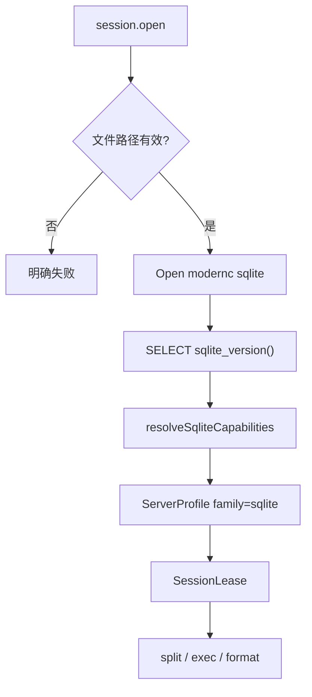

# 27 — SQLite 管理模块（Layer-1 能力服务 + Web 模块）

> 版本：v0.9 · 日期：2026-07-26  
> 状态：**模块闭环**（P0–P4 + 专业化：设计器 CHECK/GENERATED、ATTACH 文件选择器、DETACH/库属性、CSV BOM；SQLCipher 策略见 §4.1，仍未实现）  
> **隔离**：**独立进程 / 独立 kind / 独立 Web 模块 / 独立实现**；禁止与其它库服务混用代码或运行时互调  
> 关联：[13](./13-service-layout.md) · [14](./14-capability-connection-framework.md) · [18](./18-ops-connection-tree.md) · [21](./21-session-registry.md) · [23](./23-sql-dialect-completion.md) · [25 — MySQL](./25-mysql-module.md)（**节奏对照，非实现依赖**） · [database-schema.md](./database-schema.md)（平台元库，**非**本模块）

---

## 0. 文档边界

| 写在本文 | 不写在本文 |
|----------|------------|
| `sqlite-service`、`family: "sqlite"`、文件型连接、对象树与 Cap 表 | 平台本地元库 `nm_*.db`（见 [database-schema.md](./database-schema.md)） |
| Web `modules/sqlite` 与对本 kind 的注册 | MySQL / Vastbase / 达梦等其它库**业务实现** |
| 对本模块适用的共享契约用法（引用 [14]/[21]/[23]） | 在共享层硬编码多库业务分支；跨服务 Go 业务包 |

### 0.1 服务隔离与实现不混用（硬约束）

与 [26 — MariaDB](./26-mariadb-module.md) 同原则：**一引擎 = 一 Layer-1 进程 + 一套实现**，可对照其它库文档学结构，**不得**混用其服务代码或运行时能力。

| 层 | 必须独立 | 允许共用（仅框架，无引擎业务） |
|----|----------|--------------------------------|
| 进程 / 二进制 | `niuma-sqlite-service` 独享 | — |
| manifest / namespace / kind | `sqlite` 独享 | — |
| Go 模块 | `services/sqlite-service/` 自有 `go.mod` + `internal/*` | `packages/go/serviceipc`、`tunnel`、`logutil` 等**无引擎语义**包 |
| Web 业务模块 | `web/src/modules/sqlite/`、`api/sqlite.ts` | `modules/database/*` 壳组件、`sql-editor` 编排（只认 family/Cap） |
| Cap / Probe / 树 SQL | 只写在本服务 `internal/dialect|tree|meta|…` | — |

**禁止**：

1. `import` 其它 `*-service` 的 `internal/`（含 mysql / vastbase / dameng / mariadb）。  
2. 抽取「多库共用」Go 业务包（如 `packages/go/sqldb` 内 `if dialect` 分流 session/tree/meta）。  
3. platform 把多种 kind 代理到**同一**可执行文件并用内部 if 分流（默认：**一 manifest = 一二进制**）。  
4. 运行时 `bridgeInvoke('mysql.*'|'vastbase.*'|…)` 完成本模块功能。  
5. Web 把 SQLite 面板塞进 `modules/mysql` / `modules/vastbase`，或共用带引擎分支的 composable。  
6. 与 platform 元库共用 `*sql.DB` / 打开同一元库文件做「用户连接」。

**允许**：对照 25/22 **复制骨架后改写**（fork 起步）；对照完成后代码归属本仓库路径，**无**编译期/运行期依赖对方服务。

**与平台元库的边界**：

- 平台 Core 的 SQLite（连接配置、Vault 元数据等）是 **产品内部存储**，走 `platform` 包内路径，**禁止**经 `sqlite-service` 暴露给用户。  
- 本模块面向用户打开的 **任意 `.db` / `.sqlite` 文件**（及可选 ATTACH 库），与元库进程、路径、权限完全隔离。

**多库协作约定**：共享层只认 DialectFamily + CapabilitySet + 同名 RPC；**各库实现只落在各自服务与 Web 模块**，互不混用。

---

## 1. 目标与范围

面向本地 / 嵌入式 **SQLite 3** 文件库的运维与开发：

- 打开文件站点、对象导航（`connection → {Tables|Views|Indexes|Triggers}`）
- SQL 查询执行与结果集浏览
- 元数据（列、索引、DDL / `sqlite_master`）
- 表数据 Browse、CSV 导入导出、SQL dump / 执行文件

归属 `ops` / `data` 域；连接树与 `platform.connection.*` 走通用壳，**业务逻辑只在 `sqlite-service` + `web/src/modules/sqlite`**。

### 1.1 架构对齐

| 能力层 | 参考 | NiuMa 做法 |
|--------|------|-----------|
| GUI / 对象树 / SQL | DBeaver / Navicat / DB Browser | Vue + Monaco + Go 能力服务 |
| 连接与查询 | SQLite C API / 文件 | **Go + `modernc.org/sqlite`（纯 Go，无 CGO）** |
| 方言差异 | 客户端能力探测 | **DialectFamily + CapabilitySet**（契约见 [23](./23-sql-dialect-completion.md)） |
| 安装包 | 独立客户端 | 仅 `niuma-sqlite-service` Go 二进制 |

### 1.2 关键决策

| 维度 | 决策 | 理由 |
|------|------|------|
| 能力服务 | 独立 Layer-1 **`sqlite-service`**（独立二进制） | 长连接、取消、崩溃隔离；与其它库服务 / 元库进程分离 |
| 语言 | **Go（唯一）** | 与既有 Layer-1 一致 |
| 驱动 | **`modernc.org/sqlite`** | 平台元库亦用同驱动包名，但是 **另一进程/另一 `*sql.DB`**；**禁止** CGO 的 `mattn/go-sqlite3` |
| 协议 kind | **`sqlite`** | 连接树 / Session Registry；与其它 kind **不互通** |
| Bridge namespace | **`sqlite`** | 仅 `sqlite.*`；禁止借调其它 namespace |
| Dialect `family` | **`"sqlite"`** | Cap 前缀 `sqlite.*`；不复用 `mysql.*` / `vastbase.*` 默认集 |
| Web 模块 | **`web/src/modules/sqlite/`** | 独立注册；不并入其它库模块 |
| 会话策略 | **`per_profile` + idle** | 同文件多 Tab 共享会话；见 [21](./21-session-registry.md) |
| 凭据 | 可选文件加密口令走 Vault | 明文库无密码；SQLCipher 类口令按 §4 |
| SSH / 代理 | **P0 不做** | 文件在本地；远程文件走「先 SFTP 下载再打开」，不混进本服务 |
| Monitor / processlist | **不做** | 无服务端进程模型 |
| 调试 | **不做** | 无存储过程调试面 |
| **禁止** | 与其它 `*-service` 混用实现；与元库共用连接；业务进 platform-core | 见 §0.1 |

### 1.3 已预留（无需重做）

| 层 | 现状 |
|----|------|
| `SqlDialect` / `DialectFamily` | 已含 `'sqlite'` |
| 格式化 | `formatterLanguage: 'sqlite'` |
| Monaco | `genericsql`，`monacoSqlLanguages: false`（P0 用内置启发式即可） |
| 拆句 | `split/types.ts` 走 generic 默认（无 DELIMITER / PL/SQL 块） |
| `useSqlQueryEditor` | `family === 'sqlite'` → dialect `'sqlite'` |

落地时补：`defaultSqliteProfile()`、Cap 常量、`defaultProfileForFamily('sqlite')` 分支。

---

## 2. 产品模型：DialectFamily + CapabilitySet

`session.open` / `session.test` 返回（platform **整包透传**）：

```json
{
  "sessionId": "...",
  "dialect": {
    "family": "sqlite",
    "version": "3.45.1",
    "versionNum": "3045001",
    "sqlCompatibility": "",
    "capabilities": [
      "sqlite.double_quote_ident",
      "sqlite.bracket_ident",
      "sqlite.pragma",
      "format.sqlite",
      "editor.builtin_sql",
      "ddl.if_not_exists",
      "json.functions",
      "cte.window"
    ]
  }
}
```

### 2.1 Capability ID（本模块稳定字符串）

新增只加常量，**勿改已发布取值**。前缀：`sqlite.*` / `format.*` / `editor.*` / `ddl.*` / `io.*`。

| Capability | 含义 | 默认 | 启用阶段 |
|------------|------|------|----------|
| `sqlite.double_quote_ident` | 标识符双引号 | ✓ | P0 |
| `sqlite.bracket_ident` | 标识符方括号 `[name]`（兼容） | ✓ | P0 |
| `sqlite.pragma` | PRAGMA 元数据 / 设置 | ✓ | P0 |
| `format.sqlite` | 格式化方言 `sqlite` | ✓ | P0 |
| `editor.builtin_sql` | Monaco 内置 / genericsql（无专用 Worker） | ✓ | P0 |
| `ddl.if_not_exists` | `CREATE … IF NOT EXISTS` | ✓ | P2 |
| `json.functions` | `json_*` 函数（版本足够时） | 按版本 | P2 |
| `cte.window` | CTE / 窗口函数 | ✓（现代 SQLite） | P0/P2 |
| `sqlite.wal` | 文件以 WAL 模式打开（连接选项） | 按选项 | P0 |
| `sqlite.readonly` | 只读打开 | 按选项 | P0 |
| `sqlite.attach` | 支持 ATTACH 附加库（树展示） | ✓ | P3 |
| `io.csv` | CSV 旁路导入导出 | ✓ | P3 |
| `io.sql_file` | SQL 转储 / 执行文件 | ✓ | P3 |
| `io.backup_api` | 使用 Backup API 做安全拷贝 | ✓ | P4 |
| `ddl.design` | 表设计器 Preview/Apply（含重建表） | ✓ | P4 |

**解析优先级（Web）**：Capability **优先** → 无 Cap 时用 `family === 'sqlite'` 词法回退。新增行为只加 Cap。

### 2.2 Probe（P0）

1. 打开文件（含只读 / URI 模式）成功。  
2. `SELECT sqlite_version()` → `version` / `versionNum`。  
3. 可选：`PRAGMA compile_options`（记录 JSON1 等，用于 `json.functions`）。  
4. 纯函数 `resolveSqliteCapabilities(version, options)` → Cap 表（单测覆盖）。  
5. 成功时整包返回 `dialect`（`family: "sqlite"`）。



---

## 3. 分层与进程模型

```
┌ Layer 4 ─ Web ────────────────────────────────────────────┐
│ web/src/modules/sqlite/                                    │
│   连接表单（文件路径）· 树 Provider · Query · Browse        │
│   ↑ bridgeInvoke(sqlite.*)    ↑ bridgeOnEvent(niuma:event) │
└───┼───────────────────────────┼────────────────────────────┘
    │ cefQuery                  │ PostMessage
┌ Layer 3 ─ C++ Shell ──────────┴────────────────────────────┐
│ bridge_router · platform_client · 事件回投 UI               │
└───┼───────────────────────────▲────────────────────────────┘
    │ length-prefixed JSON      │ 事件帧
┌ Layer 2 ─ platform-core ──────┴────────────────────────────┐
│ platform.connection.* + sqlite.* 代理 + 可选凭据注入        │
└───┼───────────────────────────▲────────────────────────────┘
    │                           │ query / io 进度事件
┌ Layer 1 ─ sqlite-service（Go + modernc.org/sqlite）────────┐
│ 会话池 · dialect Probe · query · tree · catalog · meta · io│
└───────────────────────────────┬────────────────────────────┘
                                │ 本地文件 I/O
                                ▼
                          *.db / *.sqlite 文件
```

要点：

- 壳层与 platform-core **不写** SQLite 业务 SQL / 树语义。  
- 海量对象：树接口默认轻量（name/type），带 `filter` / `limit` / `truncated`；禁止对树中每张表默认 `COUNT(*)`。  
- 同一文件多会话：默认共享 `per_profile`；写并发依赖 SQLite 锁 / WAL，服务内对写操作串行化或文档约定「单写者」。

### 3.1 工程布局

```
services/
├── manifests/sqlite-service.yaml
└── sqlite-service/
    ├── go.mod                 # modernc.org/sqlite + niuma/pkg/*
    ├── cmd/sqlite-service/main.go
    └── internal/
        ├── dialect/           # ServerProfile / Cap* / Probe
        ├── session/           # ConnectParams、打开文件、query.exec/cancel
        ├── handler/           # session / query / tree / catalog / meta / ddl / io
        ├── tree/              # tables / views / indexes / triggers（轻量）
        ├── catalog/           # schemas（主库+ATTACH）/ tables / columns
        ├── meta/              # columns / indexes / ddl（sqlite_master / PRAGMA）
        ├── ddl/               # 表设计器 Preview/Apply（P4）
        ├── dataio/            # CSV / SQL dump / execSqlFile
        ├── eventpub/
        └── idgen/

web/src/modules/sqlite/
├── views/                     # SqliteHome / SqliteSession
├── components/                # ConnectionFields / QueryPane / BrowsePane / DdlPane …
├── composables/
├── completion/                # catalog-client（docs/23）
├── connection-form-adapter.ts
├── register-conn-form.ts
├── register-conn-full.ts
├── conn-tree-provider.ts
├── conn-tree-actions.ts
├── conn-nav-strategy.ts
├── pane-registry.ts
├── locale/                    # zh-CN.ts / en-US.ts
└── sql-seed.ts

web/src/api/
├── sqlite.ts
└── types/sqlite.ts
```

跨方言 **编排 / UI 壳**（无引擎业务）：`web/src/modules/sql-editor/`、`web/src/modules/database/`。  
SQLite 的 session/query/tree/meta/IO **适配代码只写在** `modules/sqlite/` + `sqlite-service`，禁止从 `modules/mysql` 等 import 业务 composable。

---

## 4. 连接参数（ConnectParams）

与 server 型库不同：**无 host/port/user**；核心是文件路径与打开模式。

| 字段 | 默认 | 说明 |
|------|------|------|
| `filePath` | — | **必填**；绝对路径；支持 `.db` / `.sqlite` / `.sqlite3` |
| `password` / secret | 空 | 表单可填；**非空时连接失败**（modernc 无 SQLCipher）；勿静默忽略 |
| `readOnly` | `false` | `mode=ro`；Browse/Query 可写时需 `false` |
| `createIfMissing` | `false` | 文件不存在时是否创建空库；默认否，避免误建 |
| `busyTimeoutMs` | `5000` | `PRAGMA busy_timeout` |
| `journalMode` | `""` | 空=不改；可选 `WAL` / `DELETE` 等（仅非只读） |
| `foreignKeys` | `true` | `PRAGMA foreign_keys=ON` |
| `attach` | `[]` | `{ alias, filePath, readOnly? }[]`，**P3** |

平台侧：`connection_kind = sqlite`；Vault 仅在有密码时注入。表单以「文件选择器 + 只读/创建/高级 PRAGMA」为主，**无 SSL / SSH Tab**。

P0 验收：本地存在文件 `session.test` 成功；坏路径 / 无权限明确失败；只读打开后写语句失败信息可读。

### 4.1 SQLCipher 策略（明确未支持）

| 项 | 决策 |
|----|------|
| 当前驱动 | **仅** `modernc.org/sqlite`（纯 Go，无 CGO） |
| 口令非空 | **连接失败**（禁止静默忽略，避免用户以为已加密打开） |
| 表单 | 高级 Tab 保留口令字段 + 禁用说明；口令仍可写入 Vault 以便未来启用 |
| 若引入 SQLCipher | 仍只在 `sqlite-service` 内实现；用 Capability / 可选构建标签切换；**禁止**编进 platform-core |
| 备选路径 | CGO `mattn/go-sqlite3`+SQLCipher **不作为默认**；若评估，须独立二进制或 build tag，且文档/Cap 明示 |
| 验收红线 | 明文库空口令可连；填口令必失败且错误可读；无「假成功」 |

---

## 5. Bridge 契约

命名空间：`sqlite`。方法名与 [23](./23-sql-dialect-completion.md) 对齐；**参数语义按 SQLite 对象模型**。

### 5.1 会话

| 方法 | 入参 | 返回 |
|------|------|------|
| `session.open` | `{ profileId }`（平台注路径/可选口令） | `{ sessionId, dialect }` |
| `session.close` | `{ sessionId }` | `{ closed: true }` |
| `session.test` | profile 或连接参数 | `{ ok, message, version?, dialect? }` |
| `session.attach` | `{ sessionId, attach[] \| alias+filePath }` | `{ attached }` |
| `session.detach` | `{ sessionId, alias \| aliases[] }` | `{ detached }`（禁止 `main`/`temp`） |

### 5.2 查询

| 方法 | 说明 |
|------|------|
| `query.exec` | `{ sessionId, sql, limit?, timeoutMs?, requestId? }` |
| `query.fetch` / `query.close` / `query.cancel` | 游标与取消（cancel 用 context 取消当前语句） |

**批约定（P0）**：Web 拆句后严格顺序逐条 `query.exec`；服务端按单语句执行。  
**拆句**：无 `DELIMITER`；无 PL/SQL 块；触发器 `BEGIN…END` 体内 `;` 需在 P2 视情况加 `split.sqlite_trigger`（可选 Cap）。

### 5.3 树（导航，P1）

对象模型：**无独立 database/schema 层**（主库 `main`；ATTACH 在 P3 以「附加库」节点出现）。

```
connection
  ├─ Tables → table
  ├─ Views → view
  ├─ Indexes → index          # 可选：挂在表下或独立分类
  └─ Triggers → trigger
```

| 方法 | 说明 |
|------|------|
| `tree.schemas` | P0 可返回固定 `[{ name: "main" }]`；P3 含 ATTACH alias |
| `tree.tables` | `schema`（默认 `main`）下 table/view；`types: table\|view` |
| `tree.indexes` / `tree.triggers` | 轻量列表 |
| `tree.categoryCounts` | `{ tables, views, indexes, triggers }`（对象数，非行数） |

**不做** `tree.databases`（避免与 MySQL 语义混淆）；若编排层强制要 `catalog.schemas`，映射为 `main` + ATTACH。

ResourceId：

```
res:{profileId}:schema:main:table:{table}
res:{profileId}:schema:main:view:{view}
```

### 5.4 目录补全 `catalog.*`

| RPC | SQLite 语义 |
|-----|-------------|
| `catalog.schemas` | `main` + ATTACH 别名 |
| `catalog.tables` | `schema` + prefix/limit → `sqlite_master` / `sqlite_schema` |
| `catalog.columns` | `PRAGMA table_info` / `table_xinfo` |

禁止用 `tree.*` 高 limit 假装全量目录。

### 5.5 元数据 / DDL

| 方法 | 说明 |
|------|------|
| `meta.columns` | `PRAGMA table_xinfo` |
| `meta.indexes` | `PRAGMA index_list` + `index_info` |
| `meta.ddl` | `sqlite_master.sql`（表/视图/触发器/索引） |
| `meta.foreignKeys` | `PRAGMA foreign_key_list` |
| `meta.primaryKey` | 自 `table_info` 的 `pk` 字段 |
| `meta.databaseInfo` | 版本 + 关键 PRAGMA + `database_list`（库属性面板） |

树 / meta / catalog 支持 `sessionId` **或** platform 注入的短连参数（`profileId` → 凭据注入），与 MySQL 旁路一致。

**不做**（首期）：`meta.processlist` / `meta.kill` / `meta.instanceOverview` / `meta.locks` / `meta.routineSource`。

### 5.6 DDL 设计器 / IO（P3–P4）

| 方法 | 阶段 |
|------|------|
| `ddl.designPreview` / `ddl.designApply` / `ddl.createTable*` | P4（`strategy: alter|rebuild`；类型/空约束/PK/FK 等走重建表） |
| `backup.copy` | P4（modernc Online Backup API） |
| `io.exportCsv` / `io.importCsv` / `io.dumpSql` / `io.execSqlFile` / `io.cancel` | P3 |

Dump：纯 Go 生成 `CREATE` + `INSERT`；可选 `.dump` 风格。导入大批量建议事务批提交。  
全表 CSV 导出写 **UTF-8 BOM**（Excel 友好），与 MySQL 旁路对齐。

### 5.7 事务

| 方法 | 说明 |
|------|------|
| `tx.getState` / `tx.setAutoCommit` / `tx.commit` / `tx.rollback` | P2；与 MySQL 同名，语义对齐 SQLite 事务 |

---

## 6. Web 模块落地要点

### 6.1 注册

- `register-conn-form.ts`：仅表单 + adapter  
- `register-conn-full.ts`：树 + nav +（可选）IO Dock  
- `builtin-modules.ts`：`id: 'sqlite'`，`category: 'data'`，`routePath: '/sqlite'`  
- 图标：`sqlite`（资源库补 SVG）

### 6.2 会话 Tab（pane-registry）

| Tab | Phase | 壳 |
|-----|-------|-----|
| Query | P0 | `SqlQueryShell` + `QueryResultPanel` |
| Browse | P2 | `BrowseDataShell` |
| DDL | P2 | 只读脚本壳 |
| Design | P4 | `TableDesignShell`（预览展示 alter/rebuild + warning） |
| Transfer | P3 | `DataTransferShell` |

**不做** Monitor / ObjectScript（过程/函数）/ Debug。

### 6.3 连接表单

- 基础：文件路径（`dialogApi.openFile`）+ 显示名  
- 高级：加密口令（策略见 §4.1）、**ATTACH 行列表**（别名 / 路径浏览 / 只读）、只读、不存在则创建、busy_timeout、journal_mode、foreign_keys  
- 无 SSL / SSH  

### 6.3.1 表设计器列扩展

- 列级 **CHECK**、**GENERATED ALWAYS AS … VIRTUAL|STORED**（新建 / 重建表路径）  
- `meta.columns` 从 `table_xinfo` + DDL 解析回填；变更 CHECK/GENERATED 走 rebuild

### 6.4 sql-editor 补齐清单

1. `Cap` 增加 `sqlite.*` / `format.sqlite` / `io.*` / `ddl.design` 等常量 — **✓**  
2. `defaultSqliteProfile()` + `defaultProfileForFamily` — **✓**（与 Go `DefaultProfile` 对齐）  
3. `buildAiDialectRules`：双引号标识符、ATTACH schema、`AUTOINCREMENT`、类型亲和 — **✓**  
4. 单测：`capabilities.spec.ts` 覆盖 sqlite family — **✓**

---

## 7. 分期与验收

| Phase | 内容 | 验收要点 | 状态 |
|-------|------|----------|------|
| **文档** | 本稿 | 边界清晰；与元库隔离写明 | ✓ |
| **P0** | 服务骨架、manifest、`session.*`、Probe、Query + Web Home/Session/Query | 打开本地库执行 `SELECT`；取消生效 | **✓** |
| **P1** | tree / categoryCounts / catalog + 连接树 | 树展开 Tables/Views/Indexes/Triggers；补全 | **✓** |
| **P2** | meta、Browse、DDL、tx.*、`query.explain` | Browse 分页；DDL 只读；事务 | **✓** |
| **P3** | CSV/SQL IO、可选 ATTACH、加密口令字段 | 导入导出进任务 Dock | **✓** |
| **P4** | 表设计器（含重建表策略）、Backup API 拷贝 | 设计预览/应用；安全备份 | **✓** |

### 7.1 后端已实现方法（对齐 IDEA / Navicat / DBeaver）

| 分组 | 方法 | 专业工具对齐点 |
|------|------|----------------|
| session | `open` / `close` / `test` / `attach` / `detach` | 文件站点建连；可选 ATTACH/DETACH；返回整包 `dialect` |
| query | `exec` / `fetch` / `close` / `cancel` / `explain` | 分页结果集；`EXPLAIN QUERY PLAN` |
| tx | `getState` / `setAutoCommit` / `commit` / `rollback` | 手动事务工具栏 |
| tree | `schemas` / `tables` / `indexes` / `triggers` / `categoryCounts` | `main`+ATTACH→分类节点徽章；默认隐藏 `sqlite_*` |
| catalog | `schemas` / `tables` / `columns` | 编辑器补全（与 tree 分离） |
| meta | `columns` / `indexes` / `ddl` / `primaryKey` / `foreignKeys` / `databaseInfo` | 表属性 / DDL / FK；连接级库属性面板 |
| io | `exportCsv` / `importCsv` / `dumpSql` / `execSqlFile` / `cancel` | 旁路异步任务；事件 `sqlite.io.progress` / `sqlite.io.done` |
| ddl | `designPreview` / `designApply` / `createTable` / `createTablePreview` | 原生 ALTER 或重建表（事务内 `foreign_keys=OFF`） |
| backup | `copy` | Online Backup API → 目标文件；事件 `sqlite.backup.*` |

对标 MySQL 分期节奏，但 **砍掉** Monitor、例程、外部 CLI tools、SSH。

---

## 8. manifest 草案

```yaml
id: com.niuma.sqlite
name: SQLite Service
version: 0.1.0
bridge:
  namespace: sqlite
  connection_kind: sqlite
session:
  inject_credentials: true
  credential_methods:
    - session.open
    - session.test
    - session.attach
    - tree.schemas
    - tree.tables
    - tree.indexes
    - tree.triggers
    - tree.categoryCounts
    - meta.columns
    - meta.indexes
    - meta.ddl
    - meta.primaryKey
    - meta.foreignKeys
    - meta.databaseInfo
    - catalog.schemas
    - catalog.tables
    - catalog.columns
    - io.exportCsv
    - io.importCsv
    - io.dumpSql
    - io.execSqlFile
    - io.cancel
    - ddl.designPreview
    - ddl.designApply
    - ddl.createTable
    - ddl.createTablePreview
    - backup.copy
runtime:
  executable: bin/niuma-sqlite-service.exe
  executable_windows: bin/niuma-sqlite-service.exe
  executable_unix: bin/niuma-sqlite-service
  lang: go
ipc:
  transport_windows: named_pipe
  transport_unix: unix_socket
  address_windows: '\\.\pipe\niuma.sqlite'
  address_unix: '/tmp/niuma.sqlite.sock'
  protocol: length_prefixed_json
lifecycle:
  startup: lazy
permissions: []
```

构建：`go.work` 增加 `use ./services/sqlite-service`；`scripts/build-services.ps1` 追加目标。

---

## 9. 红线

1. **禁止**与其它库服务混用实现：共享 Go 业务包、同进程多引擎 if、运行时互调、Web 模块合并（完整列表见 §0.1）。  
2. **禁止**用户连接路径指向平台元库目录并提供「管理元库」能力（产品可另做隐藏调试，不进本模块）。  
3. **禁止** CGO sqlite 驱动；统一 `modernc.org/sqlite`（与元库仍是**不同进程/不同连接**）。  
4. **禁止**在 platform-core / 壳层写 `sqlite_master` / PRAGMA 业务。  
5. **禁止**用 `family: "generic"` 或其它库 family 冒充 sqlite 会话默认集。  
6. **禁止**把 SQLCipher 专有逻辑编进 platform；加密扩展若引入，仍在 `sqlite-service` 内、用 Cap 开关。  
7. 新工具 / MCP **不**编进平台 Server 二进制（遵循仓库外部化规则）。

---

## 10. 开工 checklist（P0）

### 后端

- [x] `services/sqlite-service/` 骨架 + `serviceipc` 接入  
- [x] `services/manifests/sqlite-service.yaml`  
- [x] `session.open|close|test` + Probe  
- [x] `query.exec|fetch|close|cancel` + `query.explain`  
- [x] `tree.*` / `catalog.*` / `meta.*` / `tx.*`  
- [x] `go.work` + 构建脚本  
- [x] Probe / Cap / connect / tree / meta 单测  

### 前端

- [x] `modules/sqlite`：Home / Session / ConnectionFields / Query / Browse / DDL / Design / IO Dock  
- [x] `connection-form-adapter` + register form/full（`hideHostPort`）  
- [x] `api/sqlite.ts` + types（含 ddl / io / backup）  
- [x] `builtin-modules` + Activity Bar data 区 + i18n  
- [x] `defaultSqliteProfile` + Cap 常量 + AI rules + `capabilities.spec`  
- [x] 连接树 / nav strategy / catalog 补全 / Backup 入口  
- [x] Browse 挂载 `BrowseDataShell`（筛选 + 行编辑/插入/删除 via `query.exec` + CSV 任务）  
- [x] Browse 本页多格式 IO（csv/sql/json/xls）+ 全表 CSV 任务；右键复制 INSERT/UPDATE/DELETE  
- [x] 树维护：Drop / Empty / Rename（SqliteDdlActionHost）+ VACUUM/ANALYZE/integrity 诊断  
- [x] `session.detach` + 附加库卸载菜单；`meta.databaseInfo` 库属性对话框  
- [x] 全表 CSV UTF-8 BOM；树 `profileId` 短连 resolve（对齐 MySQL）  
- [x] 设计器 CHECK / GENERATED；ATTACH 文件选择器行编辑；SQLCipher §4.1 策略  
  - [ ] 冒烟（人工）：建连 → 树 → SQL → Browse → Design(CHECK/GENERATED) → ATTACH → DETACH · 属性  


### 文档 / 关联

- [x] 实现过程中回写本文「状态」与已落地 Phase  
- [x] [13](./13-service-layout.md) / [14](./14-capability-connection-framework.md) 索引补 sqlite  
- [x] [23](./23-sql-dialect-completion.md) 注明 sqlite catalog 映射（`main` + ATTACH）  

---

## 11. 修订记录

| 版本 | 日期 | 说明 |
|------|------|------|
| v0.1 | 2026-07-26 | 初稿：文件型连接、modernc 驱动、P0–P4 分期、与平台元库隔离 |
| v0.2 | 2026-07-26 | 强化 §0.1：每服务独立实现、禁止跨服务混用 / 互调 |
| v0.3 | 2026-07-26 | 后端 P0–P2 落地：`sqlite-service`（对齐 IDEA/Navicat/DBeaver 对象树与事务/Explain） |
| v0.4 | 2026-07-26 | Web P0–P2：`modules/sqlite` 表单/树/Query/Browse/DDL；文件型表单隐藏主机端口 |
| v0.5 | 2026-07-26 | P3：`io.*` CSV/SQL 旁路任务 + Dock；`session.attach` / options.attach；加密口令字段预留（SQLCipher 后续） |
| v0.6 | 2026-07-26 | P4：`ddl.*` 表设计器（alter/rebuild）+ `backup.copy`；Web Design 面板与树备份入口 |
| v0.7 | 2026-07-26 | 闭环：sql-editor Cap/AI/单测；BrowseDataShell；口令非空拒绝；13/14/23 索引 |
| v0.8 | 2026-07-26 | 专业化：Browse 编辑/多格式 IO；树 DDL/诊断；`session.detach`；`meta.databaseInfo`；CSV BOM；tree/meta 短连 resolve |
| v0.9 | 2026-07-26 | 设计器 CHECK/GENERATED；ATTACH 行编辑+文件选择；§4.1 SQLCipher 策略说明 |
