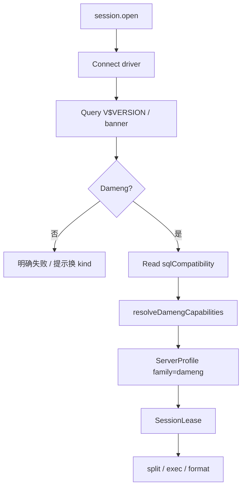

# 28 — 达梦（Dameng）管理模块（Layer-1 能力服务 + Web 模块）

> 版本：v0.6 · 日期：2026-07-26  
> 状态：**后端 / Web P0–P4 已落地**（Query / Browse / DDL / ObjectScript / Monitor / Design / Explain / 服务端 `io.*`）；真实 DM8 冒烟与视图列名微调待环境验证  
> **隔离**：**独立进程 / 独立 kind / 独立 Web 模块 / 独立实现**；禁止与 Oracle / 其它库服务混用代码或运行时互调  
> 关联：[13](./13-service-layout.md) · [14](./14-capability-connection-framework.md) · [18](./18-ops-connection-tree.md) · [21](./21-session-registry.md) · [22 — Vastbase](./22-vastbase-module.md)（**节奏对照，非实现依赖**） · [23](./23-sql-dialect-completion.md) · [25 — MySQL](./25-mysql-module.md)（**节奏对照，非实现依赖**）

---

## 0. 文档边界

| 写在本文 | 不写在本文 |
|----------|------------|
| `dameng-service`、`family: "dameng"`、达梦对象模型与 Cap 表 | Oracle 独立模块（未来 `oracle-service`；**禁止**合并进程/实现） |
| Web `modules/dameng` 与对本 kind 的注册 | Vastbase / MySQL / SQLite 等其它库**业务实现** |
| 驱动选型与 CGO/厂商库分发策略 | 共享层硬编码 `if dameng`；跨服务 Go 业务包 |

### 0.1 服务隔离与实现不混用（硬约束）

与 [26 — MariaDB](./26-mariadb-module.md) / [27 — SQLite](./27-sqlite-module.md) 同原则：**一引擎 = 一 Layer-1 进程 + 一套实现**。语法「像 Oracle」≠ 可共用 Oracle/Vastbase 服务代码。

| 层 | 必须独立 | 允许共用（仅框架，无引擎业务） |
|----|----------|--------------------------------|
| 进程 / 二进制 | `niuma-dameng-service` 独享 | — |
| manifest / namespace / kind | `dameng` 独享 | — |
| Go 模块 | `services/dameng-service/` 自有 `go.mod` + `internal/*` | `packages/go/serviceipc`、`tunnel`、`logutil` 等**无引擎语义**包 |
| Web 业务模块 | `web/src/modules/dameng/`、`api/dameng.ts` | `modules/database/*` 壳、`sql-editor` 编排（只认 family/Cap） |
| Cap / Probe / 字典 SQL | 只写在本服务 `internal/dialect|tree|meta|…` | — |
| 厂商 native | 仅本服务加载 `runtime/dameng/` | — |

**禁止**：

1. `import` 其它 `*-service` 的 `internal/`（含 mysql / vastbase / sqlite / 未来 oracle）。  
2. 抽取「Oracle+达梦共用」Go 业务包，或在单一服务内 `if dameng / if oracle` 分流。  
3. platform 把 `dameng` 与其它 kind 代理到**同一**可执行文件并用内部 if 分流（默认：**一 manifest = 一二进制**）。  
4. 运行时调用 `vastbase.*` / `mysql.*` / 未来 `oracle.*` 完成本模块功能。  
5. Web 把达梦面板并入 `modules/vastbase` 等，或共用带引擎分支的业务 composable。  
6. 用 `family: "oracle"` / `family: "vastbase"` 冒充达梦会话（兼容模式只用 `sqlCompatibility` + `compat.*` Cap）。

**允许**：对照 22/25 **复制骨架后改写**；`sql-editor` 对 dameng 启用与 Oracle **同名的拆句特性位**（`oracleQQuotes` / `plsqlBlocks`）——这是编排层 Cap/feature，**不是**服务实现混用。

**与 Oracle 的边界**：

- 未来 `oracle-service` 与本服务 **分进程、分 kind、分模块、分 Cap 前缀**。  
- Probe 连到非达梦实例 → **明确失败**，提示改用对应连接类型。

**多库协作约定**：共享层只认 DialectFamily + CapabilitySet + 同名 RPC；**各库实现只落在各自服务与 Web 模块**，互不混用。

---

## 1. 目标与范围

面向 **达梦数据库 DM8**（及后续主版本）运维与开发：

- 连接站点、对象导航（`connection → schema → {Tables|Views|Procedures|Functions|Sequences}`）
- SQL 查询执行与结果集浏览
- 元数据（列、索引、约束、DDL）
- 过程 / 函数对象脚本（类 PL/SQL）；表设计器与 CSV/SQL 导入导出（后期）

归属 `ops` / `data` 域；连接树与 `platform.connection.*` 走通用壳，**业务逻辑只在 `dameng-service` + `web/src/modules/dameng`**。

### 1.1 架构对齐

| 能力层 | 参考 | NiuMa 做法 |
|--------|------|-----------|
| GUI / 对象树 / SQL | 达梦管理工具 / DBeaver / Navicat | Vue + Monaco + Go 能力服务 |
| 连接与查询 | DM 协议（常用端口 **5236**） | **Go + 选定驱动（见 §1.3）** |
| 方言差异 | 客户端能力探测 | **DialectFamily + CapabilitySet** |
| 安装包 | 厂商 JDBC IDE | 仅 `niuma-dameng-service`（+ 按需随包厂商运行时） |

### 1.2 关键决策

| 维度 | 决策 | 理由 |
|------|------|------|
| 能力服务 | 独立 Layer-1 **`dameng-service`**（独立二进制） | 长连接、取消、崩溃隔离；与其它库服务分离 |
| 语言 | **Go（唯一）** | 与既有 Layer-1 一致；**不**为达梦单独引 JVM |
| 协议 kind | **`dameng`** | 与其它 kind **不互通** |
| Bridge namespace | **`dameng`** | 仅 `dameng.*`；禁止借调其它 namespace |
| Dialect `family` | **`"dameng"`** | Web 已预留 |
| Cap 前缀 | **`dameng.*`**（可另加跨产品稳定 ID：`proc.*` / `split.*` / `format.*`） | **不**复用 `oracle.*` / `vastbase.*` 默认集作伪装 |
| Web 模块 | **`web/src/modules/dameng/`** | 独立注册；不并入 vastbase/mysql |
| 会话策略 | **`per_tab` + 关 Tab 立即 close** | 每查询/浏览 Tab 独立物理连接，事务互不串号；见 [21](./21-session-registry.md) |
| 凭据 | platform Vault 注入 | [14](./14-capability-connection-framework.md) |
| SSH 隧道 | platform 公共 `tunnel` dialer（无引擎业务） | 连接参数同形，实现仍在本服务内调用 |
| 调试 | **首期不做** | 不复用 Vastbase `debug.*` / DBE_PLDEBUGGER |
| **禁止** | 与其它 `*-service` 混用实现；Java/JDBC sidecar；MCP 进 platform | 见 §0.1 |

### 1.3 驱动选型（P0 开工前锁定）

达梦官方生态偏 JDBC；Go 侧需在开工前做 **Spike（≤2 人日）** 锁定其一，并写回本节「采用」行。

| 方案 | 优点 | 风险 | 建议 |
|------|------|------|------|
| **A. 官方 Go 驱动 / DPI（若许可允许随包）** | 协议完整、类型对齐好 | 常需 **CGO** 或专有 `.dll/.so`；构建与分发复杂 | 企业内网包可接受时优先 |
| **B. 社区 `database/sql` 兼容驱动**（如 gorm-dameng 底层） | 接入快 | 维护活跃度、类型/取消/LOB 缺口 | Spike 验证 `query.cancel`、大结果、时间类型后可用 |
| **C. ODBC（`alexbrainman/odbc` 等）+ 达梦 ODBC 驱动** | 不绑死某一 Go 库 | Windows 依赖系统 DSN/驱动安装；UX 差 | 仅作兜底，不作为默认产品路径 |

**采用（P0 锁定）**：**方案 B 路径上的官方纯 Go `dm` 驱动** — 模块依赖 `gitee.com/chunanyong/dm`（官方 `dm-go-driver` 源码可 `go get` 分发），`database/sql` + `sql.Open("dm", dsn)`，DSN `dm://user:pass@host:port?...`；**不**使用 GORM / JDBC / CGO。构建默认 `CGO_ENABLED=0`。若需钉死安装包内确切版本，可用 `replace` 指向 `third_party/dm`。

**产品默认目标**：**方案 A 或 B（纯 Go 优先）**；若必须带厂商动态库：

- 动态库放在 `services/bin/runtime/dameng/`（或安装包 `components/dameng-native`），**不**链进 platform-core。  
- 构建脚本分 `build-services`（常規）与 `build-dameng-service`（可选 CGO/`CGO_ENABLED=1`）。  
- CI：无厂商库的环境可跳过 dameng 集成测，保留编译标签 `dameng` / `!dameng`。

**禁止**：为达梦单独拉起 JVM + JDBC 进程（与 Vastbase「禁止 Java」同原则）。

### 1.4 已预留（无需重做）

| 层 | 现状 |
|----|------|
| `SqlDialect` / `DialectFamily` | 已含 `'dameng'` |
| 格式化 | `formatterLanguage: 'sql'`（通用；后续可加专用规则） |
| Monaco | `genericsql`，`monacoSqlLanguages: true`（Worker 槽位预留，P0 可先 builtins） |
| 拆句 | 与 Oracle 并列：`oracleQQuotes`、`plsqlBlocks` |
| `useSqlQueryEditor` | `family === 'dameng'` → `'dameng'` |

落地时补：`defaultDamengProfile()`、Cap 常量、`defaultProfileForFamily('dameng')`、AI 方言规则。

---

## 2. 产品模型：DialectFamily + CapabilitySet

`session.open` / `session.test` 返回（platform **整包透传**）：

```json
{
  "sessionId": "...",
  "dialect": {
    "family": "dameng",
    "version": "8.1.3",
    "versionNum": "80103",
    "sqlCompatibility": "oracle",
    "capabilities": [
      "dameng.double_quote_ident",
      "dameng.q_quote",
      "proc.plsql_bare",
      "split.plsql_blocks",
      "script.oracle_slash",
      "format.sql",
      "editor.builtin_sql",
      "editor.sql_lsp",
      "routine.create_procedure",
      "routine.create_function",
      "ddl.if_not_exists"
    ]
  }
}
```

`sqlCompatibility`：达梦常有 Oracle / MySQL 兼容模式，Probe 读实例参数后填入（如 `oracle` / `mysql` / `''`），供 AI 规则与模板微调；**family 始终为 `dameng`**。

### 2.1 Capability ID（本模块稳定字符串）

新增只加常量，**勿改已发布取值**。

| Capability | 含义 | 默认 | 启用阶段 |
|------------|------|------|----------|
| `dameng.double_quote_ident` | 标识符双引号 | ✓ | P0 |
| `dameng.q_quote` | `q'[…]'` / `q'{…}'` 字符串 | ✓ | P0（拆句已支持） |
| `proc.plsql_bare` | `AS\|IS … BEGIN … END;` 过程体 | ✓ | P0/P3 |
| `split.plsql_blocks` | 过程体内 `;` 不拆句 | ✓ | P0 |
| `script.oracle_slash` | 独立行 `/` 提交（脚本兼容） | ✓ | P1 |
| `format.sql` | 通用 sql-formatter | ✓ | P0 |
| `format.plsql` | 若后续接 plsql 规则则切换 | — | 按需 |
| `editor.builtin_sql` | 回退编辑器（无 LSP 时） | ✓ | P0 |
| `editor.sql_lsp` | Bridge 隧道 LSP（`dameng.lsp.*` + `dmparser` 启发式） | ✓ | P0 |
| `editor.genericsql_monaco` | genericsql + Worker（已弃用路径） | — | — |
| `routine.create_procedure` / `routine.create_function` | 对象脚本模板 | ✓ | P3 |
| `ddl.if_not_exists` | 视版本 | 按 Probe | P2 |
| `dameng.identity` | IDENTITY 列 | 按版本 | P2 |
| `sequence.native` | 序列对象 | ✓ | P2 |
| `compat.oracle` / `compat.mysql` | 兼容模式提示（互斥或空） | Probe | P0 |

**解析优先级（Web）**：Capability **优先** → 无 Cap 时用 `family === 'dameng'` 回退（双引号、Q 引号、PL/SQL 块）。禁止业务散落 `if (family === 'oracle')` 处理达梦会话。

### 2.2 Probe（P0）

1. 建连成功。  
2. 查询版本：优先 `SELECT * FROM V$VERSION` / `SELECT BANNER …`（以 Spike 锁定的实际系统视图为准）。  
3. 确认达梦特征（产品名 / 版本串）；非达梦 → **失败**。  
4. 可选：读兼容模式参数 → `sqlCompatibility` + `compat.*` Cap。  
5. 纯函数 `resolveDamengCapabilities(version, compat)` → Cap 表（单测）。  
6. **P0 不做** `CREATE PROCEDURE` 试探；过程语法确认放 P3。  
7. 成功返回整包 `dialect`（`family: "dameng"`）。



---

## 3. 分层与进程模型

```
┌ Layer 4 ─ Web ────────────────────────────────────────────┐
│ web/src/modules/dameng/                                    │
│   连接表单 · 树 Provider · Query · 对象面板                 │
│   ↑ bridgeInvoke(dameng.*)    ↑ bridgeOnEvent(niuma:event) │
└───┼───────────────────────────┼────────────────────────────┘
    │ cefQuery                  │ PostMessage
┌ Layer 3 ─ C++ Shell ──────────┴────────────────────────────┐
│ bridge_router · platform_client · 事件回投 UI               │
└───┼───────────────────────────▲────────────────────────────┘
    │ length-prefixed JSON      │ 事件帧
┌ Layer 2 ─ platform-core ──────┴────────────────────────────┐
│ platform.connection.* + dameng.* 代理 + 凭据注入            │
└───┼───────────────────────────▲────────────────────────────┘
    │                           │ query / io 进度事件
┌ Layer 1 ─ dameng-service（Go + 选定驱动）──────────────────┐
│ 会话池 · dialect Probe · query · tree · catalog · meta     │
│ （可选）厂商 native runtime 同目录加载                       │
└───────────────────────────────┬────────────────────────────┘
                                │ DM 协议（默认 5236）
                                ▼
                            达梦实例
```

要点：

- 壳层与 platform-core **不写** 达梦业务 SQL / 数据字典语义。  
- 海量对象：树默认轻量 + `filter` / `limit` / `truncated`；禁止树节点默认 `COUNT(*)`。  
- 系统 schema（如 `SYS` / `SYSAUDITOR` 等）默认可排除，选项对齐 MySQL `excludeSystem`。

### 3.1 工程布局

```
services/
├── manifests/dameng-service.yaml
└── dameng-service/
    ├── go.mod
    ├── cmd/dameng-service/main.go
    └── internal/
        ├── dialect/           # ServerProfile / Cap* / Probe
        ├── session/           # ConnectParams、池、query.exec/cancel、tx
        ├── handler/
        ├── tree/              # schemas / tables / routines / sequences
        ├── catalog/           # 补全用 schemas/tables/columns
        ├── meta/              # columns / indexes / ddl / routineSource / processlist
        ├── ddl/               # 表设计器（P4）
        ├── dataio/            # CSV / SQL dump / execSqlFile（P4）
        ├── eventpub/
        └── idgen/

# 可选随包运行时（若方案 A）
services/bin/runtime/dameng/   # .dll/.so；git LFS 或安装包组件，不进 platform

web/src/modules/dameng/
├── views/                     # DamengHome / DamengSession
├── components/                # ConnectionFields / Advanced / Ssl / Query / Browse / …
├── composables/
├── completion/
├── connection-form-adapter.ts
├── register-conn-form.ts
├── register-conn-full.ts
├── conn-tree-provider.ts
├── conn-tree-actions.ts
├── conn-nav-strategy.ts
├── pane-registry.ts
├── locale/
└── sql-seed.ts

web/src/api/
├── dameng.ts
└── types/dameng.ts
```

跨库 **UI 壳 / 编排**（无引擎业务）：`modules/database/*`、`modules/sql-editor/*`。  
达梦的 session/query/tree/meta/IO/对象脚本 **适配只写在** `modules/dameng/` + `dameng-service`，禁止从 `modules/vastbase` / `modules/mysql` import 业务 composable。

---

## 4. 连接参数（ConnectParams）

与 [14](./14-capability-connection-framework.md) 公共子对象对齐（camelCase）：

| 字段 | 默认 | 说明 |
|------|------|------|
| host / port | `5236` | 直连或隧道对端 |
| user / password | — | Vault 注入；用户常对应 schema |
| schema / database | 空 | 默认 schema（登录用户）；空则连上后用当前用户 |
| appName | `NiuMa` | 会话应用名（若驱动支持） |
| ssl_mode | `disable` | 按驱动能力：`disable` / `require` / …；独立 SSL Tab |
| ssl_ca / ssl_cert / ssl_key | 空 | PEM；能力不足时 UI 隐藏并文档说明 |
| tunnel | SSH 跳板 | 复用 platform 公共 tunnel |
| proxy | 按需 | 与其它能力服务同形 |
| excludeSystemSchemas | `true` | 树/catalog 默认排除系统用户 |

P0 验收：明文直连 +（平台已通时）SSH 隧道下 `session.test` 成功；错误信息不含明文密码。

---

## 5. Bridge 契约

命名空间：`dameng`。方法名与 [23](./23-sql-dialect-completion.md) 对齐；**参数语义按达梦对象模型（类 Oracle：schema 层）**。

### 5.1 会话

| 方法 | 入参 | 返回 |
|------|------|------|
| `session.open` | `{ profileId }` | `{ sessionId, dialect }` |
| `session.close` | `{ sessionId }` | `{ closed: true }` |
| `session.test` | profile 或连接参数 | `{ ok, message, version?, dialect? }` |

### 5.2 查询

| 方法 | 说明 |
|------|------|
| `query.exec` | 单语句执行；Web 拆句后顺序调用 |
| `query.fetch` / `query.close` / `query.cancel` | 分页与取消 |
| `query.explain` | P4 ✓；plain `EXPLAIN`（`analyze` 忽略） |

**拆句**：启用 `split.plsql_blocks` + `dameng.q_quote`；`script.oracle_slash` 时独立行 `/` 为批边界（与 Vastbase/Oracle 脚本习惯对齐）。协议层不发送无意义的客户端指令行。

### 5.3 树（导航，P1）

```
connection → schema → {Tables|Views|Procedures|Functions|Sequences} → object
```

| 方法 | 说明 |
|------|------|
| `tree.schemas` | 用户/模式列表（可 excludeSystem） |
| `tree.tables` | `schema` + `types: table\|view` |
| `tree.routines` | `types: procedure\|function` |
| `tree.sequences` | 序列（P2） |
| `tree.categoryCounts` | 分类徽章用对象数 |

ResourceId：

```
res:{profileId}:schema:{schema}
res:{profileId}:schema:{schema}:table:{table}
res:{profileId}:schema:{schema}:procedure:{name}
```

段名用 **`schema`**（不用误导的 `database`）。

### 5.4 目录补全 `catalog.*`

| RPC | 达梦语义 |
|-----|----------|
| `catalog.schemas` | 用户/模式（`ALL_USERS` / `DBA_USERS` 等，按权限降级） |
| `catalog.tables` | 入参 `schema` |
| `catalog.columns` | `schema` + `table` → `ALL_TAB_COLUMNS` 等 |

必须支持 `prefix` / `limit` / `truncated`。已固化（P0–P2）：schemas→`ALL_USERS`（降级 `USER_USERS`）；tables→`ALL_TABLES`/`ALL_VIEWS`；columns→`ALL_TAB_COLUMNS`；routines→`ALL_OBJECTS`；sequences→`ALL_SEQUENCES`；indexes→`ALL_INDEXES`/`ALL_IND_COLUMNS`；约束→`ALL_CONSTRAINTS`/`ALL_CONS_COLUMNS`。

### 5.4.1 Bridge LSP `lsp.*`

| RPC / 事件 | 说明 |
|------------|------|
| `lsp.open` / `lsp.rpc` / `lsp.close` | 与 [23](./23-sql-dialect-completion.md) 同形；事件 `type: dameng.lsp` |
| `internal/dmparser` | `DialectParser`：StmtClassify + DML/例程 Diagnostics（半成品 Hint）+ 工作 AST（TableRef/DECLARE）+ 兼容模式 Hint；DocumentSymbol / Definition / Format |
| catalog 注入 | LS 进程内调 `catalog.*` 实现；协议 `database` 字段语义为当前 **schema** |

验收：关键字/schema/表/列补全；`alias.` 合理；未知表列 Warning；过程片段无 MySQL `DELIMITER`/反引号；关 session 后无 LSP 泄漏。

### 5.5 元数据 / DDL

| 方法 | 阶段 | 说明 |
|------|------|------|
| `meta.columns` / `indexes` / `ddl` | P2 | 表 Browse / DDL |
| `meta.primaryKey` / `foreignKeys` | P2/P4 | 设计器 |
| `meta.routineSource` | P3 ✓ | 过程/函数源码（GET_DDL → ALL_SOURCE） |
| `meta.processlist` / `meta.kill` | P4 ✓ | 会话监控（`V$SESSIONS` + `LAST_RECV` 时长 / `SP_CLOSE_SESSION`；无 query-only kill） |
| `meta.instanceOverview` / `meta.locks` | P4 ✓ | Monitor（锁等待优先 `V$TRXWAIT`→`SESS_ID`） |

### 5.6 对象脚本 / 设计器 / IO

| 能力 | 阶段 | 说明 |
|------|------|------|
| ObjectScript（视图/过程/函数） | P3 | 壳用 `ObjectScriptShell`；**适配与模板在本模块**；Cap `proc.plsql_bare` |
| TableDesign | P4 | 壳用 `TableDesignShell`；**达梦类型/IDENTITY/序列逻辑在本服务** |
| `io.exportCsv` / `importCsv` / `dumpSql` / `execSqlFile` | P4 ✓ | 纯 Go；任务进全局 Dock（含 `io.cancel`） |
| `tx.*` | P2 | 与 MySQL 同名事务 API |

**不做（首期）**：Vastbase 级 `debug.*`；外部 `disql` CLI 封装（若后续做，走外部组件注册，不编进 platform）。

---

## 6. Web 模块落地要点

### 6.1 注册

- `register-conn-form.ts` / `register-conn-full.ts`  
- `builtin-modules.ts`：`id: 'dameng'`，`category: 'data'`，`routePath: '/dameng'`  
- i18n：`nav.dameng`（中文「达梦」）  
- 图标：`dameng`

### 6.2 会话 Tab

| Tab | Phase | 壳 |
|-----|-------|-----|
| Query | P0 | `SqlQueryShell` + `QueryResultPanel` |
| Browse | P2 ✓ | `BrowseDataShell`（PK 突变；本页客户端 IO；无设计器） |
| DDL | P2 ✓ | 只读 `meta.ddl` |
| ObjectScript | P3 ✓ | `ObjectScriptShell`（视图/过程/函数；适配在 `modules/dameng`） |
| Monitor | P4 ✓ | 自研三页：实例 / 进程 / 锁（无 variables/status） |
| Design | P4 ✓ | `TableDesignShell` + `ddl.design*` / `createTable*`（列/索引/外键/CHECK；事务化 apply） |
| Transfer | P4 ✓ | `DataTransferShell` + Dock（`dameng.io.*`） |

### 6.3 连接表单

- 基础：host / port(5236) / user / password / 默认 schema  
- 高级：excludeSystem、appName、兼容模式只读展示（Probe 后）  
- SSL Tab、SSH 隧道：对齐 MySQL 字段形，按驱动能力裁剪

### 6.4 sql-editor 补齐清单

1. `Cap` 增加 `dameng.*` / `compat.*`  
2. `defaultDamengProfile()` + `defaultProfileForFamily`  
3. `buildAiDialectRules`：双引号、Q 引号、`ROWNUM`/`LIMIT` 按兼容模式、过程 `AS/IS`、序列 `NEXTVAL`  
4. 格式化：短期保持 `sql`；若 plsql 规则更合适可经 Cap 切到 `format.plsql`  
5. 单测覆盖 dameng split（Q 引号 + 过程块）

---

## 7. 分期与验收

| Phase | 内容 | 验收要点 |
|-------|------|----------|
| **Spike** | 驱动连通、版本 SQL、取消查询、基本类型 | 选型写入 §1.3「采用」；无 JVM |
| **文档** | 本稿 + Spike 结论 | Cap / 系统视图名固化 |
| **P0** | [x] 服务骨架、manifest、`session.*`、Probe、Query、Home/Session、注册 | 直连执行 SELECT；dialect 整包返回 |
| **P1** | tree / categoryCounts / catalog / 轻量补全 / slash 拆句 | schema→表展开；补全可用 |
| **P2** | meta、Browse、tx.*、sequences 节点 | [x] Browse/DDL（前端）；事务（后端） |
| **P3** | routineSource、ObjectScript、AI 规则 | [x] 过程/函数/视图脚本编辑；保存后刷新树 |
| **P4** | Monitor、Explain、设计器、CSV/SQL IO | [x] 对齐 MySQL P4 常用集（无调试） |

---

## 8. manifest 草案

```yaml
id: com.niuma.dameng
name: Dameng Service
version: 0.1.0
bridge:
  namespace: dameng
  connection_kind: dameng
session:
  inject_credentials: true
  credential_methods:
    - session.open
    - session.test
runtime:
  executable: bin/niuma-dameng-service.exe
  executable_windows: bin/niuma-dameng-service.exe
  executable_unix: bin/niuma-dameng-service
  lang: go
ipc:
  transport_windows: named_pipe
  transport_unix: unix_socket
  address_windows: '\\.\pipe\niuma.dameng'
  address_unix: '/tmp/niuma.dameng.sock'
  protocol: length_prefixed_json
lifecycle:
  startup: lazy
permissions: []
```

构建：`go.work` 增加模块；若 CGO/厂商库，单独文档化环境变量与打包路径，**默认开发机构建可跳过**。

---

## 9. 红线

1. **禁止**与其它库服务混用实现：共享 Go 业务包、同进程多引擎 if、运行时互调、Web 模块合并（完整列表见 §0.1）。  
2. **禁止** Java / JDBC sidecar 实现本模块。  
3. **禁止** 与 Oracle / Vastbase / 其它库合并为同一 Layer-1 进程用内部 if 分流。  
4. **禁止** `family: "oracle"` / `"vastbase"` 冒充达梦会话；兼容模式只用 `sqlCompatibility` + `compat.*` Cap。  
5. **禁止** 在 platform-core / 壳层写达梦数据字典 SQL。  
6. **禁止** 厂商动态库链进 platform-core 或其它服务；仅 `dameng-service` 加载。  
7. 新工具 / MCP 保持外部化，不编进平台 Server 二进制。

---

## 10. 开工 checklist

### Spike（阻塞 P0）

- [x] 锁定驱动方案 A/B/C 与许可证（采用官方纯 Go `dm` / `gitee.com/chunanyong/dm`）  
- [ ] 验证：连接、简单查询、取消、时间/LOB、SSL（若要做）— 需真实 DM8 环境冒烟  
- [x] 锁定版本 / schema 列表所用系统视图（`V$VERSION` / `ALL_USERS` / `ALL_TABLES` / `ALL_TAB_COLUMNS` 等）  
- [x] 更新本文 §1.3、§5.4  

### 后端 P0

- [x] `services/dameng-service/` + manifest  
- [x] `session.*` + Probe + Cap 表单测  
- [x] `query.exec|fetch|close|cancel`  
- [x] `go.work` + 构建（含可选 CGO 说明）  

### 前端 P0

- [x] `modules/dameng` Home/Session/ConnectionFields/QueryPane  
- [x] register + `api/dameng.ts` + builtin-modules + i18n  
- [x] `defaultDamengProfile` + Cap  
- [ ] 冒烟：建连 → SQL → 结果网格（需真实 DM8）  

### 前端 P2（Browse + DDL）

- [x] `DamengBrowsePane` + `useDamengBrowsePane`（`OFFSET…FETCH` 分页；PK 定位突变；本页 CSV/SQL/XLS/JSON）  
- [x] `DamengDdlPane` 只读 + Browse 内 DDL 弹层 / 「DDL 页」导航  
- [x] `pane-registry`：`query | browse | ddl`；nav 去重；树菜单 open/query/ddl  
- [x] `api/dameng`：`meta.columns|ddl|primaryKey`  
- [ ] 冒烟：表双击 Browse → 编辑/导入导出本页 → 打开 DDL（需真实 DM8）  

### 后端 / 前端 P3（ObjectScript）

- [x] `meta.routineSource`（`DBMS_METADATA.GET_DDL` → `ALL_SOURCE` 降级）  
- [x] `meta.ddl` 支持视图（按 `ALL_OBJECTS` 类型）  
- [x] `DamengObjectScriptPane` + 模板 / 规范化；视图 OR REPLACE；过程优先 OR REPLACE  
- [x] pane/nav/tree：`objectScript`；分类「新建…」；过程/函数编辑源码；视图编辑脚本  
- [x] AI 方言规则补充（OR REPLACE / 禁用 DELIMITER）  
- [ ] 冒烟：过程双击 → 改脚本保存 → 树刷新（需真实 DM8）  

### 后端 / 前端 P4（Monitor / Explain / Design / io.*）

- [x] `query.explain`（plain `EXPLAIN`；`analyze` 忽略）  
- [x] `meta.processlist` / `kill` / `instanceOverview` / `locks`（权限不足降级）  
- [x] `ddl.designPreview|designApply` / `createTablePreview|createTable`（CHECK、索引类型、跨 schema FK、事务化 apply）  
- [x] `meta.checks`（ALTER 设计器加载 CHECK）  
- [x] `io.exportCsv|importCsv|dumpSql|execSqlFile|cancel` + `dameng.io.progress|done`  
- [x] `DamengMonitorPane`（实例/进程/锁）  
- [x] `DamengDesignPane`（`TableDesignShell`；CHECK 页 + 跨 schema FK）  
- [x] Transfer Dock：`DamengDataTransferDialog` / `DamengSqlFileDialog` + 树菜单  
- [x] Query Explain 改走 `queryExplain`  
- [ ] 冒烟：Monitor kill / Design 改列 / 全表 CSV / Dump（需真实 DM8；按实例校正 V$ 列名）  

### 关联文档

- [x] [13](./13-service-layout.md) / [14](./14-capability-connection-framework.md) 索引补 dameng  
- [x] [23](./23-sql-dialect-completion.md) 注明 dameng catalog / 拆句  
- [x] 实现后回写本文状态与 Phase（P0–P4）  

---

## 11. 与其它模块对照（速查）

> 下表仅作产品能力对照；**每一列对应独立服务与独立实现，互不混用**。

| 项 | SQLite [27](./27-sqlite-module.md) | 达梦（本文） | MySQL [25](./25-mysql-module.md) | Vastbase [22](./22-vastbase-module.md) |
|----|--------------------------------------|--------------|----------------------------------|----------------------------------------|
| 服务 | `sqlite-service`（独立） | `dameng-service`（独立） | `mysql-service` | `vastbase-service` |
| 连接 | 文件路径 | host:5236 | host:3306 | host:5432 |
| 对象根 | 无 schema（main） | schema | database | database→schema |
| 驱动 | modernc（无 CGO） | 官方纯 Go `dm`（chunanyong/dm） | go-sql-driver | pgx |
| 拆句 | generic | Q 引号 + PL/SQL | DELIMITER + compound | PL/SQL + $$ |
| Monitor | 无 | P4 ✓ | 已有 | 有 |
| 调试 | 无 | 无（首期） | 无 | DBE_PLDEBUGGER |
| 格式化 | `sqlite` | `sql`（可升 plsql） | `mysql` | `plsql` |
| 实现混用 | **禁止** | **禁止** | **禁止**（含 MariaDB） | **禁止** |

---

## 12. 修订记录

| 版本 | 日期 | 说明 |
|------|------|------|
| v0.1 | 2026-07-26 | 初稿：独立服务/kind、驱动 Spike、Cap/树/分期、禁止 JVM 与 Oracle 合流 |
| v0.2 | 2026-07-26 | 强化 §0.1：每服务独立实现、禁止跨服务混用 / 互调 |
| v0.3 | 2026-07-26 | 后端 P0–P2：`dameng-service` 落地；锁定官方纯 Go `dm` 驱动；tree/catalog/meta/tx |
| v0.4 | 2026-07-26 | 前端 P2：Browse + 只读 DDL；pane/nav/tree 注册；本页客户端 IO（无服务端 `io.*`） |
| v0.5 | 2026-07-26 | P3：`meta.routineSource` + ObjectScript（视图/过程/函数）；AI 规则补充 |
| v0.6 | 2026-07-26 | P4：Explain / Monitor / Design / 服务端 `io.*` + Transfer Dock |
