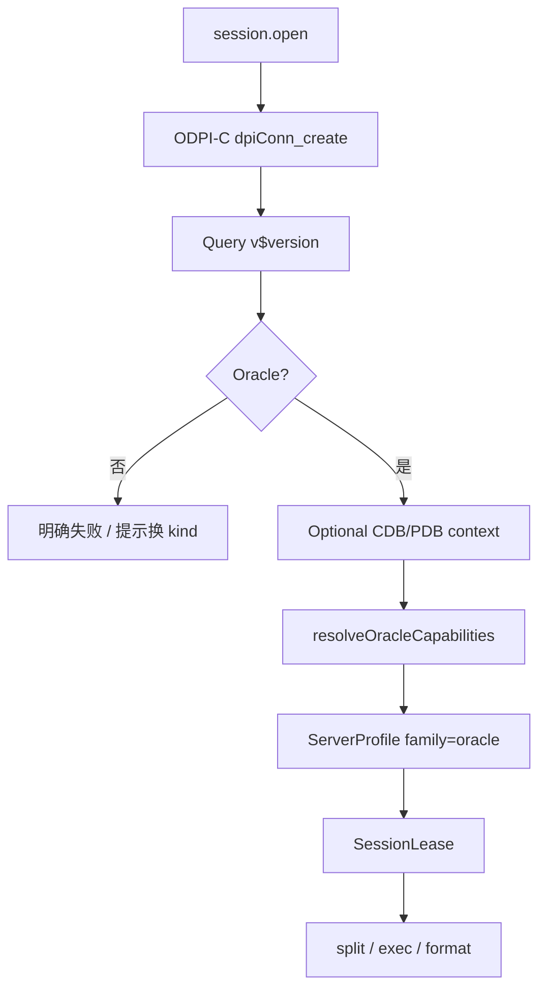

# 29 — Oracle 管理模块（Layer-1 Native 能力服务 + Web 模块）

> 版本：v0.7 · 日期：2026-07-26  
> 状态：**P0–P4 主路径已落地**（含 ObjectScript/packages、LOB、Explain、Monitor、TableDesign、CSV/SQL IO；需 Instant Client）  
> **隔离**：**独立进程 / 独立 kind / 独立 Web 模块 / 独立实现**；禁止与达梦 / Vastbase / 其它库服务混用代码或运行时互调  
> 关联：[13](./13-service-layout.md) · [14](./14-capability-connection-framework.md) · [18](./18-ops-connection-tree.md) · [21](./21-session-registry.md) · [23](./23-sql-dialect-completion.md) · [28 — 达梦](./28-dameng-module.md)（**对象模型对照，非实现依赖**） · [04](./04-plugin-system.md)（L3 Native）

---

## 0. 文档边界

| 写在本文 | 不写在本文 |
|----------|------------|
| `oracle-service`、`family: "oracle"`、Oracle 对象模型与 Cap 表 | 达梦独立模块（[28](./28-dameng-module.md)；**禁止**合并进程/实现） |
| Web `modules/oracle` 与对本 kind 的注册 | Vastbase / MySQL / SQLite 等其它库**业务实现** |
| C++ / ODPI-C / Instant Client 分发与构建 | 共享层硬编码 `if oracle`；跨服务业务包 |
| length-prefixed JSON IPC（与 Go 服务同契约） | 在 platform-core / 壳层写数据字典 SQL |

### 0.1 服务隔离与实现不混用（硬约束）

与 [26](./26-mariadb-module.md) / [27](./27-sqlite-module.md) / [28](./28-dameng-module.md) 同原则：**一引擎 = 一 Layer-1 进程 + 一套实现**。达梦「语法像 Oracle」≠ 可共用本服务代码。

| 层 | 必须独立 | 允许共用（仅框架，无引擎业务） |
|----|----------|--------------------------------|
| 进程 / 二进制 | `niuma-oracle-service` 独享 | — |
| manifest / namespace / kind | `oracle` 独享 | — |
| 实现语言与工程 | `services/oracle-service/`（**C++**，自有 CMake） | `packages/cpp/serviceipc`（`niuma::serviceipc`；与 Go/Rust **字节兼容**） |
| Web 业务模块 | `web/src/modules/oracle/`、`api/oracle.ts` | `modules/database/*` 壳、`sql-editor` 编排（只认 family/Cap） |
| Cap / Probe / 字典 SQL | 只写在本服务 `src/` | — |
| 厂商 native | 仅本服务加载 `runtime/oracle/`（Instant Client） | — |

**禁止**：

1. `import` / 链接其它 `*-service` 的业务实现（含 dameng / vastbase / mysql）。  
2. 抽取「Oracle+达梦共用」业务库，或同进程 `if oracle / if dameng` 分流。  
3. platform 把 `oracle` 与其它 kind 代理到**同一**可执行文件并用内部 if 分流。  
4. 运行时调用 `dameng.*` / `vastbase.*` 完成本模块功能。  
5. Web 把 Oracle 面板并入 `modules/dameng` / `modules/vastbase`，或共用带引擎分支的业务 composable。  
6. 用 `family: "dameng"` / `"vastbase"` 冒充 Oracle 会话。  
7. 以 Go `database/sql` + godror/CGO、或 JVM + JDBC 作为**产品默认路径**（见 §1.3；二者仅作历史对照，不采用）。

**允许**：对照 22/25/28 **复制 Web 骨架与 RPC 方法名后改写**；`sql-editor` 对 oracle 启用 `oracleQQuotes` / `plsqlBlocks` / `script.oracle_slash`——这是编排层 Cap/feature，**不是**服务实现混用。

**与达梦的边界**：

- `oracle-service` 与 `dameng-service` **分进程、分 kind、分模块、分 Cap 前缀、分语言栈**。  
- Probe 连到非 Oracle 实例 → **明确失败**，提示改用对应连接类型。

---

## 1. 目标与范围

面向 **Oracle Database**（11gR2+ / 12c–23ai；含 CDB/PDB、EE/SE）运维与开发：

- 连接站点、对象导航（`connection → schema → {Tables|Views|Procedures|Functions|Packages|Sequences|…}`）
- SQL / PL/SQL 查询执行与结果集浏览（含取消、分页、LOB）
- 元数据（列、索引、约束、DDL、例程源码）
- 包 / 过程 / 函数对象脚本；表设计器与 CSV/SQL 导入导出

归属 `ops` / `data` 域；连接树与 `platform.connection.*` 走通用壳，**业务逻辑只在 `oracle-service` + `web/src/modules/oracle`**。

### 1.1 架构对齐

| 能力层 | 参考 | NiuMa 做法 |
|--------|------|-----------|
| GUI / 对象树 / SQL | SQL Developer / DBeaver / Navicat | Vue + Monaco + **Native 能力服务** |
| 连接与查询 | Oracle Net + OCI | **C++20 + ODPI-C + Instant Client（thick）** |
| 方言差异 | 客户端能力探测 | **DialectFamily + CapabilitySet** |
| 插件级别 | [04](./04-plugin-system.md) L3 Native | 独立重量级进程；厂商库**不**链进 platform-core |
| 安装包 | Instant Client 随组件分发 | `components/oracle-native` 或 `services/bin/runtime/oracle/` |

### 1.2 关键决策（已锁定）

| 维度 | 决策 | 理由 |
|------|------|------|
| 能力级别 | **L3 Native**（重量级独立进程） | 与 [architecture](./architecture.md) / [04](./04-plugin-system.md) 对 Oracle 的定位一致 |
| 语言 | **C++20（唯一产品路径）** | OCI 生态原生语言；长连接、取消、LOB、游标、会话状态控制力最强；**不计构建/分发复杂度** |
| 客户端 API | **ODPI-C**（链 Instant Client） | Oracle 官方维护的现代 C API；完整覆盖连接池、语句取消、LOB、对象类型；比裸 OCI 可维护，比 JDBC/Go 封装更贴近协议语义 |
| 运行时 | **Instant Client Basic（或 Basic Light + 所需包）** | thick 模式；与 ODPI-C 配套；随安装包组件分发 |
| 协议 kind | **`oracle`** | 与其它 kind **不互通** |
| Bridge namespace | **`oracle`** | 仅 `oracle.*` |
| Dialect `family` | **`"oracle"`** | Web 已预留 |
| Cap 前缀 | **`oracle.*`**（可另加跨产品稳定 ID：`proc.*` / `split.*` / `format.*`） | **不**复用 `dameng.*` / `vastbase.*` 默认集 |
| Web 模块 | **`web/src/modules/oracle/`** | 独立注册 |
| 会话策略 | **`per_tab` + 关 Tab 即断** | 对齐 MySQL；多查询 Tab 事务隔离，见 [21](./21-session-registry.md) |
| 凭据 | platform Vault 注入 | [14](./14-capability-connection-framework.md) |
| SSH 隧道 | platform 公共 `tunnel` dialer | 本服务只收展开后的 host/port |
| IPC | **与 Go 服务同形**：4 字节 LE 长度 + UTF-8 JSON | platform `CapabilityRegistry` 零改动接入 |
| 调试 | **首期不做** DBMS_DEBUG_JDWP / SQL Developer 调试器 | 后续可单独立项，仍在本进程或专用 sidecar |
| **禁止默认路径** | Go+godror、JVM+JDBC、ODBC 默认 | 见 §1.3 |

### 1.3 为何不用其它语言（对照后否决为默认）

| 方案 | 专业度 | 否决为产品默认的原因 |
|------|--------|----------------------|
| **C++ + ODPI-C + Instant Client（采用）** | 最高（原生 OCI 语义） | — |
| Go + godror（CGO→OCI） | 中高 | 仍依赖 Instant Client，却多一层 CGO/运行时；取消/类型/错误映射受 Go 驱动约束；**复杂度不减、控制力下降** |
| Java + JDBC（ojdbc） | 高（SQL Developer 同族） | 需捆绑 JRE；大结果集/取消/进程模型与现有 Go L1 不一致；架构已将 Oracle 归 **Native L3** 而非 JVM |
| 纯 Go thin（无 Instant Client） | 低～中 | 协议/类型/安全特性长期落后于 OCI；不适合「最专业」目标 |
| ODBC | 中 | 类型与取消能力弱；UX 依赖系统驱动安装 |

**产品默认目标（锁定）**：**C++20 + ODPI-C + Instant Client thick**。

分发约束：

- Instant Client **默认不随安装包分发**（OTN 再分发义务 + 国内下载不稳定）。  
- 运行时探测顺序：`ORACLE_HOME[/bin]` → 旁载 `services/bin/runtime/oracle/` → PATH 中含 `oci.dll` 的目录。  
- 用户也可在 **设置 → 工具组件 → Oracle Instant Client**（`components/oracle-native`，`detect_only`）浏览指定 `oci.dll`；`oracle-service` manifest 经 `runtime.env_from_component` 注入标准变量 **`ORACLE_HOME`**（platform **不**硬编码 Oracle）。  
- **不做**应用内 `optional_download` 代下载；官方下载页由组件「打开下载页」引导。  
- Instant Client / ODPI **不**链进 platform-core / 壳层。  
- 构建：`scripts/shared/build/build-oracle-service.ps1`；`build-services.ps1` / `pnpm dev:hot` **默认**编入，无工具链时用 `-SkipOracle`。  
- CI：无 Instant Client 的 runner 只编 IPC/JSON 单测（mock），集成测打 `oracle` 标签跳过。  
- 许可证：若未来改为随包/代下载，须遵守 OTN Instant Client 再分发条款并更新 EULA / `docs/compliance/NOTICES.txt`。

### 1.4 已预留（无需重做）

| 层 | 现状 |
|----|------|
| `SqlDialect` / `DialectFamily` | 已含 `'oracle'` |
| 拆句 | `oracleQQuotes`、`plsqlBlocks`；Cap `script.oracle_slash` |
| `useSqlQueryEditor` | `family === 'oracle'` → `'oracle'` |
| sql-history key | `niuma.oracle.sqlHistory.*` 前缀已预留 |

落地时补：`defaultOracleProfile()`、Cap 常量、`defaultProfileForFamily('oracle')`、AI 方言规则、Web 模块注册。

---

## 2. 产品模型：DialectFamily + CapabilitySet

`session.open` / `session.test` 返回（platform **整包透传**）：

```json
{
  "sessionId": "...",
  "dialect": {
    "family": "oracle",
    "version": "19.21.0.0.0",
    "versionNum": "190210000",
    "sqlCompatibility": "",
    "capabilities": [
      "oracle.double_quote_ident",
      "oracle.q_quote",
      "proc.plsql_bare",
      "split.plsql_blocks",
      "script.oracle_slash",
      "format.plsql",
      "editor.builtin_sql",
      "editor.sql_lsp",
      "routine.create_procedure",
      "routine.create_function",
      "oracle.package",
      "sequence.native",
      "oracle.cdb_pdb"
    ]
  }
}
```

`family` **始终为 `"oracle"`**。Edition / PDB 名等可放 `dialect` 扩展字段或 Cap，供 AI / UI 展示；**禁止**用 `family: "dameng"` 表示兼容模式。

### 2.1 Capability ID（本模块稳定字符串）

新增只加常量，**勿改已发布取值**。

| Capability | 含义 | 默认 | 启用阶段 |
|------------|------|------|----------|
| `oracle.double_quote_ident` | 标识符双引号 | ✓ | P0 |
| `oracle.q_quote` | `q'[…]'` / `q'{…}'` 字符串 | ✓ | P0 |
| `proc.plsql_bare` | `AS\|IS … BEGIN … END;` | ✓ | P0/P3 |
| `split.plsql_blocks` | 过程体内 `;` 不拆句 | ✓ | P0 |
| `script.oracle_slash` | 独立行 `/` 提交 | ✓ | P0 |
| `format.plsql` | plsql 格式化规则 | ✓ | P0 |
| `editor.builtin_sql` | P0 默认编辑器 | ✓ | P0 |
| `editor.sql_lsp` | Bridge LSP（C++ sqllsp） | ✓ | P1 |
| `editor.genericsql_monaco` | ~~genericsql + Worker~~（已废弃，见 docs/23） | — | — |
| `routine.create_procedure` / `routine.create_function` | 对象脚本模板 | ✓ | P3 |
| `oracle.package` | 包头/包体对象 | ✓ | P2/P3 |
| `sequence.native` | 序列 | ✓ | P2 |
| `oracle.cdb_pdb` | CDB/PDB（12c+ Probe） | 按版本 | P1 |
| `oracle.identity` | IDENTITY 列（12c+） | 按版本 | P2 |
| `oracle.json_type` | JSON 类型（21c+ 等） | 按版本 | P2 |

**解析优先级（Web）**：Capability **优先** → 无 Cap 时用 `family === 'oracle'` 回退（双引号、Q 引号、PL/SQL 块、`/`）。禁止业务散落无 Cap 的硬编码分支（新增行为只加 Cap）。

### 2.2 Probe（P0）

1. ODPI-C 建连成功（Easy Connect 或完整描述符）。  
2. 查询版本：`SELECT banner FROM v$version WHERE ROWNUM = 1`（及可选 `PRODUCT_COMPONENT_VERSION`）。  
3. 确认 Oracle 特征；非 Oracle → **失败**。  
4. 可选：读 `SYS_CONTEXT('USERENV','CON_NAME')` / CDB 标志 → `oracle.cdb_pdb`。  
5. 纯函数 `resolveOracleCapabilities(version, flags)` → Cap 表（C++ 单测或 golden JSON）。  
6. **P0 不做** 过程编译试探；包/过程脚本确认放 P3。  
7. 成功返回整包 `dialect`（`family: "oracle"`）。



---

## 3. 分层与进程模型

```
┌ Layer 4 ─ Web ────────────────────────────────────────────┐
│ web/src/modules/oracle/                                    │
│   连接表单 · 树 Provider · Query · 对象面板                 │
│   ↑ bridgeInvoke(oracle.*)    ↑ bridgeOnEvent(niuma:event) │
└───┼───────────────────────────┼────────────────────────────┘
    │ cefQuery                  │ PostMessage
┌ Layer 3 ─ C++ Shell ──────────┴────────────────────────────┐
│ bridge_router · platform_client · 事件回投 UI               │
└───┼───────────────────────────▲────────────────────────────┘
    │ length-prefixed JSON      │ 事件帧
┌ Layer 2 ─ platform-core ──────┴────────────────────────────┐
│ platform.connection.* + oracle.* 代理 + 凭据注入            │
└───┼───────────────────────────▲────────────────────────────┘
    │                           │ query / io 进度事件
┌ Layer 1 ─ oracle-service（C++20 + ODPI-C）─────────────────┐
│ 会话池 · dialect Probe · query · tree · catalog · meta     │
│ 旁路加载 Instant Client（runtime/oracle）                   │
└───────────────────────────────┬────────────────────────────┘
                                │ Oracle Net（默认 1521）
                                ▼
                         Oracle Database
```

要点：

- 壳层与 platform-core **不写** Oracle 业务 SQL / 数据字典语义。  
- Instant Client **仅**本进程 `LoadLibrary` / `dlopen`（或 rpath）；崩溃隔离在 L1。  
- 海量对象：树默认轻量 + `filter` / `limit` / `truncated`；禁止树节点默认全库 `COUNT(*)`。  
- 系统 schema（`SYS` / `SYSTEM` / `XDB` / `CTXSYS` …）默认可排除，选项对齐 MySQL `excludeSystem`。

### 3.1 工程布局

```
services/
├── manifests/oracle-service.yaml
├── bin/
│   ├── niuma-oracle-service.exe      # 构建产物
│   └── runtime/oracle/               # Instant Client + ODPI-C 运行时（不进 git 大文件；LFS 或安装包）
└── oracle-service/
    ├── CMakeLists.txt                # add_subdirectory → niuma::serviceipc
    ├── README.md
    ├── third_party/
    │   └── odpi/                     # ODPI-C 源码（git submodule 或 vendor）
    ├── src/
    │   ├── main.cpp                  # 入口；链接 packages/cpp/serviceipc
    │   ├── dialect/                  # ServerProfile / Cap* / Probe
    │   ├── session/                  # 连接池、query.exec/cancel、tx
    │   ├── handler/                  # method → 实现（nlohmann/json）
    │   ├── tree/ · catalog/ · meta/  # P1+
    │   ├── ddl/ · dataio/            # P4
    │   └── util/
    └── tests/

packages/cpp/serviceipc/              # 公共 IPC（勿在各 C++ 服务内复制）
├── include/niuma/serviceipc/         # frame · server · message
└── src/

web/src/modules/oracle/
├── views/
├── components/
├── composables/
├── completion/
├── connection-form-adapter.ts
├── register-conn-form.ts
├── register-conn-full.ts
├── conn-tree-provider.ts
├── conn-tree-actions.ts
├── conn-nav-strategy.ts
├── pane-registry.ts
├── locale/
└── sql-seed.ts

web/src/api/
├── oracle.ts
└── types/oracle.ts
```

跨库 **UI 壳 / 编排**（无引擎业务）：`modules/database/*`、`modules/sql-editor/*`。  
Oracle 的 session/query/tree/meta/IO/对象脚本 **适配只写在** `modules/oracle/` + `oracle-service`。

### 3.2 IPC 字节契约（与 Go 对齐）

与 `packages/go/serviceipc/protocol` / `packages/cpp/serviceipc` 完全一致：

1. 每帧：`uint32` 小端长度 + UTF-8 JSON 正文（长度不含 4 字节头）。  
2. 请求：`{ "id", "method", "params" }`（platform 已剥 `oracle.` 前缀，method 为 `session.open` 等）。  
3. 响应：`{ "id", "result" }` 或 `{ "id", "error": { "code", "message" } }`。  
4. 事件（后续）：独立连接或同管道约定帧，形状对齐其它服务 `niuma:event`。

Windows：Named Pipe `\\.\pipe\niuma.oracle`；Unix：UDS `/tmp/niuma.oracle.sock`。

---

## 4. 连接参数（ConnectParams）

与 [14](./14-capability-connection-framework.md) 公共子对象对齐：

| 字段 | 默认 | 说明 |
|------|------|------|
| host / port | `1521` | 直连或隧道对端 |
| user / password | — | Vault 注入 |
| service_name | — | Easy Connect 优先（推荐） |
| sid | — | 与 `service_name` 二选一；并存时 **service_name 优先** |
| schema | 空 | 默认 `ALTER SESSION SET CURRENT_SCHEMA` |
| role | `normal` | `normal` / `sysdba` / `sysoper`（ODPI-C auth mode） |
| appName | `NiuMa` | `dpiConn_setClientInfo` / module |
| ssl_mode | `disable` | `disable`（TCP）/ `require`（TCPS）/ `verify-full`（TCPS + Wallet + DN 校验） |
| wallet_path / wallet_password | 空 | `verify-full` 必填路径；优先自动登录钱包（`cwallet.sso`） |
| tunnel | SSH 跳板 | 复用 platform 公共 tunnel |
| excludeSystemSchemas | `true` | 树/catalog 默认排除系统用户 |

连接串组装（服务内）：优先 Easy Connect  
`host:port/service_name`；SID 模式用描述符 `(DESCRIPTION=…)`。  
P0 验收：明文直连 +（平台已通时）SSH 隧道下 `session.test` 成功；错误信息不含明文密码。

---

## 5. Bridge 契约

命名空间：`oracle`。方法名与 [23](./23-sql-dialect-completion.md) 对齐；**参数语义按 Oracle 对象模型（schema 层）**。

### 5.1 会话

| 方法 | 入参 | 返回 |
|------|------|------|
| `session.open` | `{ profileId }` | `{ sessionId, dialect }` |
| `session.close` | `{ sessionId }` | `{ closed: true }` |
| `session.test` | profile 或连接参数 | `{ ok, message, version?, dialect? }` |

### 5.2 查询

| 方法 | 说明 |
|------|------|
| `query.exec` | 单语句执行；Web 拆句后顺序调用 |
| `query.fetch` / `query.close` / `query.cancel` | 分页与取消（ODPI-C break / 独立 worker 连接） |
| `query.explain` | P4；`EXPLAIN PLAN` + `DBMS_XPLAN` |

**拆句**：`split.plsql_blocks` + `oracle.q_quote`；`script.oracle_slash` 时独立行 `/` 为批边界。协议层不发送无意义的客户端指令行（如裸 `SET` 若未实现则剥离或报错）。

**类型**：NUMBER / DATE / TIMESTAMP / INTERVAL / CLOB / BLOB / RAW / JSON（按版本）在服务内规范为 JSON 可传输表示（字符串 + 元数据 type）；LOB 默认截断策略 + 显式「加载完整」RPC（P2）。

### 5.3 树（导航，P1）

```
connection → schema → {Tables|Views|Procedures|Functions|Packages|Sequences} → object
```

| 方法 | 说明 |
|------|------|
| `tree.schemas` | 用户/模式（可 excludeSystem） |
| `tree.tables` | `schema` + `types: table\|view` |
| `tree.routines` | `types: procedure\|function` |
| `tree.packages` | 包对象（P2） |
| `tree.sequences` | 序列（P2） |
| `tree.categoryCounts` | 分类徽章 |

ResourceId：

```
res:{profileId}:schema:{schema}
res:{profileId}:schema:{schema}:table:{table}
res:{profileId}:schema:{schema}:package:{name}
res:{profileId}:schema:{schema}:procedure:{name}
```

段名用 **`schema`**（不用 `database`）。

### 5.4 目录补全 `catalog.*`

| RPC | Oracle 语义 |
|-----|-------------|
| `catalog.schemas` | `ALL_USERS`（降级 `USER_USERS`） |
| `catalog.tables` | `ALL_TABLES` / `ALL_VIEWS` |
| `catalog.columns` | `ALL_TAB_COLUMNS` |

必须支持 `prefix` / `limit` / `truncated`。

### 5.5 元数据 / DDL

| 方法 | 阶段 | 说明 |
|------|------|------|
| `meta.columns` / `indexes` / `ddl` | P2 | `DBMS_METADATA.GET_DDL` 优先 |
| `meta.primaryKey` / `foreignKeys` | P2/P4 | 设计器 |
| `meta.routineSource` / `meta.packageSource` | P3 | `ALL_SOURCE` / `DBMS_METADATA` |
| `meta.processlist` / `meta.kill` | P4 | `GV$SESSION`；权限不足则 UI 降级 |
| `meta.instanceOverview` / `meta.locks` | P4 | Monitor |

### 5.6 对象脚本 / 设计器 / IO

| 能力 | 阶段 | 说明 |
|------|------|------|
| ObjectScript（视图/过程/函数/包） | P3 | 壳用 `ObjectScriptShell`；模板在本模块 |
| TableDesign | P4 | 壳用 `TableDesignShell`；Oracle 类型逻辑在本服务 |
| `io.exportCsv` / `importCsv` / `dumpSql` / `execSqlFile` | P4 | 任务进全局 Dock |
| `tx.*` | P2 | 与 MySQL 同名事务 API（OCI 事务） |

IO 约束：

- Oracle IO 使用固定 2 worker 队列；取消会设置协作标志并通过 `dpiConn_breakExecution` 尝试打断当前 ODPI 调用。
- CSV 按 RFC 4180 流式解析，支持列映射和字段内换行；RAW/BLOB 使用 `0x` 十六进制文本。导入“清空”使用事务内 `DELETE`，失败或取消可回滚。
- CSV 导出和 SQL 转储先写同目录临时文件，完成后原子替换目标；失败或取消不会留下可误认成完整结果的目标文件。
- SQL 文件按块拆句执行，内存与最大单条语句相关。Oracle DDL 会隐式提交，因此取消或失败只能回滚尚未提交的 DML，不能撤销已经执行的 DDL。
- SQL 转储遇到无法无损序列化的类型、对象枚举截断、DDL/数据读取失败时必须失败，不允许静默写 `NULL` 或报告成功。

**不做（首期）**：SQL Developer 级调试器；外部 `sqlplus`/`sqlcl` CLI 封装（若后续做，走外部组件注册，不编进 platform）。

---

## 6. Web 模块落地要点

### 6.1 注册

- `register-conn-form.ts` / `register-conn-full.ts`  
- `builtin-modules.ts`：`id: 'oracle'`，`category: 'data'`，`routePath: '/oracle'`  
- i18n：`nav.oracle`（中文「Oracle」）  
- 图标：`oracle`

### 6.2 会话 Tab

| Tab | Phase | 壳 |
|-----|-------|-----|
| Query | P0 | `SqlQueryShell` + `QueryResultPanel` |
| Browse | P2 | `BrowseDataShell` |
| DDL | P2 | 只读 |
| ObjectScript | P3 | `ObjectScriptShell` |
| Monitor | P4 | 自研面板 |
| Design | P4 | `TableDesignShell` |
| Transfer | P4 | `DataTransferShell` |

### 6.3 连接表单

- 基础：host / port(1521) / user / password / service_name（或 SID）/ 默认 schema  
- 高级：role（SYSDBA）、excludeSystem、appName  
- Wallet / TCPS Tab、SSH 隧道：对齐其它库字段形

### 6.4 sql-editor 补齐清单

1. `Cap` 增加 `oracle.*`（double_quote / q_quote / package / cdb_pdb / …）  
2. `defaultOracleProfile()` + `defaultProfileForFamily`  
3. `buildAiDialectRules`：双引号、Q 引号、`ROWNUM`、`FETCH FIRST`、`/`、包与过程  
4. 格式化：`format.plsql`  
5. 单测覆盖 oracle split（Q 引号 + 过程块 + `/`）— 多数已存在，补 Cap 路径

---

## 7. 分期与验收

| Phase | 内容 | 验收要点 |
|-------|------|----------|
| **Spike** | Instant Client + ODPI-C 连通、版本 SQL、取消、CLOB/NUMBER/DATE | 选型已锁定 §1.2；写出链接命令与 runtime 布局 |
| **文档** | 本稿 | Cap / 系统视图名固化 |
| **P0** | 服务骨架、manifest、IPC、`session.*`、Probe、Query、Home/Session、注册 | 直连执行 SELECT；dialect 整包返回 |
| **P1** | tree / categoryCounts / catalog / Bridge LSP 补全 | schema→表展开；查询/对象脚本智能提示 |
| **P2** | meta、Browse、tx.*、packages/sequences 节点、LOB 策略 | Browse/DDL；事务 |
| **P3** | routine/package 源码、ObjectScript、AI 规则 | 过程/包编辑保存刷新树 |
| **P4** | Monitor、Explain、设计器、CSV/SQL IO | 常用集对齐 MySQL P4 密度 |

---

## 8. manifest 草案

```yaml
id: com.niuma.oracle
name: Oracle Service
version: 0.1.0
bridge:
  namespace: oracle
  connection_kind: oracle
session:
  inject_credentials: true
  credential_methods:
    - session.open
    - session.test
runtime:
  executable: bin/niuma-oracle-service.exe
  executable_windows: bin/niuma-oracle-service.exe
  executable_unix: bin/niuma-oracle-service
  lang: cpp
  # Instant Client 旁路目录（相对 services/）；进程启动时设置 OCI DLL 搜索路径
  native_runtime: bin/runtime/oracle
  env_from_component:
    - name: ORACLE_HOME
      bundle_id: com.niuma.components.oracle-native
      tool_id: instant-client
      as_directory: true
ipc:
  transport_windows: named_pipe
  transport_unix: unix_socket
  address_windows: '\\.\pipe\niuma.oracle'
  address_unix: '/tmp/niuma.oracle.sock'
  protocol: length_prefixed_json
lifecycle:
  startup: lazy
permissions: []
```

构建：

```powershell
# 需 ORACLE_HOME / Instant Client SDK；见 services/oracle-service/README.md
.\scripts\build-oracle-service.ps1
```

常规 `.\scripts\build-services.ps1` **不**强制编本服务（避免无 Instant Client 的开发机失败）。

---

## 9. 红线

1. **禁止**与其它库服务混用实现（完整列表见 §0.1）。  
2. **禁止**以 Go+godror 或 JVM+JDBC 作为产品默认实现替换 C++/ODPI-C。  
3. **禁止** 与达梦 / Vastbase 合并为同一 Layer-1 进程用内部 if 分流。  
4. **禁止** `family: "dameng"` / `"vastbase"` 冒充 Oracle 会话。  
5. **禁止** 在 platform-core / 壳层写 Oracle 数据字典 SQL。  
6. **禁止** Instant Client / ODPI 动态库链进 platform-core 或其它服务；仅 `oracle-service` 加载。  
7. 新工具 / MCP 保持外部化，不编进平台 Server 二进制。  
8. 错误日志与 Bridge 响应 **不得**回显明文密码 / wallet 密码。

---

## 10. 开工 checklist

### Spike（P0 前）

- [x] 锁定实现栈：**C++20 + ODPI-C + Instant Client**（本文 §1.2 / §1.3）  
- [ ] 本机 Instant Client 连通：建连、简单查询、`dpiConn_breakExecution` 取消、CLOB/DATE  
- [x] 固化版本 SQL（`v$version` banner；树/catalog 系统视图名见 §5，P1 实现）  
- [x] Instant Client 默认不随包；`components/oracle-native`（detect_only）+ NOTICES 说明；再分发合规文案待「若改为随包/代下载」时补 EULA  


### 后端 P0

- [x] `services/oracle-service/` CMake 工程 + IPC 帧  
- [x] `services/manifests/oracle-service.yaml`  
- [x] `session.*` + Probe + Cap  
- [x] `query.exec|fetch|close|cancel`  
- [x] `scripts/shared/build/build-oracle-service.ps1` + `runtime/oracle` 布局说明  

### 前端 P0

- [x] `modules/oracle` Home/Session/ConnectionFields/QueryPane  
- [x] register + `api/oracle.ts` + builtin-modules + i18n  
- [x] `defaultOracleProfile` + Cap  
- [ ] 冒烟：建连 → SQL → 结果网格（需本机 Instant Client + Oracle 实例）  

### 后端 P1

- [x] `tree.schemas|tables|routines|sequences|categoryCounts`  
- [x] `catalog.schemas|tables|columns`  
- [x] Web 连接树 provider  
- [x] Bridge LSP：`oracle.lsp.open|rpc|close|lexicon` + `packages/cpp/sqllsp` 启发式补全  
- [x] Oracle 词表深化：内置函数片段 / CREATE 片段；PACKAGE；序列 `NEXTVAL`/`CURRVAL`；CONNECT BY / OVER / FETCH 槽  
- [x] Cap `editor.sql_lsp`；前端 `monaco-bootstrap` / `useOracleSqlEditor` attach  
- [x] 查询层资源安全：`StmtGuard`、peek `hasMore`、`timeoutMs`/`requestId` 取消、标识符转义  

### 后端 / 前端 P2

- [x] `meta.columns|indexes|ddl|primaryKey`  
- [x] `tx.getState|setAutoCommit|commit|rollback`（OCI commit；autoCommit 时 DML 后自动 commit）  
- [x] Browse / DDL 面板  

### 后端 / 前端 P3

- [x] `tree.packages` + `meta.routineSource` / `meta.packageSource`  
- [x] ObjectScript（视图/过程/函数/包）  
- [x] LOB 预览截断（`$lob`）+ `query.loadLob`  

### 后端 / 前端 P4

- [x] `query.explain`（EXPLAIN PLAN + DBMS_XPLAN）  
- [x] Monitor：`meta.processlist` / `kill` / `instanceOverview` / `locks`  
- [x] `meta.foreignKeys`；TableDesign（`ddl.design*` / `createTable*`）  
- [x] CSV/SQL IO（`io.exportCsv|importCsv|dumpSql|execSqlFile|cancel` + `oracle.io.*` 事件）  


### 关联文档

- [x] 本文  
- [x] [13](./13-service-layout.md) / [14](./14-capability-connection-framework.md) / [23](./23-sql-dialect-completion.md) / README 索引  
- [x] 实现后回写本文状态与 Phase（后端 P0 骨架）  

---

## 11. 与其它模块对照（速查）

> 下表仅作产品能力对照；**每一列对应独立服务与独立实现，互不混用**。

| 项 | Oracle（本文） | 达梦 [28](./28-dameng-module.md) | MySQL [25](./25-mysql-module.md) | Vastbase [22](./22-vastbase-module.md) |
|----|----------------|----------------------------------|----------------------------------|----------------------------------------|
| 服务 | `oracle-service`（**C++**） | `dameng-service`（Go） | `mysql-service`（Go） | `vastbase-service`（Go） |
| 级别 | **L3 Native** | L1/L2 Go 进程 | L1/L2 Go 进程 | L1/L2 Go 进程 |
| 驱动/API | ODPI-C + Instant Client | 官方纯 Go `dm` | go-sql-driver | pgx |
| 连接 | host:1521 + service/SID | host:5236 | host:3306 | host:5432 |
| 对象根 | schema（+ package） | schema | database | database→schema |
| 拆句 | Q 引号 + PL/SQL + `/` | 同左（独立实现） | DELIMITER + compound | PL/SQL + $$ |
| 格式化 | `plsql` | `sql`（可升 plsql） | `mysql` | `plsql` |
| 实现混用 | **禁止** | **禁止** | **禁止** | **禁止** |

---

## 12. 修订记录

| 版本 | 日期 | 说明 |
|------|------|------|
| v0.1 | 2026-07-26 | 初稿：锁定 C++20 + ODPI-C + Instant Client；独立服务/kind；Cap/树/分期；禁止与达梦合流及 Go/JDBC 默认路径 |
| v0.2 | 2026-07-26 | 后端 P0：`oracle-service` CMake/IPC/`session.*`/`query.*`/manifest/构建脚本；文档交叉引用 |
| v0.3 | 2026-07-26 | IPC 抽至 `packages/cpp/serviceipc`（`niuma::serviceipc`），oracle-service 仅业务 |
| v0.4 | 2026-07-26 | 查询 RAII/`hasMore`/超时取消；`tree.*`/`catalog.*`；Web P0 模块注册与 Query |
| v0.5 | 2026-07-26 | 连接树；`meta.*`/`tx.*`；Browse/DDL；manifest 凭据注入扩展 |
| v0.6 | 2026-07-26 | packages/ObjectScript；LOB/`loadLob`；Explain；Monitor |
| v0.7 | 2026-07-26 | `meta.foreignKeys`；`ddl.*` 设计器；`io.*` DataTransfer；事件发布；Web Design/IO 接线 |
