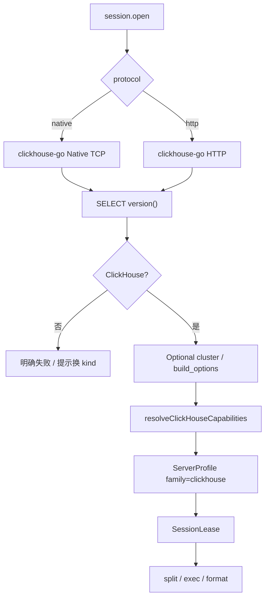

# 30 — ClickHouse 管理模块（Layer-1 能力服务 + Web 模块）

> 版本：v0.9 · 日期：2026-07-30  
> 状态：**P0–P4 常用集 + LSP / Browse 行编辑 / 外部 clickhouse-client**（session/query/tree/catalog/meta、Browse 可编辑、DDL/ObjectScript、`io.*`、EXPLAIN、Monitor、表设计器、`clickhouse.lsp.*`、`tools.*`；**事务 `tx.*` / 过程调试仍不做**）  
> **隔离**：**独立进程 / 独立 kind / 独立 Web 模块 / 独立实现**；禁止与 MySQL / Vastbase / 其它库服务混用代码或运行时互调  
> 关联：[13](./13-service-layout.md) · [14](./14-capability-connection-framework.md) · [18](./18-ops-connection-tree.md) · [21](./21-session-registry.md) · [23](./23-sql-dialect-completion.md) · [25 — MySQL](./25-mysql-module.md)（**树形与反引号节奏对照，非实现依赖**） · [27 — SQLite](./27-sqlite-module.md)（**分期节奏对照，非实现依赖**）

---

## 0. 文档边界

| 写在本文 | 不写在本文 |
|----------|------------|
| `clickhouse-service`、`family: "clickhouse"`、ClickHouse 对象模型与 Cap 表 | MySQL / MariaDB 等其它库**业务实现**（即便标识符也用反引号） |
| Web `modules/clickhouse` 与对本 kind 的注册 | 共享层硬编码 `if clickhouse`；跨服务 Go 业务包 |
| Native / HTTP 协议选型、`system.*` 字典 SQL | 把 ClickHouse 伪装成 `family: "mysql"` 会话 |

### 0.1 服务隔离与实现不混用（硬约束）

与 [26](./26-mariadb-module.md) / [27](./27-sqlite-module.md) / [28](./28-dameng-module.md) 同原则：**一引擎 = 一 Layer-1 进程 + 一套实现**。ClickHouse「SQL 像 MySQL、端口可走 HTTP」≠ 可共用 `mysql-service` 代码。

| 层 | 必须独立 | 允许共用（仅框架，无引擎业务） |
|----|----------|--------------------------------|
| 进程 / 二进制 | `niuma-clickhouse-service` 独享 | — |
| manifest / namespace / kind | `clickhouse` 独享 | — |
| Go 模块 | `services/clickhouse-service/` 自有 `go.mod` + `internal/*` | `packages/go/serviceipc`、`tunnel`、`logutil` 等**无引擎语义**包 |
| Web 业务模块 | `web/src/modules/clickhouse/`、`api/clickhouse.ts` | `modules/database/*` 壳、`sql-editor` 编排（只认 family/Cap） |
| Cap / Probe / 字典 SQL | 只写在本服务 `internal/dialect|tree|meta|…` | — |

**禁止**：

1. `import` 其它 `*-service` 的 `internal/`（含 mysql / mariadb / vastbase / sqlite / dameng / oracle）。  
2. 抽取「MySQL+ClickHouse 共用」Go 业务包，或同进程 `if mysql / if clickhouse` 分流。  
3. platform 把 `clickhouse` 与其它 kind 代理到**同一**可执行文件并用内部 if 分流（默认：**一 manifest = 一二进制**）。  
4. 运行时调用 `mysql.*` / `vastbase.*` 等完成本模块功能。  
5. Web 把 ClickHouse 面板并入 `modules/mysql`，或共用带引擎分支的业务 composable。  
6. 用 `family: "mysql"` / `"generic"` 冒充 ClickHouse 会话（词法回退仅作无 Cap 时的最后手段，Probe 成功后必须是 `clickhouse`）。

**允许**：对照 25/27 **复制骨架后改写**；`sql-editor` 对 clickhouse 启用反引号等**同名拆句特性位**——这是编排层 Cap/feature，**不是**服务实现混用。

**多库协作约定**：共享层只认 DialectFamily + CapabilitySet + 同名 RPC；**各库实现只落在各自服务与 Web 模块**，互不混用。

---

## 1. 目标与范围

面向 **ClickHouse**（开源 / Cloud；目标兼容 **22.8 LTS+**，以官方当前支持主线为准）运维与分析开发：

- 连接站点、对象导航（`connection → database → {Tables|Views|MaterializedViews|Dictionaries}`）
- SQL 查询执行与结果集浏览（含取消、分页、大结果截断）
- 元数据（列、引擎、分区键 / 排序键、DDL、`system.*`）
- 表数据 Browse、CSV / 原生格式导入导出（后期）；集群与进程监控（后期）

归属 `ops` / `data` 域；连接树与 `platform.connection.*` 走通用壳，**业务逻辑只在 `clickhouse-service` + `web/src/modules/clickhouse`**。

### 1.1 架构对齐

| 能力层 | 参考 | NiuMa 做法 |
|--------|------|-----------|
| GUI / 对象树 / SQL | DBeaver / DataGrip / Tabix / ClickHouse Play | Vue + Monaco + Go 能力服务 |
| 连接与查询 | Native TCP / HTTP | **Go + 官方 `clickhouse-go/v2`** |
| 方言差异 | 客户端能力探测 | **DialectFamily + CapabilitySet**（契约见 [23](./23-sql-dialect-completion.md)） |
| 安装包 | 独立客户端 | 仅 `niuma-clickhouse-service` Go 二进制（无 JVM / 无额外 native 旁载） |

### 1.2 关键决策

| 维度 | 决策 | 理由 |
|------|------|------|
| 能力服务 | 独立 Layer-1 **`clickhouse-service`** | 长连接、取消、崩溃隔离；与其它库服务分离 |
| 语言 | **Go（唯一）** | 与既有 Layer-1 一致；官方 Go 驱动成熟 |
| 驱动 | **`github.com/ClickHouse/clickhouse-go/v2`** | 官方维护；Native + HTTP；支持 `database/sql` 与 native API |
| 默认传输 | **Native TCP（端口 9000 / TLS 9440）** | 性能与类型保真最佳；HTTP（8123 / 8443）作选项（LB / 代理场景） |
| API 面 | P0 优先 **`database/sql`（`clickhouse.OpenDB`）** 与现有 session/query 模式对齐；大批量 INSERT / 列式导出可在 P3+ 用 native `Conn`/`PrepareBatch` | 降低与其它 Go 服务的会话模型差异 |
| 协议 kind | **`clickhouse`** | 与其它 kind **不互通** |
| Bridge namespace | **`clickhouse`** | 仅 `clickhouse.*` |
| Dialect `family` | **`"clickhouse"`** | Cap 前缀 `clickhouse.*`；**不**复用 `mysql.*` 默认集作伪装 |
| Web 模块 | **`web/src/modules/clickhouse/`** | 独立注册 |
| 会话策略 | **`per_profile` + idle** | 见 [21](./21-session-registry.md)；同站点多 Tab 共享业务会话 |
| 凭据 | platform Vault 注入 | [14](./14-capability-connection-framework.md) |
| SSH 隧道 | platform 公共 `tunnel` dialer | 本服务只收展开后的 host/port |
| 事务 `tx.*` | **不做** | ClickHouse 无传统多语句 ACID；Query 面板 `show-transaction=false` |
| 存储过程调试 | **不做** | 无 PL 调试面；UDF 仅对象浏览 |
| **禁止** | 与其它 `*-service` 混用；JVM/JDBC sidecar；MCP 进 platform | 见 §0.1 |

### 1.3 驱动与协议（锁定）

| 方案 | 说明 | 结论 |
|------|------|------|
| **A. clickhouse-go/v2 Native TCP（采用默认）** | `Protocol: Native`，默认 `9000` | **产品默认** |
| **B. clickhouse-go/v2 HTTP** | `Protocol: HTTP`，默认 `8123`；适合经 HTTP LB / 反向代理 | ConnectParams `protocol: http` 可选 |
| C. 纯 REST / 自拼 HTTP | 无类型 / 取消能力弱 | **否决** |
| D. JDBC / clickhouse-jdbc | 需 JVM | **否决**（同 Vastbase/达梦原则） |

**采用（锁定）**：方案 A 为默认；B 为连接选项。构建 `CGO_ENABLED=0`。依赖写入本服务 `go.mod`，不进 platform-core。

分发约束：

- 无厂商动态库旁载。  
- 纳入 `scripts/build-services.ps1` / `go.work`。  
- CI：无 ClickHouse 实例时集成测打 `clickhouse` 标签跳过；保留 dialect Cap 单测。

### 1.4 协议与兼容范围

| 项 | 说明 |
|----|------|
| 目标产品 | ClickHouse Server / ClickHouse Cloud（Cloud 常见仅 HTTP(S) → 表单默认可切 HTTP） |
| 线协议 | Native TCP **9000**（TLS **9440**）；HTTP **8123**（TLS **8443**） |
| SQL | ClickHouse SQL + 扩展类型（Array / Map / Tuple / Nested / JSON 等） |
| 元数据 | 以 **`system.*`** 为准（`system.databases` / `system.tables` / `system.columns` / `system.dictionaries` …） |
| 引擎 | MergeTree 族、View / MaterializedView、Dictionary、Distributed 等；树节点展示 `engine` |
| **不做（首期）** | 传统 `tx.*`；过程调试；把 Distributed 集群管理做成独立产品（P4 仅只读展示） |

### 1.5 待预留（落地时补齐）

| 层 | 现状（写文档时） | 落地时补 |
|----|------------------|----------|
| `SqlDialect` / `DialectFamily` | **尚未**含 `'clickhouse'` | 增加 `'clickhouse'` |
| 格式化 | — | P0：`formatterLanguage: 'sql'`（或 `spark` 试验）；Cap `format.sql` |
| Monaco | — | P0：`editor.builtin_sql` → 内置 `sql` / `genericsql`；P1+ 可评估 sparksql/hivesql Worker |
| 拆句 | — | 反引号 + 通用 `;`；**无** DELIMITER / PL/SQL 块 / `/` |
| Cap / Profile | — | `defaultClickHouseProfile()`、`defaultProfileForFamily('clickhouse')`、AI 方言规则 |

---

## 2. 产品模型：DialectFamily + CapabilitySet

`session.open` / `session.test` 返回（platform **整包透传**）：

```json
{
  "sessionId": "...",
  "dialect": {
    "family": "clickhouse",
    "version": "24.8.4.13",
    "versionNum": "24080413",
    "sqlCompatibility": "",
    "capabilities": [
      "clickhouse.backtick_ident",
      "clickhouse.double_quote_ident",
      "clickhouse.settings_clause",
      "clickhouse.format_clause",
      "format.sql",
      "editor.builtin_sql",
      "editor.sql_lsp",
      "ddl.if_not_exists",
      "cte.window",
      "clickhouse.array_map_tuple",
      "clickhouse.materialized_view",
      "clickhouse.dictionary"
    ]
  }
}
```

`family` **始终为 `"clickhouse"`**。Cloud / 开源差异用 Cap 或扩展字段表达，**禁止**写成 `family: "mysql"`。

### 2.1 Capability ID（本模块稳定字符串）

新增只加常量，**勿改已发布取值**。前缀：`clickhouse.*` / `format.*` / `editor.*` / `ddl.*` / `io.*`。

| Capability | 含义 | 默认 | 启用阶段 |
|------------|------|------|----------|
| `clickhouse.backtick_ident` | 标识符反引号 `` `name` `` | ✓ | P0 |
| `clickhouse.double_quote_ident` | 标识符双引号（兼容） | ✓ | P0 |
| `clickhouse.settings_clause` | 语句级 `SETTINGS …` | ✓ | P0 |
| `clickhouse.format_clause` | `FORMAT JSON/CSV/…`（脚本识别；协议层结果仍走 RPC 表格） | ✓ | P1 |
| `format.sql` | 通用 sql-formatter | ✓ | P0 |
| `editor.builtin_sql` | P0 默认编辑器（无 LSP 时回退） | ✓ | P0 |
| `editor.sql_lsp` | Bridge 隧道 LSP（`clickhouse.lsp.*` + `clickhouseparser`） | ✓ | P5 |
| `ddl.if_not_exists` | `CREATE … IF NOT EXISTS` | ✓ | P2 |
| `cte.window` | CTE / 窗口函数 | ✓（现代版本） | P0 |
| `clickhouse.array_map_tuple` | Array / Map / Tuple 展示与字面量提示 | ✓ | P2 |
| `clickhouse.materialized_view` | 物化视图对象 | ✓ | P1 |
| `clickhouse.dictionary` | 字典对象 | ✓ | P1/P2 |
| `clickhouse.lightweight_delete` | `DELETE` 轻量删除（版本足够时） | 按版本 | P2 |
| `clickhouse.cluster` | 集群名 / `ON CLUSTER` 提示 | Probe | P4 |
| `io.csv` | CSV 导入导出 | ✓ | P3 |
| `io.native_format` | Native PrepareBatch 批量导入 | ✓ | P4 |
| `ddl.design` | 表设计器（引擎 / ORDER BY / PARTITION BY） | ✓ | P4 |
| `clickhouse.create_or_replace_view` | `CREATE OR REPLACE VIEW`（失败可回退 DROP+CREATE） | ✓（≥20 / 默认） | P3 |
| `clickhouse.create_or_replace_materialized_view` | `CREATE OR REPLACE MATERIALIZED VIEW` | 默认关（多数版本语法不支持） | P3 |
| `clickhouse.create_or_replace_dictionary` | `CREATE OR REPLACE DICTIONARY` | 默认关（易报 387） | P3 |

**解析优先级（Web）**：Capability **优先** → 无 Cap 时用 `family === 'clickhouse'` 词法回退（反引号）。**禁止**业务散落 `if (family === 'mysql')` 处理 ClickHouse 会话。

本模块 **默认集不含**：`proc.plsql_bare`、`split.plsql_blocks`、`script.oracle_slash`、`split.delimiter_blocks`、`split.mysql_compound`、`routine.create_procedure`。

### 2.2 Probe（P0）

1. 按 ConnectParams 建连（Native 或 HTTP）成功。  
2. `SELECT version()` → `version` / 解析 `versionNum`。  
3. 确认 ClickHouse 特征（版本串形态 / 可选 `SELECT name FROM system.build_options LIMIT 1`）；非 ClickHouse → **明确失败**。  
4. 可选：`SELECT value FROM system.settings WHERE name = 'default_database'`；读 `system.clusters` 是否非空 → `clickhouse.cluster`。  
5. 纯函数 `resolveClickHouseCapabilities(version, flags)` → Cap 表（单测覆盖版本矩阵）。  
6. **P0 不做** DDL 试探写；物化视图 / 字典确认靠只读 `system.*`。  
7. 成功返回整包 `dialect`（`family: "clickhouse"`）。



---

## 3. 分层与进程模型

```
┌ Layer 4 ─ Web ────────────────────────────────────────────┐
│ web/src/modules/clickhouse/                                │
│   连接表单 · 树 Provider · Query · Browse · Monitor        │
│   ↑ bridgeInvoke(clickhouse.*) ↑ bridgeOnEvent(niuma:event)│
└───┼───────────────────────────┼────────────────────────────┘
    │ cefQuery                  │ PostMessage
┌ Layer 3 ─ C++ Shell ──────────┴────────────────────────────┐
│ bridge_router · platform_client · 事件回投 UI               │
└───┼───────────────────────────▲────────────────────────────┘
    │ length-prefixed JSON      │ 事件帧
┌ Layer 2 ─ platform-core ──────┴────────────────────────────┐
│ platform.connection.* + clickhouse.* 代理 + 凭据注入        │
└───┼───────────────────────────▲────────────────────────────┘
    │                           │ query / io 进度事件
┌ Layer 1 ─ clickhouse-service（Go + clickhouse-go/v2）──────┐
│ 会话池 · dialect Probe · query · tree · catalog · meta     │
└───────────────────────────────┬────────────────────────────┘
                                │ Native 9000 / HTTP 8123
                                ▼
                          ClickHouse 实例 / Cloud
```

要点：

- 壳层与 platform-core **不写** ClickHouse 业务 SQL / `system.*` 语义。  
- 海量对象：树默认轻量（name/type/engine）+ `filter` / `limit` / `truncated`；**禁止**对树中每张表默认 `COUNT(*)` / `SELECT *`。  
- 大结果：`query.exec` 必须 `limit` 封顶；超限返回 `hasMore` / `truncated`，由 `query.fetch` 续取或提示用户加 `LIMIT`。

### 3.1 工程布局

```
services/
├── manifests/clickhouse-service.yaml
└── clickhouse-service/
    ├── go.mod                 # clickhouse-go/v2 + niuma/pkg/*
    ├── cmd/clickhouse-service/main.go
    └── internal/
        ├── dialect/           # ServerProfile / Cap* / Probe
        ├── session/           # ConnectParams、池、query.exec/cancel
        ├── handler/           # session / query / tree / catalog / meta / ddl / io
        ├── tree/              # databases / tables / views / mvs / dictionaries
        ├── catalog/           # schemas≈databases / tables / columns（补全）
        ├── meta/              # columns / engine / ddl / processes
        ├── ddl/               # 表设计器 Preview/Apply（P4）
        ├── dataio/            # CSV / SQL dump / execSqlFile（P3+）
        ├── eventpub/
        └── idgen/

web/src/modules/clickhouse/
├── views/                     # ClickHouseHome / ClickHouseSession
├── components/                # ConnectionFields / QueryPane / BrowsePane / DdlPane …
├── composables/
├── completion/                # catalog-client（docs/23）
├── connection-form-adapter.ts
├── register-conn-form.ts
├── register-conn-full.ts
├── conn-tree-provider.ts
├── conn-tree-actions.ts
├── conn-nav-strategy.ts
├── pane-registry.ts
├── locale/                    # zh-CN.ts / en-US.ts
└── sql-seed.ts

web/src/api/
├── clickhouse.ts
└── types/clickhouse.ts
```

跨库 **UI 壳 / 编排**（无引擎业务）：`modules/database/*`、`modules/sql-editor/*`。  
ClickHouse 的 session/query/tree/meta/IO **适配只写在** `modules/clickhouse/` + `clickhouse-service`。

---

## 4. 连接参数（ConnectParams）

与 [14](./14-capability-connection-framework.md) 公共子对象对齐（camelCase）：

| 字段 | 默认 | 说明 |
|------|------|------|
| host / port | host 空；port 随 protocol：`9000`（native）/ `8123`（http） | 直连或隧道对端；TLS 时 UI 提示改 `9440` / `8443` |
| protocol | `native` | `native` \| `http` |
| user / password | 常 `default` / 空 | Vault 注入；Cloud 用服务账号 |
| database | `default` | 默认库；空则驱动默认 |
| secure / tls | `false` | TLS 开关；独立 SSL Tab |
| ssl_ca / ssl_cert / ssl_key | 空 | PEM；verify 模式时使用 |
| compress | `true`（native 常用 lz4） | 按驱动选项透传 |
| dialTimeoutMs / readTimeoutMs | 产品默认 | 连接与读超时 |
| tunnel | SSH 跳板 | 复用 platform 公共 tunnel（展开后本服务只见本地端口） |
| proxy | 按需 | 与其它能力服务同形；**HTTP 协议**下更常见 |
| excludeSystemDatabases | `true` | 树/catalog 默认排除 `system` / `INFORMATION_SCHEMA` 等 |
| cluster | 空 | 可选默认集群名（P4 `ON CLUSTER` 提示） |

P0 验收：Native 明文直连 +（可选）HTTP；错误信息不含明文密码；Cloud 场景可用 HTTP(S)。

---

## 5. Bridge 契约

命名空间：`clickhouse`。方法名与 [23](./23-sql-dialect-completion.md) 对齐；**参数语义按 ClickHouse 对象模型（database 层，无独立 schema）**。

### 5.1 会话

| 方法 | 入参 | 返回 |
|------|------|------|
| `session.open` | `{ profileId }` | `{ sessionId, dialect }` |
| `session.close` | `{ sessionId }` | `{ closed: true }` |
| `session.test` | profile 或连接参数 | `{ ok, message, version?, dialect? }` |

### 5.2 查询

| 方法 | 说明 |
|------|------|
| `query.exec` | 单语句执行；Web 拆句后**严格顺序**调用；默认强制/尊重 `limit` |
| `query.fetch` / `query.close` / `query.cancel` | 分页与取消（`context.Cancel` + 驱动取消） |
| `query.explain` | P4 ✓；专业化：`EXPLAIN PLAN`（默认 indexes/header/description）/ `ESTIMATE` / `PIPELINE` / `AST` / `SYNTAX` / `QUERY TREE` / `ANALYZE`；按 `clickhouse.explain_*` 能力版本锁定；剥离外层 EXPLAIN 防双重包装 |

**批约定（P0）**：服务端按**单语句**执行；不开启多语句糊成一条。  
**拆句**：`;` 分隔 + 反引号/字符串字面量感知；**不**识别 `DELIMITER`、PL/SQL 块、独立行 `/`。  
**SETTINGS / FORMAT**：允许出现在用户 SQL 中；结果集仍以 RPC columns/rows 返回（除非后续单独做「原始 FORMAT 下载」任务）。

### 5.3 树（导航，P1）

对象模型：**无独立 schema 层**（与 MySQL 同形：database 即命名空间）。

```
connection → database → {Tables|Views|MaterializedViews|Dictionaries} → object
```

| 方法 | 说明 |
|------|------|
| `tree.databases` | 库列表（可 `excludeSystem`）；源 `system.databases` |
| `tree.tables` | 指定 `database`；`types: table\|view\|materialized_view`；附带 `engine?` |
| `tree.dictionaries` | 字典（P1/P2；Cap `clickhouse.dictionary`） |
| `tree.categoryCounts` | `{ database }` → 各分类对象数（非行数） |

**树右键（P1 常用集，密度对齐 MySQL、低于 Vastbase）**：

- **库节点**：新建查询、刷新、复制名称、（P3+）转储 / 执行 SQL；危险操作二次确认。  
- **表节点**：查询数据、查看 DDL、生成 SELECT/INSERT 模板、Truncate/Drop（确认）、导入导出（P3）、复制限定名 `` `db`.`table` ``。  
- **视图 / MV**：打开定义、编辑脚本（P3 ObjectScript）、Drop。  
- **连接级**：Monitor（P4）、切换默认库（可选）。

ResourceId（与 [18](./18-ops-connection-tree.md) 对齐）：

```
res:{profileId}:database:{db}
res:{profileId}:database:{db}:table:{table}
res:{profileId}:database:{db}:view:{name}
res:{profileId}:database:{db}:materialized_view:{name}
res:{profileId}:database:{db}:dictionary:{name}
```

段名用 **`database`**，**不用**误导性的 `schema`。协议层 `catalog.*` 入参字段仍叫 `schema`（跨方言槽位），**本模块映射：`schema` = database 名**。

### 5.4 目录补全 `catalog.*`

| RPC | ClickHouse 语义 |
|-----|-----------------|
| `catalog.schemas` | **database 列表**（槽位名 schemas；实现查 `system.databases`） |
| `catalog.tables` | 入参 `schema` = **database 名**；查 `system.tables` |
| `catalog.columns` | `schema` + `table` → `system.columns` |

必须支持 `prefix` / `limit` / `truncated`；禁止用 `tree.*` 高 limit 假装全量目录。

### 5.5 元数据 / DDL

| 方法 | 阶段 | 说明 |
|------|------|------|
| `meta.columns` | P2 | 列名 / 类型 / 默认 / 注释（`system.columns`） |
| `meta.tableInfo` | P2 | engine、partition_key、sorting_key、primary_key、total_rows/bytes（注意权限与开销） |
| `meta.indexes` | P2 | 跳数索引 / 数据跳过索引（`system.data_skipping_indices` 等） |
| `meta.ddl` | P2 | `SHOW CREATE TABLE` |
| `meta.processes` / `meta.kill` | P4 | `system.processes` + `KILL QUERY`（**非** `query.cancel` 的唯一路径；二者都要） |
| `meta.instanceOverview` / `meta.clusters` | P4 | 版本、uptime、集群只读信息 |
| `ddl.script` / `ddl.createTablePreview` / `ddl.designPreview` / `ddl.designApply` / `ddl.objectScriptPreview` / `ddl.objectScriptApply` | P3/P4 | 设计器；对象脚本按会话 Cap 裁决 OR REPLACE / DROP+CREATE |
| `io.exportCsv` / `io.importCsv` / `io.dumpSql` / `io.execSqlFile` / `io.cancel` | P3+ | 纯 Go；任务进全局数据任务 Dock；Tools 面板默认走此路径 |
| `tools.detect` / `tools.dump` / `tools.restore` / `tools.cancel` | P5 | 外部 `clickhouse-client`（[20](./20-tool-components.md)）；**仅 Native TCP**；拒绝 HTTP / SSH 隧道；dump 写带 `;` 的可还原脚本 |

**备份/还原约定**：默认内置引擎；CLI 与内置 dump 均剥离库名前缀便于换库还原；禁止对 `system` / `information_schema` 备份还原；无多语句事务 / 非集群 `ON CLUSTER` 备份。跨引擎互操作不保证（优先同引擎往返）。

**首期不做**：`tx.*`；Vastbase `debug.*` / 过程调试状态机；集群级物理备份 / Replicated 路径重写。

### 5.6 对象脚本 / 设计器 / IO

| 能力 | 阶段 | 说明 |
|------|------|------|
| ObjectScript（视图 / MV / 字典） | P3 | 壳用 `ObjectScriptShell`；**保存策略在 clickhouse-service**（`ddl.objectScript*` + Cap）；前端负责展示规范化与预览 UI |
| TableDesign | P4 | 壳用 `TableDesignShell`；**引擎与键表达式逻辑只在本服务** |
| CSV / SQL IO | P3–P4 | 导入注意类型转换（DateTime64、Array）；大表优先限流 + 任务进度事件 |
| 批量 INSERT | P3+ | 可选用 native `PrepareBatch`；不暴露给 platform |

---

## 6. Web 模块落地要点

### 6.1 注册

- `register-conn-form.ts` / `register-conn-full.ts`  
- `builtin-modules.ts`：`id: 'clickhouse'`，`category: 'data'`，`routePath: '/clickhouse'`  
- i18n：`nav.clickhouse`（中文「ClickHouse」）  
- 图标：暂用 `database`（`niuma-ui` 尚无专用 clickhouse 图标）

### 6.2 会话 Tab

| Tab | Phase | 壳 |
|-----|-------|-----|
| Query | P0 | `SqlQueryShell` + `QueryResultPanel`（**无事务条**；P4 已接 EXPLAIN） |
| Browse | P2→P5 | `BrowseDataShell`（PRIMARY KEY / ORDER BY 定位；INSERT + ALTER UPDATE + 轻量 DELETE / ALTER DELETE） |
| Tools（备份与还原） | P5 | **双引擎**：默认内置 `io.dumpSql` / `io.execSqlFile`（HTTP/隧道可用）；可选外部 `clickhouse-client`（`tools.*`，仅 Native TCP、无隧道；`components/clickhouse-tools`） |
| DDL | P2 | 只读 `SHOW CREATE` |
| ObjectScript | P3 | `ObjectScriptShell`（视图 / MV） |
| Monitor | P4 | 进程 / Kill / 集群只读 / 实例概览 |
| Design | P4 | `TableDesignShell`（ENGINE / ORDER BY / PARTITION BY） |
| Transfer | P3 | `DataTransferShell`（CSV / SQL Dock） |

### 6.3 连接表单

- 基础：host / protocol（native|http）/ port / user / password / database  
- 高级：compress、超时、excludeSystem、cluster（P4）  
- SSL Tab、SSH 隧道：字段形对齐 MySQL；按协议裁剪端口提示

### 6.4 sql-editor 补齐清单

1. `SqlDialect` / `DialectFamily` 增加 `'clickhouse'`  
2. `Cap` 增加 `clickhouse.*`  
3. `defaultClickHouseProfile()` + `defaultProfileForFamily`  
4. `resolveSplitFeaturesFromProfile`：反引号；无 compound / delimiter / slash  
5. `buildAiDialectRules`：MergeTree 键、`SETTINGS`、类型 Array/Map、无传统事务、标识符反引号  
6. 格式化：P0 用 `sql`；勿误用 `mysql` formatter 冒充（除非单测证明等价且经 Cap 显式选择）

---

## 7. 分期与验收

| Phase | 内容 | 验收要点 |
|-------|------|----------|
| **Spike** | 驱动连通 Native/HTTP、`version()`、取消、常见类型（含 Array） | 选型确认 §1.3；无 JVM |
| **文档** | 本稿 | Cap / `system.*` 映射固化 |
| **P0** | [x] 服务骨架、manifest、`session.*`、Probe、`query.exec/fetch/close/cancel` + Web Home/Session/Query | 单测通过；真实实例冒烟：Test → 开会话 → `SELECT 1`；lease 有 `capabilities` |
| **P1** | [x] `tree.databases/tables/dictionaries/categoryCounts`、`catalog.*`、Web 树 Provider + catalog 补全客户端 | 展开见库表；`FROM db.` / `table.` 可补全（需实例冒烟） |
| **P2** | [x] 只读 Browse、`meta.columns/tableInfo/indexes/ddl`、DDL Tab、树右键 Browse/DDL | 双击表看数据；DDL 可打开；无行编辑 |
| **P3** | [x] ObjectScript（视图/MV）；`io.exportCsv/importCsv/dumpSql/execSqlFile/cancel` + Dock | 树/Browse 导出导入；库级 Dump/Exec；取消任务 |
| **P4** | [x] Monitor（`meta.processes`/`kill`/`clusters`）、`query.explain`、表设计器（`ddl.design*`/`createTable*`）、树密度（drop/rename/truncate/脚本/字典）、SSL 证书路径加载；可选 `clickhouse-client` 外部组件仍未做 | 常用集对齐 MySQL P4 密度（无调试/无事务） |

---

## 8. manifest 草案

```yaml
id: com.niuma.clickhouse
name: ClickHouse Service
version: 0.1.0
bridge:
  namespace: clickhouse
  connection_kind: clickhouse
session:
  inject_credentials: true
  credential_methods:
    - session.open
    - session.test
    - tree.databases
    - tree.tables
    - tree.dictionaries
    - tree.categoryCounts
    - catalog.schemas
    - catalog.tables
    - catalog.columns
    - meta.columns
    - meta.tableInfo
    - meta.indexes
    - meta.ddl
    - meta.processes
    - meta.kill
    - meta.clusters
    - query.explain
    - ddl.designPreview
    - ddl.designApply
    - ddl.createTablePreview
    - ddl.createTable
    - ddl.objectScriptPreview
    - ddl.objectScriptApply
    - io.exportCsv
    - io.importCsv
    - io.dumpSql
    - io.execSqlFile
    - io.cancel
runtime:
  executable: bin/niuma-clickhouse-service.exe
  executable_windows: bin/niuma-clickhouse-service.exe
  executable_unix: bin/niuma-clickhouse-service
  lang: go
ipc:
  transport_windows: named_pipe
  transport_unix: unix_socket
  address_windows: '\\.\pipe\niuma.clickhouse'
  address_unix: '/tmp/niuma.clickhouse.sock'
  protocol: length_prefixed_json
lifecycle:
  startup: lazy
permissions: []
```

构建：`go.work` 增加 `services/clickhouse-service`；`scripts/shared/build/build-services.*` 纳入；二进制名 **`niuma-clickhouse-service`**。

---

## 9. 红线

1. **禁止**与其它库服务混用实现：共享 Go 业务包、同进程多引擎 if、运行时互调、Web 模块合并（完整列表见 §0.1）。  
2. **禁止**用 `family: "mysql"` 或复用 `mysql.*` 默认 Cap 集伪装 ClickHouse。  
3. **禁止** Java / JDBC sidecar。  
4. **禁止**在 platform-core / 壳层写 `system.*` 业务 SQL。  
5. **禁止**对树节点默认全表 `COUNT(*)` / 无 limit 的 `SELECT *`。  
6. **禁止**把传统 `tx.*` / 过程调试状态机拷进本服务。  
7. 新工具 / MCP / `clickhouse-client` 封装保持**外部化**，不编进平台 Server 二进制。  
8. platform 代理**不得裁剪** `dialect` 整包。

---

## 10. 开工 checklist

### Spike（建议 ≤1–2 人日，可与 P0 并行）

- [x] 锁定 Native 默认 + HTTP 选项的 ConnectParams 字段名  
- [ ] 验证：连接、简单查询、取消、Array/DateTime64、TLS（若要做）— 需真实 ClickHouse 环境冒烟  
- [x] 锁定树 / catalog 所用 `system.*` 列（`system.databases` / `system.tables` / `system.columns` / `system.dictionaries`）  
- [x] 更新本文 §1.3（驱动锁定）  

### 后端 P0

- [x] `services/clickhouse-service/` + manifest  
- [x] `session.*` + Probe + Cap 表单测（含防泄漏 / 标识符安全）  
- [x] `query.exec|fetch|close|cancel`  
- [x] `go.work` + build-services  

### 后端 P1

- [x] `tree.databases|tables|dictionaries|categoryCounts`  
- [x] `catalog.schemas|tables|columns`  
- [x] tree/catalog 单测 + manifest credential_methods  

### 后端 / 前端 P2

- [x] `meta.columns|tableInfo|indexes|ddl`  
- [x] Web 只读 Browse（LIMIT/OFFSET + WHERE）+ DDL 面板  
- [x] 树双击 / 右键 Browse·DDL  
- [ ] 冒烟：建连 → 树展开 → Browse / DDL（需真实 ClickHouse 实例）  

### 前端 P3（ObjectScript + IO）

- [x] 视图 / 物化视图 / 字典 ObjectScript（`meta.ddl` 加载；`ddl.objectScriptPreview|Apply` 按 Cap 裁决；工具栏预览将执行 SQL）  
- [x] 树右键「编辑脚本 / 新建视图·MV」  
- [x] 后端 `io.exportCsv|importCsv|dumpSql|execSqlFile|cancel`（`internal/dataio`，无事务）  
- [x] Web Dock：`ClickHouseDataTransferDialog` / `ClickHouseSqlFileDialog` + 树/Browse 入口  
- [ ] 冒烟：导出 CSV / Dump / Exec / 取消（需真实实例）  
- [ ] 冒烟：编辑视图 → CREATE OR REPLACE → 树刷新（需真实实例）  

### 前端 P0 / P1

- [x] `modules/clickhouse` Home/Session/ConnectionFields/QueryPane  
- [x] register + `api/clickhouse.ts` + builtin-modules + i18n + session-registry  
- [x] `DialectFamily` / `defaultClickHouseProfile` / Cap  
- [x] 连接树 Provider（database → Tables/Views/MVs/Dictionaries）+ catalog-client  
- [ ] 冒烟：建连 → 树展开 → SQL → 结果网格（需真实 ClickHouse 实例）  

### 关联文档

- [x] [13](./13-service-layout.md) / [14](./14-capability-connection-framework.md) 索引补 clickhouse  
- [x] [23](./23-sql-dialect-completion.md) 注明 clickhouse catalog 映射（schema≈database）  
- [x] 实现后回写本文状态与 Phase（后端 P0–P2 + Web Browse/DDL/ObjectScript）  

---

## 11. 与其它模块对照（速查）

> 下表仅作产品能力对照；**每一列对应独立服务与独立实现，互不混用**。

| 项 | ClickHouse（本文） | MySQL [25](./25-mysql-module.md) | SQLite [27](./27-sqlite-module.md) | Vastbase [22](./22-vastbase-module.md) |
|----|--------------------|----------------------------------|------------------------------------|----------------------------------------|
| 服务 | `clickhouse-service`（独立） | `mysql-service` | `sqlite-service` | `vastbase-service` |
| 连接 | host:9000（native）/ 8123（http） | host:3306 | 文件路径 | host:5432 |
| 对象根 | database | database | main（+ATTACH） | database→schema |
| 驱动 | clickhouse-go/v2 | go-sql-driver | modernc | pgx |
| 标识符 | 反引号（自有 Cap） | 反引号（mysql.*） | 双引号 / `[]` | 双引号 |
| 拆句 | generic + backtick | DELIMITER + compound | generic | PL/SQL + $$ |
| 事务 | **无**（首期） | 有 | 有 | 有 |
| Monitor | P4（processes） | 已有 | 无 | 有 |
| 调试 | 无 | 无（首期） | 无 | DBE_PLDEBUGGER |
| 格式化 | `sql` | `mysql` | `sqlite` | `plsql` |
| 实现混用 | **禁止** | **禁止**（含 MariaDB） | **禁止** | **禁止** |

---

## 12. 修订记录

| 版本 | 日期 | 说明 |
|------|------|------|
| v0.1 | 2026-07-26 | 初稿：独立服务/kind、clickhouse-go/v2、Native 默认、Cap/树/`system.*`、分期与红线 |
| v0.2 | 2026-07-26 | 后端 P0：`clickhouse-service` session/query/Probe/Cap；单测覆盖版本解析、标识符安全、会话资源释放 |
| v0.3 | 2026-07-26 | 后端 P1 tree/catalog；Web P0/P1（表单/Query/树/Cap/session-registry） |
| v0.4 | 2026-07-26 | 后端 P2 meta.*；Web 只读 Browse + DDL Tab + 树接线 |
| v0.5 | 2026-07-26 | Web P3 ObjectScript（视图/MV）；`io.*` 仍待做 |
| v0.6 | 2026-07-26 | P3 `io.*` 全套 + Web Dock/树/Browse 接线 |
| v0.7 | 2026-07-26 | P4：EXPLAIN、Monitor、Design、树 DDL ActionHost、字典动作、SSL 证书加载 |
| v0.8 | 2026-07-30 | 补齐：`meta.instanceOverview`；字典 ObjectScript/Dump；ALTER `MODIFY ORDER BY` + `ON CLUSTER`；CSV `PrepareBatch`；Cap `io.csv`/`io.native_format`/`ddl.design` |
| v0.9 | 2026-07-30 | SQL LSP（`clickhouseparser` + `editor.sql_lsp`）；Browse 行编辑（ALTER UPDATE / 轻量 DELETE）；外部 `clickhouse-client`（`tools.*` + `clickhouse-tools`）；事务/过程调试维持不做 |
