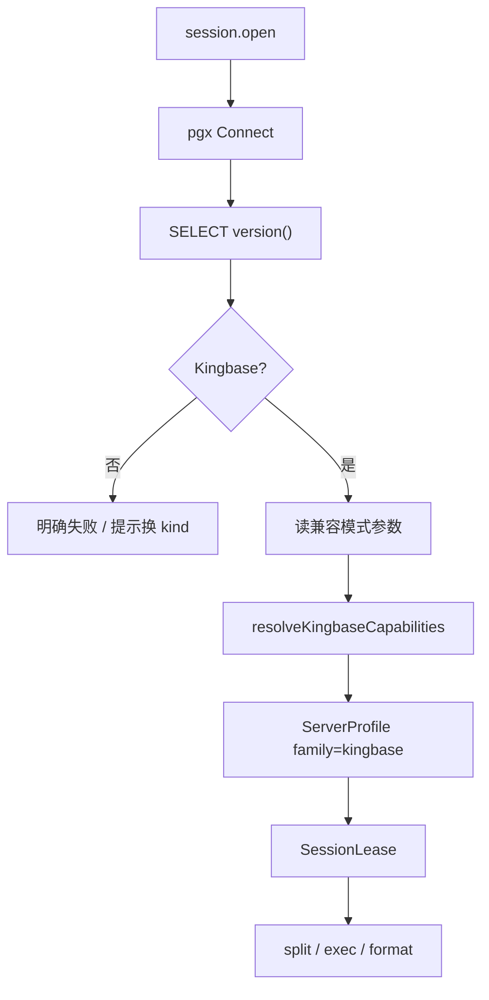

# 31 — 人大金仓（KingbaseES）管理模块（Layer-1 能力服务 + Web 模块）

> 版本：v0.4 · 日期：2026-07-28  
> 状态：**后端/Web P0–P4 主路径已落地**（Browse 单元格编辑、ObjectScript、CSV/SQL IO、Monitor、表设计器）；**LSP：`kingbaseparser` + `kingbase.lsp.*`（`editor.sql_lsp`）**；过程调试仍不做；驱动锁定 **Go + `jackc/pgx/v5`**  
> **隔离**：**独立进程 / 独立 kind / 独立 Web 模块 / 独立实现**；禁止与 Vastbase / 其它库服务混用代码或运行时互调  
> 关联：[13](./13-service-layout.md) · [14](./14-capability-connection-framework.md) · [18](./18-ops-connection-tree.md) · [21](./21-session-registry.md) · [22 — Vastbase](./22-vastbase-module.md)（**PG 线协议与节奏对照，非实现依赖**） · [34 — PostgreSQL](./34-postgresql-module.md)（**原生 PG，禁止混用**） · [23](./23-sql-dialect-completion.md) · [30 — ClickHouse](./30-clickhouse-module.md)（**分期骨架对照**）

---

## 0. 文档边界

| 写在本文 | 不写在本文 |
|----------|------------|
| `kingbase-service`、`family: "kingbase"`、金仓对象模型与 Cap 表 | Vastbase / 原生 PostgreSQL 业务实现（即便线协议同为 PG wire） |
| Web `modules/kingbase` 与对本 kind 的注册 | 共享层硬编码 `if kingbase`；跨服务 Go 业务包 |
| 驱动选型结论（pgx）与 Probe 门禁 | 把金仓伪装成 `family: "vastbase"` / `"postgresql"` 会话 |

### 0.1 服务隔离与实现不混用（硬约束）

与 [26](./26-mariadb-module.md) / [28](./28-dameng-module.md) / [30](./30-clickhouse-module.md) 同原则：**一引擎 = 一 Layer-1 进程 + 一套实现**。金仓「像 PostgreSQL / 像 Vastbase」≠ 可共用 `vastbase-service` 代码。

| 层 | 必须独立 | 允许共用（仅框架，无引擎业务） |
|----|----------|--------------------------------|
| 进程 / 二进制 | `niuma-kingbase-service` 独享 | — |
| manifest / namespace / kind | `kingbase` 独享 | — |
| Go 模块 | `services/kingbase-service/` 自有 `go.mod` + `internal/*` | `packages/go/serviceipc`、`tunnel`、`logutil` 等**无引擎语义**包 |
| Web 业务模块 | `web/src/modules/kingbase/`、`api/kingbase.ts` | `modules/database/*` 壳、`sql-editor` 编排（只认 family/Cap） |
| Cap / Probe / 字典 SQL | 只写在本服务 `internal/dialect|tree|meta|…` | — |

**禁止**：

1. `import` 其它 `*-service` 的 `internal/`（含 vastbase / mysql / dameng / clickhouse / oracle）。  
2. 抽取「Vastbase+Kingbase 共用」Go 业务包，或同进程 `if vastbase / if kingbase` 分流。  
3. platform 把 `kingbase` 与其它 kind 代理到**同一**可执行文件并用内部 if 分流（默认：**一 manifest = 一二进制**）。  
4. 运行时调用 `vastbase.*` 等完成本模块功能。  
5. Web 把金仓面板并入 `modules/vastbase`，或共用带引擎分支的业务 composable。  
6. 用 `family: "vastbase"` / `"postgresql"` 冒充金仓会话（兼容模式只用 `sqlCompatibility` + `compat.*` Cap）。

**允许**：对照 22/30 **复制骨架后改写**；`sql-editor` 对 kingbase 启用与 PG 系**同名的拆句特性位**（dollar quote、PL 块等）——这是编排层 Cap/feature，**不是**服务实现混用。

**与 Vastbase 的边界**：

- `kingbase-service` 与 `vastbase-service` **分进程、分 kind、分模块、分 Cap 前缀**。  
- Probe 连到非金仓实例（纯 PG / Vastbase 等）→ **明确失败**，提示改用对应连接类型。

**多库协作约定**：共享层只认 DialectFamily + CapabilitySet + 同名 RPC；**各库实现只落在各自服务与 Web 模块**，互不混用。

---

## 1. 目标与范围

面向 **人大金仓 KingbaseES**（V8 / V9 主线；PG 兼容为主，Oracle / MySQL / SQLServer 兼容模式用 Cap 表达）运维与开发：

- 连接站点、对象导航（`connection → database → schema → {Tables|Views|Procedures|Functions|Sequences}`）
- SQL 查询执行与结果集浏览（含取消、分页）
- 元数据（列、索引、约束、DDL）
- 过程 / 函数对象脚本与调用（后期）；Monitor / IO / 表设计（后期）

归属 `ops` / `data` 域；连接树与 `platform.connection.*` 走通用壳，**业务逻辑只在 `kingbase-service` + `web/src/modules/kingbase`**。

### 1.1 架构对齐

| 能力层 | 参考 | NiuMa 做法 |
|--------|------|-----------|
| GUI / 对象树 / SQL | 金仓管理工具 / DBeaver / Navicat | Vue + Monaco + Go 能力服务 |
| 连接与查询 | PostgreSQL wire（默认端口 **54321**） | **Go + `jackc/pgx/v5`** |
| 方言差异 | 客户端能力探测 | **DialectFamily + CapabilitySet**（契约见 [23](./23-sql-dialect-completion.md)） |
| 安装包 | 厂商 JDBC IDE | 仅 `niuma-kingbase-service` Go 二进制（无 JVM / 无 Gokb 旁载） |

### 1.2 关键决策

| 维度 | 决策 | 理由 |
|------|------|------|
| 能力服务 | 独立 Layer-1 **`kingbase-service`** | 长连接、取消、崩溃隔离；与其它库服务分离 |
| 语言 | **Go（唯一）** | 与既有 Layer-1 一致；**不**为金仓单独引 JVM |
| 驱动 | **`jackc/pgx/v5`**（锁定，见 §1.3） | 业界 Go 连 PG 系事实标准；公共模块可拉；对齐 Vastbase 工程能力 |
| 协议 kind | **`kingbase`** | 与其它 kind **不互通** |
| Bridge namespace | **`kingbase`** | 仅 `kingbase.*` |
| Dialect `family` | **`"kingbase"`** | Cap 前缀 `kingbase.*`；**不**复用 `vastbase.*` 默认集作伪装 |
| Web 模块 | **`web/src/modules/kingbase/`** | 独立注册 |
| 会话策略 | **`per_profile` + idle** | 见 [21](./21-session-registry.md) |
| 凭据 | platform Vault 注入 | [14](./14-capability-connection-framework.md) |
| SSH 隧道 | platform 公共 `tunnel` dialer | 本服务只收展开后的 host/port |
| 调试 | **首期不做** | 不复用 Vastbase `debug.*` / `DBE_PLDEBUGGER`（金仓是否有等价面另 Spike） |
| **禁止** | 与其它 `*-service` 混用；JVM/JDBC sidecar；MCP 进 platform | 见 §0.1 |

### 1.3 驱动选型（已锁定）

| 方案 | 说明 | 结论 |
|------|------|------|
| **A. `jackc/pgx/v5`（采用）** | PG wire；`go get` 可得（已验证 `v5.10.0`）；池化 / 取消成熟 | **产品默认 / 锁定** |
| B. 官方 Gokb（`kingbase.com/gokb`） | 厂商文档主推；过程 `OUT` 等更贴产品 | **当前不可用**：仓库无包；`goproxy` 404；`go-get` 超时；未上公共模块站。日后若合法随包再评估 |
| C. JDBC + 打包 JRE/JDK | 业界桌面工具主流 | **否决**：体积/内存/双进程开销大；与仓库「主路径无 Java」一致 |
| D. `lib/pq` | 旧 PG 驱动 | **否决**（维护态） |

**采用（锁定）**：方案 A。构建 `CGO_ENABLED=0`。依赖只写在本服务 `go.mod`，不进 platform-core。无厂商动态库旁载。

**日后切换 Gokb 的条件（非 P0 阻塞）**：

1. 从厂商渠道拿到可再分发的源码/库；  
2. Spike 证明过程 `OUT` / 兼容模式相对 pgx 有不可绕过收益；  
3. 许可允许随 NiuMa 安装包分发；  
4. 会话层仍暴露同一套 Bridge RPC（驱动替换不改 Web 契约）。

### 1.4 协议与兼容范围

| 项 | 说明 |
|----|------|
| 目标产品 | KingbaseES V8 / V9（及后续主版本） |
| 线协议 | PostgreSQL wire；默认端口 **54321** |
| SQL | 标准 SQL + 厂商扩展；兼容模式（Oracle / MySQL / SQLServer）→ `sqlCompatibility` + Cap |
| 元数据 | 优先 `information_schema` / `pg_catalog`；厂商系统视图按版本在 `internal/meta` 适配 |
| 对象模型 | **有 schema 层**（与 Vastbase 同形，异于 MySQL/ClickHouse） |
| **不做（首期）** | 过程调试状态机；Gokb 强依赖特性；`ksql` 外部 CLI（若后续做，走 [20](./20-tool-components.md)） |

### 1.5 待预留 / 已补齐

| 层 | 状态 |
|----|------|
| `SqlDialect` / `DialectFamily` | [x] `'kingbase'` |
| 格式化 | [x] Cap `format.plsql` + sql-formatter |
| Monaco / LSP | [x] Bridge `kingbase.lsp.*` + `kingbaseparser`（工作 AST）；Monarch `kingbase`；Cap `editor.sql_lsp` |
| 拆句 | [x] dollar quote / PL 块 / Oracle `/`（Cap + sqlCompatibility） |
| Cap / Profile | [x] `defaultKingbaseProfile()` 与 Probe 对齐 |

---

## 2. 产品模型：DialectFamily + CapabilitySet

`session.open` / `session.test` 返回（platform **整包透传**）：

```json
{
  "sessionId": "...",
  "dialect": {
    "family": "kingbase",
    "version": "V008R006C008B0020",
    "versionNum": "8006008",
    "sqlCompatibility": "pg",
    "capabilities": [
      "kingbase.double_quote_ident",
      "kingbase.dollar_quote",
      "proc.plsql_bare",
      "func.plpgsql_dollar",
      "split.plsql_blocks",
      "script.oracle_slash",
      "editor.suppress_pg_diagnostics",
      "format.plsql",
      "cte.window",
      "sequence.native"
    ]
  }
}
```

`family` **始终为 `"kingbase"`**。兼容模式差异用 `sqlCompatibility`（如 `pg` / `oracle` / `mysql` / `sqlserver`）与 `compat.*` Cap 表达，**禁止**写成 `family: "vastbase"`。

### 2.1 Capability ID（本模块稳定字符串）

新增只加常量，**勿改已发布取值**。前缀：`kingbase.*` / `proc.*` / `split.*` / `format.*` / `editor.*` / `compat.*` / `io.*`。

| Capability | 含义 | 默认 | 启用阶段 |
|------------|------|------|----------|
| `kingbase.double_quote_ident` | 标识符双引号 | ✓ | P0 |
| `kingbase.dollar_quote` | `$tag$…$tag$` | ✓ | P0 |
| `proc.plsql_bare` | PL/SQL 风格过程体 | 按兼容模式 | P0/P1 |
| `func.plpgsql_dollar` | `LANGUAGE plpgsql AS $$…$$` | PG 兼容默认 | P0 |
| `split.plsql_blocks` | 过程块内不分号硬拆 | 按模式 | P0 |
| `script.oracle_slash` | 独立行 `/` 批边界 | Oracle 兼容时 | P1 |
| `editor.suppress_pg_diagnostics` | 清 pgsql Worker 误报 | ✓ | P0 |
| `format.plsql` | 过程友好格式化 | ✓ | P0 |
| `cte.window` | CTE / 窗口 | ✓ | P0 |
| `sequence.native` | 序列对象 | ✓ | P1 |
| `compat.oracle` / `compat.mysql` / `compat.sqlserver` | 兼容模式提示 | Probe | P0 |
| `io.csv` / `io.sql_file` | 导入导出 | ✓ | P3 |
| `ddl.design` | 表设计器 | ✓ | P4 |

**解析优先级（Web）**：Capability **优先** → 无 Cap 时用 `family === 'kingbase'` 词法回退（双引号 / dollar quote）。**禁止**业务散落 `if (family === 'vastbase')` 处理金仓会话。

### 2.2 Probe（P0）

1. 按 ConnectParams 用 pgx 建连成功。  
2. `SELECT version()` → `version` / 解析 `versionNum`。  
3. 确认金仓特征（版本串含 `Kingbase` / 厂商标识；可选读系统设置）；**非金仓 → 明确失败**。  
4. 读兼容模式相关 GUC / 系统参数（若可得）→ `sqlCompatibility` + `compat.*`。  
5. 纯函数 `resolveKingbaseCapabilities(version, compat)` → Cap 表（单测）。  
6. P0 **不做**写性 DDL 试探；过程能力按兼容模式给默认 Cap，后续可再细探。  
7. 成功返回整包 `dialect`（`family: "kingbase"`）。



---

## 3. 分层与进程模型

```
┌ Layer 4 ─ Web ────────────────────────────────────────────┐
│ web/src/modules/kingbase/                                  │
│   连接表单 · 树 Provider · Query · Browse · Monitor        │
│   ↑ bridgeInvoke(kingbase.*) ↑ bridgeOnEvent(niuma:event) │
└───┼───────────────────────────┼────────────────────────────┘
    │ cefQuery                  │ PostMessage
┌ Layer 3 ─ C++ Shell ──────────┴────────────────────────────┐
│ bridge_router · platform_client · 事件回投 UI               │
└───┼───────────────────────────▲────────────────────────────┘
    │ length-prefixed JSON      │ 事件帧
┌ Layer 2 ─ platform-core ──────┴────────────────────────────┐
│ platform.connection.* + kingbase.* 代理 + 凭据注入          │
└───┼───────────────────────────▲────────────────────────────┘
    │                           │ query / io 进度事件
┌ Layer 1 ─ kingbase-service（Go + pgx/v5）──────────────────┐
│ 会话池 · dialect Probe · query · tree · catalog · meta     │
└───────────────────────────────┬────────────────────────────┘
                                │ PG wire :54321
                                ▼
                          KingbaseES 实例
```

要点：

- 壳层与 platform-core **不写** 金仓业务 SQL / 数据字典语义。  
- 海量对象：树默认轻量（name/type）+ `filter` / `limit` / `truncated`；**禁止**对树中每张表默认 `COUNT(*)`。  
- 大结果：`query.exec` 分页游标语义对齐 [22](./22-vastbase-module.md)（`limit` = 页大小，`hasMore` + `resultSetId`）。

### 3.1 工程布局

```
services/
├── manifests/kingbase-service.yaml
└── kingbase-service/
    ├── go.mod                 # jackc/pgx/v5 + niuma/pkg/*
    ├── cmd/kingbase-service/main.go
    └── internal/
        ├── dialect/           # ServerProfile / Cap* / Probe
        ├── session/           # ConnectParams、pgx 池、query.exec/cancel
        ├── handler/           # session / query / tree / catalog / meta / ddl / io
        ├── tree/              # databases / schemas / tables / routines / sequences
        ├── catalog/           # schemas / tables / columns（补全）
        ├── meta/              # columns / indexes / constraints / ddl / …
        ├── ddl/               # 表设计器 Preview/Apply（P4）
        ├── dataio/            # CSV / SQL dump / execSqlFile（P3）
        ├── eventpub/
        └── idgen/

web/src/modules/kingbase/
├── views/                     # KingbaseHome / KingbaseSession
├── components/                # ConnectionFields / QueryPane / BrowsePane / …
├── composables/
├── completion/                # catalog-client（docs/23）
├── connection-form-adapter.ts
├── register-conn-form.ts
├── register-conn-full.ts
├── conn-tree-provider.ts
├── conn-tree-actions.ts
├── conn-nav-strategy.ts
├── pane-registry.ts
├── locale/                    # zh-CN.ts / en-US.ts
└── sql-seed.ts

web/src/api/
├── kingbase.ts
└── types/kingbase.ts
```

跨库 **UI 壳 / 编排**（无引擎业务）：`modules/database/*`、`modules/sql-editor/*`。  
金仓的 session/query/tree/meta/IO **适配只写在** `modules/kingbase/` + `kingbase-service`。

---

## 4. 连接参数（ConnectParams）

与 [14](./14-capability-connection-framework.md) 公共子对象对齐（Bridge camelCase；协议字段 snake_case）：

| 字段 | 默认 | 说明 |
|------|------|------|
| host / port | host 空；port **54321** | 直连或隧道对端；`port <= 0` 时服务回退 54321 |
| user / password | 常 `system` / Vault | 凭据注入；错误信息不含明文密码 |
| database | 产品默认（如 `TEST` / `kingbase`） | 初始登录库；表单必填或给占位 |
| ssl_mode | `prefer` | `disable` / `prefer` / `require` / `verify-ca` / `verify-full` |
| ssl_root_cert / ssl_cert / ssl_key | 空 | PEM 路径（libpq 形） |
| search_path | 空 | 可选；打开后 `SET search_path`（P1） |
| client_encoding | `UTF8` | — |
| application_name | `niuma-kingbase` | `pg_stat_activity` 识别 |
| connect_timeout_seconds | 10 | 建连超时 |
| statement_timeout_ms | 0 | 0 = 不设置 |
| exclude_system_schemas | `true` | 树/catalog 默认隐藏系统 schema |
| tunnel / proxy | 无 | 与其它能力服务同形 |

P0 验收：明文直连 + SSL 选项字段齐全；Test Connection 成功返回 `dialect`。

---

## 5. Bridge 契约

命名空间：`kingbase`。方法名与 [23](./23-sql-dialect-completion.md) 对齐；**参数语义按金仓对象模型（database + schema）**。

### 5.1 会话

| 方法 | 入参 | 返回 |
|------|------|------|
| `session.open` | `{ profileId }` | `{ sessionId, dialect }` |
| `session.close` | `{ sessionId }` | `{ closed: true }` |
| `session.test` | profile 或连接参数 | `{ ok, message, version?, dialect? }` |

### 5.2 查询

| 方法 | 说明 |
|------|------|
| `query.exec` | 单语句执行；Web 拆句后严格顺序调用；分页语义同 Vastbase |
| `query.fetch` / `query.close` / `query.cancel` | 续取 / 关闭游标 / `context` + pgx 取消 |
| `query.explain` | P4；`EXPLAIN` / `EXPLAIN ANALYZE`（按版本与权限） |

**批约定（P0）**：服务端按**单语句**执行。  
**拆句**：由 Web Cap 驱动（dollar quote / PL 块 / 可选 `/`）；协议层不发送无意义客户端指令行。

### 5.3 树（导航，P1）

```
connection → database → schema → {Tables|Views|Procedures|Functions|Sequences} → object
```

| 方法 | 说明 |
|------|------|
| `tree.databases` | 库列表 |
| `tree.schemas` | 指定 database；可 `excludeSystem` |
| `tree.tables` | schema 下表/视图；`types` 过滤 |
| `tree.routines` | 过程 / 函数 |
| `tree.sequences` | 序列（Cap `sequence.native`） |
| `tree.categoryCounts` | 各分类对象数（非行数） |

**树右键（P1 常用集，密度对齐 Vastbase 常用子集）**：

- **库 / schema**：新建查询、刷新、复制名称。  
- **表**：查询数据、查看 DDL、生成 SELECT/INSERT、Truncate/Drop（确认）、导入导出（P3）。  
- **视图 / 过程 / 函数**：打开定义 / 对象脚本（P3）、Drop。  
- **连接级**：Monitor（P4）。

ResourceId（与 [18](./18-ops-connection-tree.md) 对齐）：

```
res:{profileId}:database:{db}
res:{profileId}:database:{db}:schema:{schema}
res:{profileId}:database:{db}:schema:{schema}:table:{table}
res:{profileId}:database:{db}:schema:{schema}:view:{name}
res:{profileId}:database:{db}:schema:{schema}:procedure:{name}
res:{profileId}:database:{db}:schema:{schema}:function:{name}
res:{profileId}:database:{db}:schema:{schema}:sequence:{name}
```

### 5.4 目录补全 `catalog.*`

| RPC | 金仓语义 |
|-----|----------|
| `catalog.schemas` | 当前库（或指定 database）下 schema 列表 |
| `catalog.tables` | `schema` + prefix → 表/视图 |
| `catalog.columns` | `schema` + `table` → 列 |

必须支持 `prefix` / `limit` / `truncated`；禁止用 `tree.*` 高 limit 假装全量目录。

### 5.5 元数据 / DDL / IO

| 方法 | 阶段 | 说明 |
|------|------|------|
| `meta.columns` / `indexes` / `constraints` / `ddl` | P2 | 列 / 索引 / 约束 / `SHOW` 或拼装 DDL |
| `meta.primaryKey` / `foreignKeys` | P2 | Browse / 设计器用 |
| `meta.routineSource` | P3 | 过程/函数源码 |
| `meta.instanceOverview` / `activity` / `locks` / `serverVariables` / `serverStatus` | P4 | Monitor（实例 / 会话 / 锁 / 变量 / 状态） |
| `ddl.script` / `ddl.designPreview` / `ddl.designApply` | P3/P4 | 对象脚本与表设计 |
| `io.exportCsv` / `importCsv` / `dumpSql` / `execSqlFile` / `cancel` | P3 | 纯 Go；任务进全局 Dock |

**首期不做**：Vastbase 级 `debug.*`；外部 `ksql` CLI 编进 platform。

---

## 6. Web 模块落地要点

### 6.1 注册

- `register-conn-form.ts` / `register-conn-full.ts`  
- `builtin-modules.ts`：`id: 'kingbase'`，`category: 'data'`，`routePath: '/kingbase'`  
- i18n：`nav.kingbase`（中文「人大金仓」）  
- 图标：暂用 `database`（无专用图标时）  
- `session-policy.ts`：`kingbase: { sharing: 'per_tab', closeOnRelease: true }`（多查询 Tab 独立连接与事务隔离，对齐 MySQL）  
- `ops/types` / `CONN_KIND_DEFS`：`defaultPort: 54321`

### 6.2 会话 Tab

| Tab | Phase | 壳 |
|-----|-------|-----|
| Query | P0 | `SqlQueryShell` + `QueryResultPanel`（可有事务条，按 Cap） |
| Browse | P2 | `BrowseDataShell` |
| DDL | P2 | 只读 DDL |
| ObjectScript | P3 | `ObjectScriptShell`（视图/过程/函数） |
| Monitor | P4 | 实例 / 会话 / 锁 / 变量（`pg_settings`） / 状态（`pg_stat_*`） |
| Design | P4 | `TableDesignShell` |
| Transfer | P3/P4 | `DataTransferShell` |

### 6.3 连接表单

- 基础：host / port(54321) / user / password / database  
- SSL Tab、高级（search_path、timeout、exclude_system_schemas）  
- SSH 隧道：字段形对齐 Vastbase / MySQL

### 6.4 sql-editor 补齐清单

1. `SqlDialect` / `DialectFamily` 增加 `'kingbase'`  
2. `Cap` 增加 `kingbase.*`（可复用已有 `proc.*` / `split.*` / `editor.suppress_pg_diagnostics`）  
3. `defaultKingbaseProfile()` + `defaultProfileForFamily`  
4. `resolveSplitFeaturesFromProfile`：dollar quote + 按 Cap 的 PL 块 / slash  
5. Monaco：挂 `pgsql` Worker（与 vastbase 同路径）；勿用 `family === 'vastbase'` 硬判断金仓  
6. `buildAiDialectRules`：金仓品牌、默认端口、兼容模式、标识符双引号  

---

## 7. 分期与验收

| Phase | 内容 | 验收要点 |
|-------|------|----------|
| **文档** | 本稿 | 驱动锁定 pgx；隔离红线固化 |
| **P0** | [x] 服务骨架、manifest、`session.*`、Probe、`query.exec/fetch/close/cancel`；[x] Web Home/Session/Query + Cap | 单测通过；真实实例：Test → 开会话 → `SELECT 1`；lease 有 `capabilities` |
| **P1** | [x] `tree.*`、`catalog.*`、Web 树 + catalog 客户端 | 展开见库/schema/表；catalog RPC 可用 |
| **P2** | [x] Browse、`meta.*`、DDL Tab、树右键 | 双击表看数据；DDL 可开；Truncate/Drop 确认 |
| **P3** | [x] ObjectScript；`io.*` + Dock | 过程/视图脚本；CSV/SQL 导入导出 |
| **P4** | [x] Monitor、表设计器；Explain 仍走 query.exec 包装 | 密度对齐 Vastbase/MySQL 常用集（无调试） |
| **LSP** | [x] `kingbaseparser` + `kingbase.lsp.*` + Monaco `kingbase` | Cap `editor.sql_lsp`；兼容模式隔离；补全/诊断主路径 |

**建议开工顺序（对照复制）**：

1. 复制 `clickhouse-service` / `modules/clickhouse` 的 **注册与 IPC 骨架**；  
2. 会话 / 查询 / 树 SQL **对照 `vastbase-service` 改写为金仓 Probe 与字典**（禁止 import）；  
3. Web Pane 壳复用 `database/*`，适配只留在 `modules/kingbase`。

---

## 8. manifest 草案

```yaml
id: com.niuma.kingbase
name: Kingbase Service
version: 0.1.0
bridge:
  namespace: kingbase
  connection_kind: kingbase
session:
  inject_credentials: true
  credential_methods:
    - session.open
    - session.test
    - tree.databases
    - tree.schemas
    - tree.tables
    - tree.routines
    - tree.sequences
    - tree.categoryCounts
    - catalog.schemas
    - catalog.tables
    - catalog.columns
    - meta.columns
    - meta.indexes
    - meta.constraints
    - meta.ddl
    - meta.primaryKey
    - meta.foreignKeys
    - meta.routineSource
    - io.exportCsv
    - io.importCsv
    - io.dumpSql
    - io.execSqlFile
    - io.cancel
runtime:
  executable: bin/niuma-kingbase-service.exe
  executable_windows: bin/niuma-kingbase-service.exe
  executable_unix: bin/niuma-kingbase-service
  lang: go
ipc:
  transport_windows: named_pipe
  transport_unix: unix_socket
  address_windows: '\\.\pipe\niuma.kingbase'
  address_unix: '/tmp/niuma.kingbase.sock'
  protocol: length_prefixed_json
lifecycle:
  startup: lazy
permissions: []
```

构建：`go.work` 增加 `services/kingbase-service`；`scripts/build-services.ps1` 纳入；二进制名 **`niuma-kingbase-service`**。

---

## 9. 红线

1. **禁止**与其它库服务混用实现：共享 Go 业务包、同进程多引擎 if、运行时互调、Web 模块合并（见 §0.1）。  
2. **禁止**用 `family: "vastbase"` / `"postgresql"` 或复用 Vastbase 默认 Cap 集伪装金仓。  
3. **禁止** Java / JDBC sidecar / 为金仓打包 JDK。  
4. **禁止**把当前不可用的 Gokb 当作 P0 阻塞项；未拿到前不得空等。  
5. **禁止**在 platform-core / 壳层写金仓数据字典 SQL。  
6. **禁止**对树节点默认全表 `COUNT(*)` / 无 limit 的 `SELECT *`。  
7. **禁止**把 Vastbase `debug.*` 状态机原样拷进本服务（无独立 Spike 证明前）。  
8. 新工具 / MCP / `ksql` 封装保持**外部化**，不编进平台 Server 二进制。  
9. platform 代理**不得裁剪** `dialect` 整包。

---

## 10. 开工 checklist

### 驱动与文档

- [x] 确认 Gokb 当前不可公开获取（proxy 404 / 仓库无包）  
- [x] 锁定 **pgx/v5** 为产品默认  
- [x] 本稿 + [13](./13-service-layout.md) / [14](./14-capability-connection-framework.md) / [23](./23-sql-dialect-completion.md) / README 索引  

### 后端 P0

- [x] `services/kingbase-service/` + manifest  
- [x] `session.*` + Probe（金仓门禁）+ Cap 单测  
- [x] `query.exec|fetch|close|cancel`  
- [x] `go.work` + build-services  

### 前端 P0

- [x] `modules/kingbase` Home/Session/ConnectionFields/QueryPane  
- [x] register + `api/kingbase.ts` + builtin-modules + i18n + session-policy  
- [x] `DialectFamily` / `defaultKingbaseProfile` / Cap  

### 后端 / 前端 P1

- [ ] `tree.databases|schemas|tables|routines|sequences|categoryCounts`  
- [ ] `catalog.schemas|tables|columns`  
- [ ] 连接树 Provider + catalog-client  

### P2+

- [ ] Browse / meta / DDL  
- [ ] ObjectScript / io.*  
- [ ] Monitor / Design / Explain  

### 冒烟（需真实 KingbaseES）

- [ ] Test → 开会话 → `SELECT 1` → 树展开 → Browse / DDL  

---

## 11. 与其它模块对照（速查）

> 下表仅作产品能力对照；**每一列对应独立服务与独立实现，互不混用**。

| 项 | Kingbase（本文） | Vastbase [22](./22-vastbase-module.md) | 达梦 [28](./28-dameng-module.md) | ClickHouse [30](./30-clickhouse-module.md) |
|----|------------------|----------------------------------------|----------------------------------|--------------------------------------------|
| 服务 | `kingbase-service`（独立） | `vastbase-service` | `dameng-service` | `clickhouse-service` |
| 语言 / 驱动 | Go + **pgx/v5** | Go + pgx/v5 | Go + 官方 `dm` | Go + clickhouse-go/v2 |
| kind / family | `kingbase` | `vastbase` | `dameng` | `clickhouse` |
| 默认端口 | **54321** | 5432 | 5236 | 9000 / 8123 |
| 对象模型 | database → **schema** → 对象 | 同左 | schema（类 Oracle） | database（无 schema） |
| 调试 | 首期不做 | DBE_PLDEBUGGER | 不做 | 不做 |
| JVM | 禁止 | 禁止 | 禁止 | 禁止 |

---

## 修订记录

| 版本 | 日期 | 说明 |
|------|------|------|
| v0.1 | 2026-07-26 | 初稿：锁定 Go + pgx；Gokb 当前不可用；独立服务/kind；Cap/树/分期/红线；禁 JVM 与 Vastbase 合流 |
| v0.2 | 2026-07-26 | 后端 P0：`kingbase-service`（pgx 会话/查询/金仓 Probe 硬门禁；manifest + go.work + build） |
| v0.3 | 2026-07-27 | Web P0：连接表单 / Home / Session / Query / Cap / 注册接线（无对象树） |
