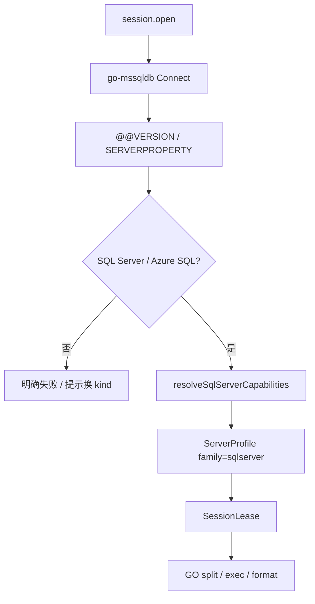

# 32 — SQL Server 管理模块（Layer-1 能力服务 + Web 模块）

> 版本：v0.2 · 日期：2026-08-03  
> 状态：**后端 P0 + LSP 已落地**；**Web P0 已落地**（ConnKind / session / Query / `GO` 拆批 / Monaco LSP）；tree/catalog / Browse 待 P1  
> **隔离**：**独立进程 / 独立 kind / 独立 Web 模块 / 独立实现**；禁止与 MySQL / Oracle / 达梦 / 其它库服务混用代码或运行时互调  
> 关联：[13](./13-service-layout.md) · [14](./14-capability-connection-framework.md) · [18](./18-ops-connection-tree.md) · [20](./20-tool-components.md) · [21](./21-session-registry.md) · [23](./23-sql-dialect-completion.md) · [25 — MySQL](./25-mysql-module.md)（**分期骨架对照，非实现依赖**） · [31 — 金仓](./31-kingbase-module.md)（**有 schema 层对照，非实现依赖**）

---

## 0. 文档边界

| 写在本文 | 不写在本文 |
|----------|------------|
| `sqlserver-service`、`family: "sqlserver"`、T-SQL 对象模型与 Cap 表 | MySQL / Oracle / 达梦 / Azure Data Studio 业务实现 |
| Web `modules/sqlserver` 与对本 kind 的注册 | 共享层硬编码 `if sqlserver`；跨服务业务包 |
| **实现语言与驱动锁定结论（Go + microsoft/go-mssqldb）** | 把 SQL Server 伪装成其它 `family` 会话 |
| 对标 DBeaver / Navicat 的常用集分期 | SSMS 全功能（Profiler / 调试器 / Agent 全编辑） |

### 0.1 服务隔离与实现不混用（硬约束）

与 [25](./25-mysql-module.md) / [28](./28-dameng-module.md) / [31](./31-kingbase-module.md) 同原则：**一引擎 = 一 Layer-1 进程 + 一套实现**。

| 层 | 必须独立 | 允许共用（仅框架，无引擎业务） |
|----|----------|--------------------------------|
| 进程 / 二进制 | `niuma-sqlserver-service` 独享 | — |
| manifest / namespace / kind | `sqlserver` 独享 | — |
| Go 模块 | `services/sqlserver-service/` 自有 `go.mod` + `internal/*` | `packages/go/serviceipc`、`tunnel`、`logutil` 等**无引擎语义**包 |
| Web 业务模块 | `web/src/modules/sqlserver/`、`api/sqlserver.ts` | `modules/database/*` 壳、`sql-editor` 编排（只认 family/Cap） |
| Cap / Probe / 字典 SQL | 只写在本服务 `internal/dialect|tree|meta|…` | — |

**禁止**：

1. `import` 其它 `*-service` 的 `internal/`（含 mysql / oracle / dameng / kingbase / vastbase）。  
2. 抽取「多库共用 T-SQL / TDS」Go 业务包，或同进程 `if sqlserver / if mysql` 分流。  
3. platform 把 `sqlserver` 与其它 kind 代理到**同一**可执行文件并用内部 if 分流（默认：**一 manifest = 一二进制**）。  
4. 运行时调用其它库 namespace 完成本模块功能。  
5. Web 把 SQL Server 面板并入其它 `modules/*`，或共用带引擎分支的业务 composable。  
6. 用其它 `family` 冒充 SQL Server 会话。

**允许**：对照 25/31 **复制骨架后改写**；`sql-editor` 对 sqlserver 启用 `split.go_batches` / bracket ident 等编排层 Cap——**不是**服务实现混用。

**多库协作约定**：共享层只认 DialectFamily + CapabilitySet + 同名 RPC；**各库实现只落在各自服务与 Web 模块**。

---

## 1. 目标与范围

面向 **Microsoft SQL Server**（2016+ 为主；含 2019 / 2022）与 **Azure SQL**（Database / Managed Instance，同 family、用 Cap 表达差异）运维与开发：

- 连接站点、对象导航（`connection → database → schema → {Tables|Views|Procedures|Functions|Synonyms|Sequences}`）
- T-SQL 查询执行与结果集浏览（含 `GO` 批、取消、分页）
- 元数据（列、索引、约束、DDL、例程源码）
- 表设计器、CSV/SQL 导入导出、会话监视（后期）

归属 `ops` / `data` 域；连接树与 `platform.connection.*` 走通用壳，**业务逻辑只在 `sqlserver-service` + `web/src/modules/sqlserver`**。

### 1.1 架构对齐（对标 DBeaver / Navicat）

| 能力层 | 参考 | NiuMa 做法 |
|--------|------|-----------|
| GUI / 对象树 / SQL | DBeaver / Navicat for SQL Server / SSMS 常用集 | Vue + Monaco + Go 能力服务 |
| 连接与查询 | TDS（默认端口 **1433**） | **Go + `microsoft/go-mssqldb`** |
| 方言差异 | 客户端能力探测 | **DialectFamily + CapabilitySet**（契约见 [23](./23-sql-dialect-completion.md)） |
| 外部 CLI | sqlcmd / bcp | [20 — 工具组件](./20-tool-components.md)，**不**编进 platform |
| 安装包 | 独立客户端 | 仅 `niuma-sqlserver-service` Go 二进制（无 JVM / 无 .NET 运行时捆绑） |

### 1.2 关键决策（已锁定）

| 维度 | 决策 | 理由 |
|------|------|------|
| 能力服务 | 独立 Layer-1 **`sqlserver-service`** | 长连接、取消、崩溃隔离；与其它库服务分离 |
| **实现语言** | **Go（唯一产品默认路径）** | 见 §1.3 |
| **驱动** | **`github.com/microsoft/go-mssqldb`** | 微软维护；`database/sql`；纯 Go；`CGO_ENABLED=0` |
| 协议 kind | **`sqlserver`** | 与其它 kind **不互通** |
| Bridge namespace | **`sqlserver`** | 仅 `sqlserver.*` |
| Dialect `family` | **`"sqlserver"`** | Web 已预留；Cap 前缀 `sqlserver.*` |
| Web 模块 | **`web/src/modules/sqlserver/`** | 独立注册 |
| 会话策略 | **`per_tab` + closeOnRelease** | 多查询 Tab 独立物理连接与事务；见 [21](./21-session-registry.md) |
| 凭据 | platform Vault 注入 | [14](./14-capability-connection-framework.md) |
| SSH 隧道 | platform 公共 `tunnel` dialer | 本服务只收展开后的 host/port |
| 调试 | **首期不做** | 不做 SSMS 级 T-SQL 调试器 |
| **禁止** | 与其它 `*-service` 混用；JVM/JDBC 默认；.NET 运行时捆绑为默认；MCP 进 platform | 见 §0.1 / §1.3 |

### 1.3 实现语言推荐（锁定：**Go**）

> **结论：产品默认实现语言 = Go。**  
> SQL Server 在 NiuMa 中定位为 **Layer-1 Go 能力服务**，与 MySQL / 金仓 / ClickHouse / 达梦同构；**不**走 Oracle 式 C++ L3 Native，也**不**引入 .NET / JVM 作为默认路径。

#### 1.3.1 候选对照

| 方案 | 专业度（协议/生态） | 与 NiuMa 架构契合 | 分发 / 运维 | 结论 |
|------|---------------------|-------------------|-------------|------|
| **A. Go + `microsoft/go-mssqldb`（采用）** | 高：微软官方 Go TDS 驱动；取消 / 类型 / Azure 认证持续演进 | **最高**：与既有 L1、`serviceipc`、构建/打包、supervisor 完全同构 | 单二进制；`CGO_ENABLED=0`；无旁载运行时 | **产品默认 / 锁定** |
| B. C# / .NET + `Microsoft.Data.SqlClient` | 最高（微软第一方） | 低：需新增 .NET 宿主、IPC 适配、打包链路；与现有 Go L1 分叉 | 捆绑 runtime 或依赖本机 .NET | **否决为默认**（复杂度不换协议收益） |
| C. C++ + ODBC / FreeTDS | 中高 | 中：仓库已有 C++ IPC（Oracle），但 SQL Server **无** Instant Client 级强制理由 | ODBC 依赖系统驱动 / 驱动管理器；跨平台 UX 差 | **否决为默认**（仅极端兜底） |
| D. Java + JDBC（mssql-jdbc） | 高（DBeaver 同族） | 低：需 JRE；与「主路径无 Java」红线冲突 | 体积与双进程开销大 | **否决** |
| E. Go + 社区旧叉（`denisenkom/go-mssqldb`） | 中 | 高 | 已并入 / 由 microsoft 维护线承接 | **勿双依赖**；统一 microsoft 模块路径 |

#### 1.3.2 为何不用 C++（对照 Oracle）

Oracle 选 C++20 + ODPI-C，是因为 **OCI / Instant Client thick** 是产品级完整语义的事实路径，Go+CGO 控制力下降且复杂度不减（见 [29](./29-oracle-module.md)）。

SQL Server **没有**对等约束：

- TDS 有成熟的**纯 Go** 官方驱动，不依赖本机 Native Client / ODBC 安装即可作为产品默认；  
- 查询取消、大结果分页、TLS、命名实例、Azure SQL 等 P0–P4 常用集可在 Go 侧覆盖；  
- 引入 C++ 只会增加构建矩阵，**不**换来 Oracle 那种不可替代的协议收益。

因此：**SQL Server ≠ Oracle 的 Native 特例**；保持 Go L1。

#### 1.3.3 为何不用 C#（对照「最原教旨」）

若脱离 NiuMa、单论微软生态，C# + `Microsoft.Data.SqlClient` 确实最贴 SSMS。但本仓库约束是：

1. Layer-1 已形成 **Go 服务族**（manifest / supervisor / length-prefixed JSON / 打包脚本）；  
2. 新增 .NET 运行时会破坏「一引擎一 Go 二进制」的运维与体积模型；  
3. Web ↔ Bridge ↔ platform 契约与语言无关——**协议能力用 Cap/RPC 表达，不靠宿主语言「更微软」**。

故 C# 仅在未来出现「Go 驱动无法覆盖的硬缺口」（经 Spike 证明）时再评估 sidecar，**不得**作为 P0 默认。

#### 1.3.4 驱动锁定细节

| 项 | 约定 |
|----|------|
| 模块 | `github.com/microsoft/go-mssqldb` |
| API | `database/sql` + 驱动扩展（如 Azure AD connector，P2+） |
| 构建 | `CGO_ENABLED=0` |
| 依赖位置 | **仅** `services/sqlserver-service/go.mod`；**不**进入 platform-core |
| 厂商库旁载 | **无**（不同于 Oracle Instant Client） |

P0 Spike（≤1 人日）验收：`session.test`、单语句 `query.exec`、`context` 取消、`uniqueidentifier` / `datetime2` / `nvarchar(max)` 往返、命名实例或非默认端口、Encrypt 常见组合。

### 1.4 协议与产品范围

| 项 | 说明 |
|----|------|
| 目标产品 | SQL Server 2016+（优先 2019/2022）；Azure SQL Database / MI |
| 线协议 | TDS；默认端口 **1433**；命名实例可走 SQL Browser 或显式 port |
| SQL | T-SQL；批分隔符 **`GO`**（客户端拆批，不发往服务器） |
| 元数据 | `sys.*` + `INFORMATION_SCHEMA`；版本差异用 Cap |
| 对象模型 | **database + schema 两层**（同形金仓/Vastbase，异于 MySQL） |
| **不做（首期）** | T-SQL 调试器；SQL Agent 全量编辑；Always On 可视化运维；Profiler/XEvent 设计器 |

### 1.5 已预留 / 待补齐

| 层 | 状态 |
|----|------|
| `DialectFamily` | [x] `'sqlserver'`（`sql-editor/capabilities`） |
| 格式化 | [x] `formatterLanguage: 'transactsql'`（`sql-editor/dialect.ts`） |
| Monaco / LSP | [x] 后端 `sqlserver.lsp.*` + Web `ensureSqlServerLspLanguage` / Query 编辑器接线 |
| 拆句 | [x] Cap `split.go_batches` + splitter 独立行 `GO`（不发往服务器） |
| Cap / Profile | [x] 服务端 + Web `defaultSqlServerProfile()` |
| AI 方言规则 | [x] `buildAiDialectRules` 的 sqlserver 专用段落 |
| 服务 / Web 模块 | [x] `sqlserver-service` P0；[x] Web `modules/sqlserver`（P0 无树） |

---

## 2. 产品模型：DialectFamily + CapabilitySet

`session.open` / `session.test` 返回（platform **整包透传**，禁止裁成仅 `sessionId`）：

```json
{
  "sessionId": "...",
  "dialect": {
    "family": "sqlserver",
    "version": "16.0.1000.6",
    "versionNum": "1600",
    "sqlCompatibility": "",
    "capabilities": [
      "sqlserver.bracket_ident",
      "sqlserver.at_variable",
      "split.go_batches",
      "format.transactsql",
      "editor.builtin_sql",
      "routine.create_procedure",
      "routine.create_function",
      "ddl.if_not_exists",
      "sqlserver.sequence",
      "sqlserver.json"
    ]
  }
}
```

`family` **始终为 `"sqlserver"`**。Azure SQL 等变体仍用同一 family，差异只用 Cap / `version` 表达，**禁止**另开 kind（除非未来产品明确要求「仅 Azure」独立入口）。

### 2.1 Capability ID（本模块稳定字符串）

新增只加常量，**勿改已发布取值**。前缀：`sqlserver.*` / `split.*` / `format.*` / `editor.*` / `routine.*` / `ddl.*` / `io.*`。

| Capability | 含义 | 默认 | 启用阶段 |
|------------|------|------|----------|
| `sqlserver.bracket_ident` | `[ident]` 引号 | ✓ | P0 |
| `sqlserver.at_variable` | `@local` / `@@global` | ✓ | P0 |
| `split.go_batches` | 独立行 `GO` 为批边界（SSMS/Navicat 核心） | ✓ | P0 |
| `format.transactsql` | 格式化方言 transactsql | ✓ | P0 |
| `editor.builtin_sql` | Monaco 内置 sql（无专用 Worker） | ✓ | P0 |
| `editor.sql_lsp` | Bridge 隧道 LSP（本服务内嵌） | — | P3+ |
| `routine.create_procedure` | `CREATE PROCEDURE` 模板 | ✓ | P3 |
| `routine.create_function` | `CREATE FUNCTION` 模板 | ✓ | P3 |
| `ddl.if_not_exists` | 条件 DDL 习惯（按版本/写法） | 弱→✓ | P2 |
| `sqlserver.sequence` | `CREATE SEQUENCE`（2012+） | Probe | P1 |
| `sqlserver.json` | JSON 函数（2016+） | Probe | P2 |
| `sqlserver.temporal` | 系统版本表（2016+） | Probe | 按需 |
| `io.csv` / `io.sql_file` | 导入导出 | ✓ | P4 |
| `ddl.design` | 表设计器 | ✓ | P4 |

**解析优先级（Web）**：Capability **优先** → 无 Cap 时用 `family === 'sqlserver'` 词法回退（方括号 / `GO`）。新增行为只加 Cap，不扩散裸 `if (family === …)` 业务分支。

### 2.2 Probe（P0）

1. 按 ConnectParams 用 go-mssqldb 建连成功。  
2. `SELECT @@VERSION` + `SERVERPROPERTY('ProductVersion')` / `ProductLevel` / `Edition`。  
3. 确认 SQL Server / Azure SQL 特征；**非本引擎 → 明确失败**，提示改用对应连接类型。  
4. 解析主版本 → `version` / `versionNum`。  
5. 纯函数 `resolveSqlServerCapabilities(version, edition, isAzure)` → Cap 表（单测覆盖 2016/2019/2022/Azure 矩阵）。  
6. P0 **不做**写性 DDL 试探。  
7. 成功返回整包 `dialect`（`family: "sqlserver"`）。



---

## 3. 分层与进程模型

```
┌ Layer 4 ─ Web ────────────────────────────────────────────┐
│ web/src/modules/sqlserver/                                 │
│   连接表单 · 树 Provider · Query · Browse · Monitor        │
│   ↑ bridgeInvoke(sqlserver.*) ↑ bridgeOnEvent(niuma:event) │
└───┼───────────────────────────┼────────────────────────────┘
    │ cefQuery                  │ PostMessage
┌ Layer 3 ─ C++ Shell ──────────┴────────────────────────────┐
│ bridge_router · platform_client · 事件回投 UI               │
└───┼───────────────────────────▲────────────────────────────┘
    │ length-prefixed JSON      │ 事件帧
┌ Layer 2 ─ platform-core ──────┴────────────────────────────┐
│ platform.connection.* + sqlserver.* 代理 + 凭据注入         │
└───┼───────────────────────────▲────────────────────────────┘
    │                           │ query / io 进度事件
┌ Layer 1 ─ sqlserver-service（Go + microsoft/go-mssqldb）───┐
│ 会话池 · dialect Probe · query · tree · catalog · meta     │
└───────────────────────────────┬────────────────────────────┘
                                │ TDS :1433
                                ▼
                     SQL Server / Azure SQL 实例
```

要点：

- 壳层与 platform-core **不写** SQL Server 业务 SQL / `sys.*` 语义。  
- 海量对象：树默认轻量（name/type）+ `filter` / `limit` / `truncated`；**禁止**对树中每张表默认 `COUNT(*)`。  
- 大结果：`query.exec` 分页游标语义对齐其它 SQL 库（`limit` = 页大小，`hasMore` + `resultSetId`）。  
- **`GO` 只在 Web/编排层拆批**；服务端默认按**单批**执行（不把 `GO` 发给服务器）。

### 3.1 工程布局

```
services/
├── manifests/sqlserver-service.yaml
└── sqlserver-service/
    ├── go.mod                 # microsoft/go-mssqldb + niuma/pkg/*
    ├── cmd/sqlserver-service/main.go
    └── internal/
        ├── dialect/           # ServerProfile / Cap* / Probe
        ├── session/           # ConnectParams、池、query.exec/cancel、tx
        ├── handler/           # session / query / tree / catalog / meta / ddl / io
        ├── tree/              # databases / schemas / tables / routines / …
        ├── catalog/           # schemas / tables / columns（补全）
        ├── meta/              # columns / indexes / constraints / ddl / routineSource
        ├── ddl/               # 表设计器 Preview/Apply（P4）
        ├── dataio/            # CSV / SQL dump / execSqlFile（P4）
        ├── tools/             # 可选 sqlcmd/bcp（P5；路径来自 components）
        ├── eventpub/
        └── idgen/

web/src/modules/sqlserver/
├── views/                     # SqlServerHome / SqlServerSession
├── components/                # ConnectionFields / QueryPane / BrowsePane / …
├── composables/
├── completion/                # catalog-client（docs/23）
├── connection-form-adapter.ts
├── register-conn-form.ts
├── register-conn-full.ts
├── conn-tree-provider.ts
├── conn-tree-actions.ts
├── conn-nav-strategy.ts
├── pane-registry.ts
├── locale/                    # zh-CN.ts / en-US.ts
└── sql-seed.ts

web/src/api/
├── sqlserver.ts
└── types/sqlserver.ts

components/sqlserver-tools/    # P5：sqlcmd / bcp（detect_only + 官方下载页）
└── manifest.yaml
```

跨库 **UI 壳 / 编排**（无引擎业务）：`modules/database/*`、`modules/sql-editor/*`。  
SQL Server 的 session/query/tree/meta/IO **适配只写在** `modules/sqlserver/` + `sqlserver-service`。

---

## 4. 连接参数（ConnectParams）

与 [14](./14-capability-connection-framework.md) 公共子对象对齐（Bridge camelCase；协议字段 **snake_case**）：

| 字段 | 默认 | 说明 |
|------|------|------|
| host / port | host 空；port **1433** | 直连或隧道对端；`port <= 0` 时服务回退 1433 |
| instance | 空 | 命名实例（如 `SQLEXPRESS`）；与显式 port 的优先级在服务内文档化并单测 |
| user / password | — | SQL 认证；Vault 注入；错误信息不含明文密码 |
| database | 空 | 初始库（catalog）；空则登录后不强制 `USE` |
| auth_type | `sql` | `sql` \| `windows` \| `aad_password` \| `aad_integrated` 等；**P0 仅保证 `sql`** |
| encrypt | `optional`（本地）/ Azure 建议 `mandatory` | 对齐 DBeaver Encrypt / Navicat SSL 区 |
| trust_server_certificate | `false` | 开发常见勾选；生产默认关 |
| host_name_in_certificate | 空 | 证书主机名校验（按需） |
| application_name | `NiuMa` | 会话识别 |
| connect_timeout_seconds | 10 | 建连超时 |
| packet_size | 驱动默认 | 高级可选 |
| exclude_system_schemas | `true` | 树/catalog 默认隐藏 `sys` / `INFORMATION_SCHEMA` 等 |
| tunnel / proxy | 无 | 与其它能力服务同形 |

表单 Tab 建议：常规 · 认证 · 加密 · SSH · 高级（对齐现有 ops 连接表单体系）。

P0 验收：SQL 认证明文/Encrypt 常见组合 +（若平台已通）SSH 隧道下 `session.test` 成功并返回 `dialect`。  
Windows / AAD：**P2+**（驱动支持，但本机环境与 UX 依赖重，不阻塞 P0）。

---

## 5. Bridge 契约

命名空间：`sqlserver`。方法名与 [23](./23-sql-dialect-completion.md) 跨方言约定对齐；**参数语义按 SQL Server 对象模型（database + schema）**。

### 5.1 会话

| 方法 | 入参 | 返回 |
|------|------|------|
| `session.open` | `{ profileId }`（平台注凭据） | `{ sessionId, dialect }` |
| `session.close` | `{ sessionId }` | `{ closed: true }` |
| `session.test` | profile 或连接参数 | `{ ok, message, version?, dialect? }` |

### 5.2 查询 / 事务

| 方法 | 说明 |
|------|------|
| `query.exec` | `{ sessionId, sql, limit?, timeoutMs?, requestId? }` → columns/rows/`hasMore?`/`resultSetId?` |
| `query.fetch` / `query.close` / `query.cancel` | 游标分页与取消 |
| `tx.begin` / `tx.commit` / `tx.rollback` | 显式事务（`per_tab` 下互不串号） |
| `query.explain` | 执行计划（P3；`SET SHOWPLAN_*` / 实际计划策略在实现时锁定） |

**批约定（P0）**：

- Web 按 **`split.go_batches`** 拆批后 **严格顺序** 逐批 `query.exec`；  
- 服务端默认按 **单批** 执行；**禁止**把客户端 `GO` 行发给服务器；  
- 批内多语句是否允许由驱动/连接选项控制，须在实现中明确并写单测（避免隐式多结果集踩坑）。

### 5.3 树（导航，P1）

对象模型：**有 database + schema 层**。

| 方法 | 说明 |
|------|------|
| `tree.databases` | 库列表（可 `excludeSystem`） |
| `tree.schemas` | 指定 `database` 下 schema |
| `tree.tables` | `database` + `schema`；`types: table\|view\|synonym` |
| `tree.routines` | 过程/函数（`types: procedure\|function`） |
| `tree.sequences` | 序列（有 `sqlserver.sequence` 时） |
| `tree.categoryCounts` | 分类节点数量后缀（对象数，非行数） |

对象树层级（对齐 DBeaver / Navicat）：

```
connection → database → schema → {Tables|Views|Procedures|Functions|Synonyms|Sequences} → object
```

**树右键（常用集，密度对齐 MySQL 文档级，低于 SSMS）**：

- **库 / schema 节点**：新建查询、新建表/视图/过程/函数、刷新、复制名称；工具（转储 SQL / 执行 SQL 文件）后期挂 IO。  
- **对象节点**：查询数据、查看/复制 DDL、生成 CRUD、重命名/Truncate/Drop、例程编辑、导入导出。  
- **连接级**：进程/请求监视（Monitor）。

ResourceId（与 [18](./18-ops-connection-tree.md) 对齐）：

```
res:{profileId}:database:{db}
res:{profileId}:database:{db}:schema:{schema}
res:{profileId}:database:{db}:schema:{schema}:table:{table}
```

### 5.4 目录补全 `catalog.*`（与树分离）

| RPC | SQL Server 语义 |
|-----|-----------------|
| `catalog.schemas` | 当前上下文下的 schema 列表（入参可带 `database`） |
| `catalog.tables` | `database` + `schema` → 表/视图 |
| `catalog.columns` | `database` + `schema` + `table` → 列 |

必须支持 `prefix` / `limit` / `truncated`；禁止用 `tree.*` 高 limit 假装全量目录。

### 5.5 元数据 / DDL / IO / Monitor

| 方法 | 说明 |
|------|------|
| `meta.columns` / `indexes` / `ddl` | 表级 Browse/DDL |
| `meta.routineSource` | 过程/函数对象脚本 |
| `meta.primaryKey` / `meta.foreignKeys` | 设计器辅助 |
| `meta.processlist` / `meta.kill` | 近似 `sys.dm_exec_sessions` / `requests` + `KILL`（非 `query.cancel`） |
| `meta.instanceOverview` / `meta.locks` | 实例概览与锁等待（P4） |
| `ddl.designPreview` / `ddl.designApply` / `ddl.createTable*` | 表设计器（P4） |
| `io.exportCsv` / `io.importCsv` / `io.dumpSql` / `io.execSqlFile` / `io.cancel` | CSV/SQL 任务（P4；任务进全局 Dock） |
| `tools.detect` / `tools.dump` / `tools.restore` / `tools.cancel` | 可选 sqlcmd/bcp（P5；[20](./20-tool-components.md)） |

过程模板（P3）：T-SQL `CREATE PROCEDURE … AS BEGIN … END`（**不是** MySQL `DELIMITER` 或 PL/SQL `/`）。

---

## 6. Web 接线（仅 `sqlserver` kind）

1. **ConnKind** 注册 `sqlserver`（表单、侧栏、导航策略、图标）。  
2. **session-policy**：`sqlserver: { sharing: 'per_tab', closeOnRelease: true }`。  
3. **session-registry** `openRemoteSession`：增加 `case 'sqlserver'`，缓存 `dialect`。  
4. **capabilities**：`defaultSqlServerProfile()` + Cap 常量；  
   - P0：`editor.sql_lsp` → Monaco `sqlserver`（Bridge LSP）；无 LSP 时 `editor.builtin_sql` 回退；  
   - `resolveSplitFeaturesFromProfile`：读 `split.go_batches` / `sqlserver.bracket_ident`；  
   - `buildAiDialectRules`：只生成 T-SQL / SQL Server 规则。  
5. **Query 面板**：`splitSqlStatementsWithFeatures(...)`（含 `GO`）。  
6. **树 / DDL**：P1+；短连接或独立 lease（不与其它 kind 混用 sessionId）+ 传 `capabilities`。  
7. **补全**：实现 `sqlserver.catalog.*` 后接入共用 CatalogCache。  
8. **骨架对照**：树/schema 语义优先对照 `modules/kingbase`；Query/IO/设计器壳对照 `modules/mysql` + `modules/database/*`。

---

## 7. manifest 模板

```yaml
id: com.niuma.sqlserver
name: SQL Server Service
version: 0.1.0
bridge:
  namespace: sqlserver
  connection_kind: sqlserver
session:
  inject_credentials: true
  credential_methods:
    - session.open
    - session.test
    # P1+ 短连接只读方法按需列入，例如：
    # tree.databases / tree.schemas / tree.tables / catalog.* / meta.*
runtime:
  executable: bin/niuma-sqlserver-service.exe
  executable_windows: bin/niuma-sqlserver-service.exe
  executable_unix: bin/niuma-sqlserver-service
  lang: go
ipc:
  transport: named_pipe
  transport_windows: named_pipe
  transport_unix: unix_socket
  address: '\\.\pipe\niuma.sqlserver'
  address_windows: '\\.\pipe\niuma.sqlserver'
  address_unix: '/tmp/niuma.sqlserver.sock'
  protocol: length_prefixed_json
lifecycle:
  startup: lazy
permissions: []
```

构建：`scripts/shared/build/build-services.*` 增加 `sqlserver-service`；`go.work` 纳入模块。二进制名统一为 **`niuma-sqlserver-service`**。

---

## 8. 分期（对标 DBeaver / Navicat 常用集）

| Phase | 内容 | 验收 |
|-------|------|------|
| **P0** | 服务骨架、manifest、kind、session、Probe、`query.exec/cancel`、`GO` 拆批、连接表单（SQL 认证 + Encrypt）、最小 Query | Test → 开会话 → 批脚本；lease 有 `capabilities` |
| **P1** | `tree.databases/schemas/tables/routines`、连接树 Provider + 常用右键；`catalog.*` + Query 轻量补全 | 展开见库/schema/表；补全能出表列 |
| **P2** | 只读 Browse、`meta.columns/indexes/ddl`；树 open→browse、表 ddl→DDL Tab；Windows/AAD 认证（可选） | 双击表看数据/列/索引；右键 DDL |
| **P3** | `meta.routineSource`；对象脚本面板；`query.explain`；可选 `editor.sql_lsp` | 新建/编辑视图·例程；执行计划 |
| **P4** | Monitor；表设计器；CSV/SQL `io.*` | 监视三页级可用；设计表；导入导出进 Dock |
| **P5** | `components/sqlserver-tools`（sqlcmd/bcp）；高级 Azure 认证体验打磨 | 设置页可检测路径；大批量工具链可用 |

**首期明确不做**：SSMS 调试器、Agent Job 全编辑、Always On 管理平面、Profiler/XEvent 设计器、ER 全图。

---

## 9. 与 DBeaver / Navicat 能力对照

| 能力 | DBeaver / Navicat | NiuMa 落点 |
|------|-------------------|------------|
| 连接向导（SQL Auth / Encrypt / Tunnel） | ✓ | P0 表单 + Vault + tunnel |
| 对象树（DB → Schema → 分类计数） | ✓ | P1 `tree.*` |
| SQL 编辑 + `GO` 批 | ✓ | P0 Cap + splitter |
| 结果集浏览 / 导出 | ✓ | P2 Browse；P4 `io.*` |
| 表设计器 | ✓ | P4 `ddl.design*` |
| Dump / 执行 SQL 文件 | ✓ | P4 纯 Go；P5 可选 sqlcmd |
| 会话监视 / Kill | ✓ | P4 DMV |
| 调试 / Profiler / Agent | 部分有 | **不做（首期）** |

---

## 10. 红线

1. **禁止**在 Query/DDL/AI 散落裸版本分支；只读 Cap。  
2. **禁止**与其它 `*-service` 混用实现 / 运行时互调。  
3. **禁止**默认路径使用 JVM+JDBC、ODBC、或捆绑 .NET 运行时。  
4. **禁止** platform 代理裁剪 `dialect`。  
5. **禁止** MCP / 新工具逻辑编进 platform-core；sqlcmd/bcp 只走 [20](./20-tool-components.md)。  
6. **禁止**把客户端 `GO` 发送给服务器。  
7. **禁止**在 `sqlserver-service` 或 `modules/sqlserver` 内实现其它 `ConnKind` 业务。  
8. 树新建 / DDL：**优先传 `sessionId`**，服务端用会话 Probe 结果。

---

## 11. 落地顺序（建议切片）

1. 本稿定稿（语言/驱动锁定）+ README 索引  
2. Spike：`go-mssqldb` 测连 / 取消 / 关键类型 / Encrypt  
3. `sqlserver-service` 骨架 + manifest + `go.work` + build  
4. `session.open/test` + Probe + `dialect`  
5. Web：kind / registry / 最小 Session + Query（`GO` 拆批 + capabilities）  
6. `query.exec` + 取消 + 结果表  
7. tree + catalog（database+schema）+ 补全  
8. meta / ObjectScript / Explain / Design / IO / Monitor 按 §8 推进  
9. 回写本稿状态与实测版本矩阵（2016 / 2019 / 2022 / Azure SQL）

---

## 12. 修订记录

| 版本 | 日期 | 说明 |
|------|------|------|
| v0.1 | 2026-08-03 | 初稿：隔离约束、**Go + microsoft/go-mssqldb 锁定**、对象模型、Cap/Probe、Bridge、分期与 DBeaver/Navicat 对照 |
| v0.2 | 2026-08-03 | 后端 P0：`services/sqlserver-service` session/query/dialect；manifest + go.work + build-services |
| v0.3 | 2026-08-03 | 后端 LSP：`sqlserverparser` 关键字/内置函数全量补全 + `lsp.open/rpc/close/lexicon`；Cap `editor.sql_lsp` |
| v0.4 | 2026-08-03 | Web P0：`modules/sqlserver` Query + ConnKind/session/`GO` 拆批 + Monaco LSP；无对象树（P1） |
