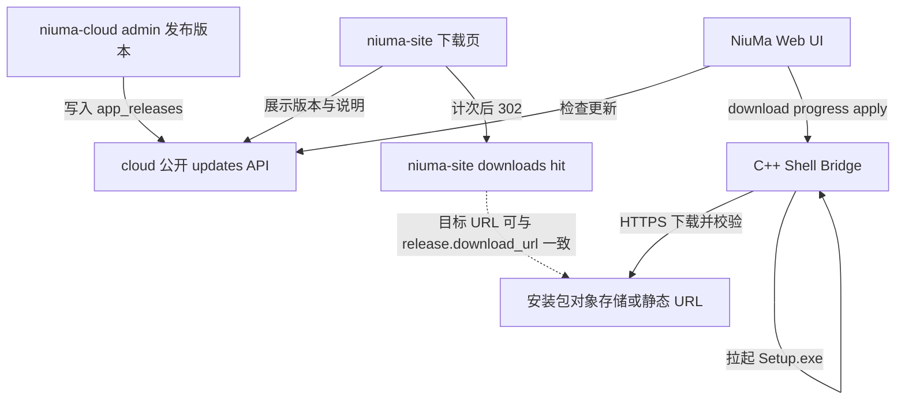

# 33 — 桌面端应用内更新

> 版本：v0.3 · 日期：2026-08-06  
> 状态：**P0 已落地**；官网读 cloud 版本/notes + 去 SQLite（计次 JSON）已接  

> 相关仓：`NiuMa`（桌面）· `niuma-cloud`（发布 API / Admin）· `niuma-site`（官网展示与下载计次）

---

## 1. 背景与现状

当前用户拿到的桌面安装包**不会**自动发现新版本，也**不会**在应用内下载更新。

| 能力 | 现状 |
|------|------|
| 本地版本 | 根 `package.json` → `build/version.json` → Shell `AppConfig`；Web 经 `shell.version` 只读展示 |
| 云端版本清单 | **无**；`niuma-cloud` 仅在反馈里存 `clientVersion` |
| Admin | 账户 / 员工 / 反馈 / 审计；**无**发布管理 |
| 官网下载 | `niuma-site`：hit 计次写本地 JSON 后 302；版本/notes 读 cloud `updates/latest` |
| 安装包 | Windows：Inno Setup 6 → `NiuMa-<ver>-windows-x64-Setup.exe`（固定 `AppId`，支持覆盖升级） |

市场主流（非 Electron / 非商店）路径：公开更新清单 → 应用比对 → 展示说明 → 下载完整安装包 → 校验 → 拉起安装程序 → 退出当前进程。本方案对齐该路径。

与「设置 → 工具组件」的 `optional_download`（第三方 CLI）严格分离：本文只覆盖 **NiuMa 本体**升级。

---

## 2. 目标与非目标

### 2.1 目标

1. 用户启动后可发现新版本，并选择「稍后」或「立即更新」。
2. **更新说明（changelog）单一真相**：由 **niuma-cloud Admin** 维护，经业务 API 同时服务 **官网** 与 **桌面端**。
3. **专业主流安装**：应用内下载 Setup → SHA-256 校验 → 拉起安装包 → 退出应用（不做运行中热替换）。
4. 支持**强制更新**（低于最低可用版本，或单版本标记强制）。
5. P0 交付 **Windows x64**；Linux / macOS 共用契约后启。

### 2.2 非目标

- 不引入 Electron `autoUpdater` / Sparkle / Squirrel。
- 不做 CEF / 主 `exe` 运行中热替换。
- 安装包**不**经 cloud 反代大文件；cloud 只返回元数据 + 直链 URL + 校验信息。
- 不把更新逻辑编译进 Platform Core 或做成内置 Tool（见仓库 external-tools 原则）。
- P0 不做差分包、静默后台强制安装、多渠道 `beta`。

### 2.3 已锁定决策

| 项 | 决定 |
|----|------|
| 清单与说明 | `niuma-cloud` 表 + Admin；公开 API 免登录 |
| 官网 | 版本号 / 说明读 cloud；下载按钮仍可走 site `hit` 计次 |
| 安装 | 应用内下载 + 校验 + 拉起 Inno Setup |
| 渠道 | P0 仅 `stable` |

---

## 3. 架构与职责边界



| 组件 | 职责 |
|------|------|
| **niuma-cloud Admin** | 草稿 / 编辑说明 / 发布 / 撤回；审计 |
| **niuma-cloud API** | `updates/latest` · `updates/check` · `updates/releases`；Ops CRUD |
| **安装包托管** | OSS / CDN / 静态站；HTTPS；URL 写入 release 记录 |
| **niuma-site** | 展示 latest / notes；下载 hit 计次（可与 cloud 元数据解耦） |
| **NiuMa Web** | 启动延迟 + 每小时检查、弹窗、进度；帮助菜单「关于」手动检查 |
| **C++ Shell** | 受限 HTTPS 下载、SHA-256、拉起 Setup、退出进程 |

版本比较规则：

- 使用 **semver**（与根 `package.json` / `build/version.json` 一致）。
- `updateAvailable = latest.version > current`（严格大于；预发布标签 P0 忽略，仅 `X.Y.Z`）。
- `forceUpdate = release.force_update OR current < release.min_supported_version`（以 check 接口返回的聚合布尔为准）。

---

## 4. 数据模型（niuma-cloud）

### 4.1 表 `app_releases`

SQLite / MySQL 双 migrate（接在现有 `001` / `002` 之后，如 `003_app_releases.sql`）。

| 列 | 类型（概念） | 说明 |
|----|--------------|------|
| `id` | string PK | 如 `rel_…` |
| `product` | string | 固定起步：`niuma` |
| `version` | string | semver，如 `1.0.1` |
| `channel` | string | P0：`stable` |
| `platform` | string | `windows` / `linux` / `macos` |
| `arch` | string | `x64` / `arm64` |
| `min_supported_version` | string | 可空；低于则强制更新 |
| `force_update` | bool | 本条发布强制更新 |
| `title` | string | 短标题 |
| `notes_md` | text | Markdown 更新说明（官网与桌面共用） |
| `download_url` | string | HTTPS 安装包直链 |
| `sha256` | string | 小写 hex |
| `file_size` | int64 | 字节；可 0 表示未知 |
| `status` | string | `draft` \| `published` \| `yanked` |
| `published_at` | datetime | 发布时写入；草稿为空 |
| `created_by` | string | 员工 id |
| `created_at` / `updated_at` | datetime | |

约束建议：

- 唯一：`(product, channel, platform, arch, version)`。
- `latest` 查询：同维度下 `status=published`，按 semver 最大（实现可用排序键或应用层比较）；`yanked` 不参与。

### 4.2 审计动作码

| Action | 时机 |
|--------|------|
| `release.create` | 创建草稿 |
| `release.update` | 编辑草稿或已发布字段（谨慎） |
| `release.publish` | `draft` → `published` |
| `release.yank` | `published` → `yanked` |

---

## 5. API 契约

前缀：`/cloud`（与现有 Identity / Feedback / Ops 一致）。  
公开接口：**免登录**；Ops 接口：员工 JWT。

### 5.1 公开：`GET /cloud/api/v1/updates/latest`

Query：

| 参数 | 必填 | 示例 |
|------|------|------|
| `product` | 否 | 默认 `niuma` |
| `platform` | 是 | `windows` |
| `arch` | 是 | `x64` |
| `channel` | 否 | 默认 `stable` |

响应 `200`：

```json
{
  "product": "niuma",
  "channel": "stable",
  "platform": "windows",
  "arch": "x64",
  "version": "1.0.1",
  "title": "1.0.1 稳定性修复",
  "notesMd": "## 修复\n- …\n",
  "downloadUrl": "https://cdn.example.com/niuma/NiuMa-1.0.1-windows-x64-Setup.exe",
  "sha256": "a1b2…",
  "fileSize": 123456789,
  "minSupportedVersion": "1.0.0",
  "forceUpdate": false,
  "publishedAt": "2026-08-05T12:00:00Z"
}
```

无已发布版本：`404` + `{ "error": "not_found" }`。

### 5.2 公开：`GET /cloud/api/v1/updates/check`

Query：在 latest 参数基础上增加：

| 参数 | 必填 | 说明 |
|------|------|------|
| `current` | 是 | 客户端当前版本，如 `1.0.0` |

响应 `200`：

```json
{
  "updateAvailable": true,
  "forceUpdate": false,
  "current": "1.0.0",
  "latest": {
    "version": "1.0.1",
    "title": "1.0.1 稳定性修复",
    "notesMd": "## 修复\n- …\n",
    "downloadUrl": "https://cdn.example.com/niuma/NiuMa-1.0.1-windows-x64-Setup.exe",
    "sha256": "a1b2…",
    "fileSize": 123456789,
    "minSupportedVersion": "1.0.0",
    "publishedAt": "2026-08-05T12:00:00Z"
  }
}
```

`forceUpdate` 聚合规则见 §3。无 published release 时：`updateAvailable: false`，`latest: null`（仍 `200`，避免桌面端当致命错误）。

### 5.3 公开：`GET /cloud/api/v1/updates/releases`

Query：`product`、`platform`、`arch`、`channel`、`limit`（默认 20，最大 50）。

返回 `published`（可选含近期 `yanked` 由实现决定；官网 changelog 默认只列 `published`）列表，字段同 latest 摘要（可省略超大 `notesMd` 用截断，完整说明走单条详情；P0 可直接返回完整 `notesMd`）。

### 5.4 Ops（Admin）

| 方法 | 路径 | 说明 |
|------|------|------|
| `GET` | `/cloud/api/v1/ops/releases` | 列表（含 draft/yanked）；筛选 product/platform/status |
| `POST` | `/cloud/api/v1/ops/releases` | 创建草稿 |
| `GET` | `/cloud/api/v1/ops/releases/{id}` | 详情 |
| `PATCH` | `/cloud/api/v1/ops/releases/{id}` | 编辑；`status` 迁移：`publish` / `yank` 可用专用字段或子路径 |
| `POST` | `/cloud/api/v1/ops/releases/{id}/publish` | 发布 |
| `POST` | `/cloud/api/v1/ops/releases/{id}/yank` | 撤回 |

发布前校验：`version` 合法、`download_url` 为 https、`sha256` 长度 64 hex、同维度 version 未占用 published。

### 5.5 大文件与计次

- Cloud **不**代理 Setup 字节流。
- 官网下载按钮：继续 `GET|POST /api/v1/downloads/windows/hit`（niuma-site）；服务端 302 目标建议与当前 `published` 的 `download_url` 对齐（运维配置或后续 site 读 cloud）。
- 桌面端下载 hit：`POST /niuma/cloud/api/v1/updates/hit` 已落地；失败不阻断更新。

---

## 6. Admin 运营界面要点

路由建议：`/ops/releases`（挂到现有 OpsLayout 导航）。

能力：

1. 列表：版本、平台/架构、状态、发布时间、强制标记。
2. 新建 / 编辑：表单字段对齐 §4.1；`notes_md` 用 Markdown 文本域；预览可选。
3. 操作：发布、撤回；发布前二次确认（将影响全部桌面检查与官网展示）。
4. 辅助：粘贴 `sha256` / `file_size`；不在 Admin 内上传大文件（P0），由运维先上传 CDN 再填 URL。

---

## 7. 桌面 UX 与状态机

### 7.1 入口

| 入口 | 行为 |
|------|------|
| 启动后约 **30s** | 静默 `updates/check`（失败吞掉，不打扰） |
| 设置 → 关于 / 运行时 | 「检查更新」按钮；展示当前 `shell.version` |
| 强制更新 | 模态不可关闭（仅「立即更新」）；阻断主要工作流 |

「稍后提醒」：本地记住 `snoozeUntil`（如 24h）与已提示的 `latest.version`；同版本在 snooze 内不再自动弹（手动检查仍弹）。

### 7.2 弹窗内容

- 标题：发现新版本 `v{latest}`
- 正文：`title` + `notesMd`（Markdown 渲染，样式克制）
- 操作：稍后提醒 · 立即更新；（强制时隐藏稍后）
- 下载中：进度条（已下载 / 总大小）、取消（非强制可取消）

### 7.3 状态机

```text
idle
  → checking
  → upToDate | available | forced | checkFailed
available / forced
  → downloading → verifying → applying → exited
  → downloadFailed | verifyFailed | applyFailed
  → snoozed（仅 available）
```

本地版本：`bridgeStore` / `shellApi.getVersion()`（已有）。  
Cloud 客户端：复用 `web/src/api/cloud/client.ts`（`VITE_CLOUD_API_BASE`），新增 `web/src/api/cloud/updates.ts`。

平台 / arch：来自 `shell.info` 的 `platform`，arch 由 Shell 扩展字段或 Web 侧映射（实现时在 `shell.info` 增加 `arch`，避免猜）。

---

## 8. Shell Bridge 契约与安全

扩展 `shell/src/bridge/bridge_router.cpp`（及 Web `shellApi` 封装）。下载进度用现有 stream / 事件通道（与其它长任务一致；实现时选定一种并在 PR 中固定）。

### 8.1 方法

#### `shell.update.download`

请求：

```json
{
  "url": "https://cdn.example.com/.../NiuMa-1.0.1-windows-x64-Setup.exe",
  "sha256": "a1b2…",
  "expectedSize": 123456789
}
```

行为：

- 仅 `https:`。
- Host 必须命中 **allowlist**（环境变量 `NIUMA_UPDATE_DOWNLOAD_HOSTS`；默认 `niuma007.com` / `www.niuma007.com`，子域如 `cdn.niuma007.com` 经后缀匹配放行）。
- 写入 `%TEMP%/niuma-update/`（或等价临时目录），文件名来自 URL 最后一段并做消毒。
- 进度事件：`{ "received": n, "total": n }`。
- 成功：`{ "path": "…", "bytes": n }`。

#### `shell.update.verify`

请求：`{ "path": "…", "sha256": "…" }`  
成功：`{ "ok": true }`；失败：明确 `hash_mismatch` / `file_missing`。

#### `shell.update.apply`

请求：`{ "path": "…" }`  

Windows P0：

1. `path` 必须位于更新临时目录内（防任意路径执行）。
2. `ShellExecute` 启动 Setup（交互向导；**不**默认 `/SILENT`）。
3. 启动成功后退出当前 NiuMa 进程（先停 Platform 子进程）。
4. 非 Windows：Shell 返回 `apply_unsupported_platform`；Web 改为 `openExternal(downloadUrl)`。

当前 iss：固定 `AppId`、`PrivilegesRequired=admin`、`CloseApplications=yes`、`RestartApplications=no`。

#### `shell.update.cancel`

取消进行中的下载；清理不完整文件。

### 8.2 安全红线

- 禁止 `http://`（本地开发可用编译开关或额外 localhost allow，**不得进生产包**）。
- 禁止执行 allowlist 外 host 的 URL。
- `apply` 仅允许临时更新目录下的 `.exe`（Windows）。
- 校验失败不得调用 `apply`。
- 不把下载逻辑放进 Web 无校验的「随便 fetch 写盘」（桌面写盘与执行必须在 Shell）。

---

## 9. 官网（niuma-site）对接

| 页面 / 能力 | 状态 |
|-------------|------|
| `/download` | 版本标签、更新说明：读 cloud `updates/latest` |
| 下载按钮 | site `downloads/windows/hit` 计次（JSON 元数据）+ 302 |
| 存储 | **无 SQLite**；`data/download-stats.json` |
| `VITE_DOWNLOAD_VERSION` | cloud 不可达时的展示回落 |
| 文档 | `niuma-site/docs/06-site-api.md` |

桌面与官网展示同一份 `notesMd`，避免两套文案。

---

## 10. 发版与回滚 Runbook

### 10.1 发布

1. 在 NiuMa 仓执行 `pnpm release:win`（或等价），产出  
   `output/windows-x64/setup/NiuMa-<ver>-windows-x64-Setup.exe`。
2. 同目录会生成 `NiuMa-<ver>-windows-x64-Setup.release.json`（含 `sha256` / `fileSize`）；亦可手动：

   ```powershell
   Get-FileHash .\NiuMa-1.0.1-windows-x64-Setup.exe -Algorithm SHA256
   (Get-Item .\NiuMa-1.0.1-windows-x64-Setup.exe).Length
   ```

3. 上传至 CDN / 对象存储，得到 HTTPS `download_url`（host 须在 cloud 与桌面白名单内）。
4. Admin → 发布：填写 `version`、`notes_md`、`download_url`、`sha256`、`file_size`、可选 `force_update` / `min_supported_version` → **发布**。
5. 验证：
   - `GET …/updates/latest?platform=windows&arch=x64`
   - 旧版桌面「关于 → 检查更新」出现说明并可下载安装
   - （P1）官网下载页版本与说明一致

### 10.2 回滚

1. Admin 对错误版本执行 **撤回（yank）**。
2. `latest` / `check` 自动回到上一 `published`。
3. 已下载错误包的用户：勿再引导安装；必要时发布更高版本热修。
4. CDN 对象可保留或删除；yank 后 API 不再下发该 URL 即可。

### 10.3 生产下载域名白名单

| 侧 | 配置 | 默认 / 建议 |
|----|------|-------------|
| **cloud Admin 校验** | `config/app.yaml` → `updates.download_url_hosts` | 生产填 `niuma007.com`（子域放行）；见 `app.yaml.example` |
| **桌面 Platform 下载** | 环境变量 `NIUMA_UPDATE_DOWNLOAD_HOSTS`（逗号分隔） | 未设置时默认 `niuma007.com,www.niuma007.com`；CDN 为其它根域时两边同步追加 |

两侧规则均为：HTTPS、禁凭据/内网/localhost；host 精确匹配或 `*.allowed` 后缀匹配。

### 10.4 Inno 与升级体验

- [x] `CloseApplications=yes` + `RestartApplications=no`
- [x] 固定 **AppId**（禁止改）
- [x] 签名：`scripts/shared/sign/sign-windows.ps1`（有证书时）

---

## 11. 分期与验收

| 阶段 | 范围 | 验收 |
|------|------|------|
| **P0** | cloud 表 + migrate；公开 `latest`/`check`；Ops CRUD；Admin 基础页；桌面延迟检查 + 弹窗 + 下载/校验/apply；Windows x64 | 旧包可升到新包；hash 错误拒绝安装；无 release 时静默 |
| **P1** | 官网读 cloud（版本/notes）；强制更新 UI；稍后提醒持久化；帮助菜单手动检查；审计动作 | 强制不可关；官网与桌面 notes 一致 |
| **P2** | Linux/macOS 包与 apply；`updates/hit`；`beta` 渠道；差分包（可选） | 各平台冒烟 |

### P0 验收清单（实现时勾选）

- [x] `app_releases` sqlite + mysql migrate
- [x] 公开 check/latest；无数据不导致桌面崩溃
- [x] Admin 可发布 / yank
- [x] Web 启动延迟 + 每小时检查；帮助菜单手动检查
- [x] Shell/Platform download allowlist + sha256 + apply + 退出
- [x] Inno `CloseApplications`；非 Windows 打开下载链（不半成品 apply）
- [x] 生产白名单配置示例（cloud `updates.download_url_hosts` + 桌面 `NIUMA_UPDATE_DOWNLOAD_HOSTS`）
- [ ] **发版联调**：用真实 Setup 完成一次覆盖升级（须在装机环境人工跑）

#### 覆盖升级联调步骤（人工）

1. 安装旧版 Setup（或保留当前已装版本 A）。
2. 打出版本 B（`> A`）Setup，上传 CDN；Admin 发布（填 `.release.json` 中的 hash/size）。
3. 启动版本 A → 帮助 → 关于 → 检查更新 → 立即更新。
4. 确认：进度 → UAC/向导 → 安装完成后版本为 B；数据/配置目录未丢。
5. 负例：Admin 故意填错 sha256 → 客户端报校验失败且不拉起安装。

---

## 12. 相关文件挂点（实现索引）

### niuma-cloud

| 区域 | 路径 |
|------|------|
| 路由注册 | `server/internal/httpapi/server.go` |
| 新 handlers / store | `server/internal/httpapi/*updates*` · `server/internal/store/releases.go` |
| Migrate | `server/internal/db/migrations/{sqlite,mysql}/003_app_releases.sql` |
| Admin 路由 / 页 | `admin/src/router/index.ts` · `admin/src/views/releases/` |
| Admin API | `admin/src/api/releases.ts` |

### NiuMa

| 区域 | 路径 |
|------|------|
| Cloud 客户端 | `web/src/api/cloud/client.ts` · 新增 `updates.ts` |
| Shell API | `web/src/api/shell.ts` · `web/src/api/types/shell.ts` |
| UI / store | `web/src/shell/account/{UpdateHost,HelpHost}.vue` · `stores/app-update.ts` |
| Bridge | `shell/src/bridge/bridge_router.cpp` |
| 版本源 | `package.json` · `scripts/shared/version/emit-build-info.mjs` · `build/version.json` |
| Windows 安装包 | `scripts/platforms/windows/pack/build-installer.ps1` |

### niuma-site

| 区域 | 路径 |
|------|------|
| 下载页 | `src/pages/DownloadPage.vue` |
| 下载 API（计次） | `src/api/downloads.ts` · `docs/06-site-api.md` |
| 配置 fallback | `src/config/site.ts` · `VITE_DOWNLOAD_VERSION` |

---

## 13. 修订记录

| 版本 | 日期 | 说明 |
|------|------|------|
| v0.1 | 2026-08-05 | 初稿：cloud/admin 单一真相 + 应用内下载 Setup；官网与桌面共用 updates API |
| v0.2 | 2026-08-05 | P0 实现：releases 表/公开 API/Admin；Platform 受限下载；Shell apply；Web 检查弹窗 |
| v0.3 | 2026-08-06 | Inno CloseApplications；发版 meta json；生产白名单示例；非 Windows 打开下载链 |
| v0.4 | 2026-08-06 | 官网去 SQLite：计次 JSON；下载页读 cloud updates |
