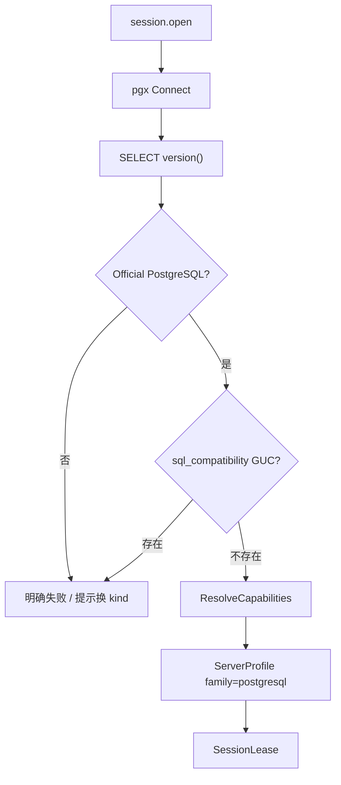

# 34 — PostgreSQL 管理模块（Layer-1 能力服务 + Web 模块）

> 版本：v0.2 · 日期：2026-08-18  
> 状态：**后端 P0–P4 + LSP 已落地**（session / query / tree / catalog / meta / ddl / io / Monitor）；**Web `modules/postgres` 已独立注册**  
> **隔离**：**独立进程 / 独立 kind / 独立 Web 模块 / 独立实现**；禁止与 Vastbase / 金仓 / 其它库服务混用代码或运行时互调  
> 关联：[13](./13-service-layout.md) · [14](./14-capability-connection-framework.md) · [18](./18-ops-connection-tree.md) · [20](./20-tool-components.md) · [21](./21-session-registry.md) · [23](./23-sql-dialect-completion.md) · [22 — Vastbase](./22-vastbase-module.md) · [31 — 金仓](./31-kingbase-module.md)（**PG 线协议对照，非实现依赖**）

---

## 0. 文档边界

| 写在本文 | 不写在本文 |
|----------|------------|
| `postgres-service`、`family: "postgresql"`、官方 PostgreSQL 对象模型与 Cap 表 | Vastbase / KingbaseES / openGauss 业务实现 |
| Web `modules/postgres` 与对本 kind 的注册 | 共享层硬编码 `if postgresql`；跨服务 Go 业务包 |
| **实现语言与驱动锁定结论（Go + jackc/pgx/v5）** | 把原生 PG 伪装成 `vastbase` / `kingbase` 会话 |

### 0.1 服务隔离与实现不混用（硬约束）

与 [26](./26-mariadb-module.md) / [31](./31-kingbase-module.md) / [32](./32-sqlserver-module.md) 同原则：**一引擎 = 一 Layer-1 进程 + 一套实现**。线协议同为 PostgreSQL wire ≠ 可共用 `vastbase-service` / `kingbase-service` 代码。

| 层 | 必须独立 | 允许共用（仅框架，无引擎业务） |
|----|----------|--------------------------------|
| 进程 / 二进制 | `niuma-postgres-service` 独享 | — |
| manifest / namespace / kind | `postgres` 独享 | — |
| Go 模块 | `services/postgres-service/` 自有 `go.mod` + `internal/*` | `packages/go/serviceipc`、`tunnel`、`logutil`、`sqllsp` 等**无引擎语义**包 |
| Web 业务模块 | `web/src/modules/postgres/`、`api/postgres.ts` | `modules/database/*` 壳、`sql-editor` 编排（只认 family/Cap） |
| Cap / Probe / 字典 SQL | 只写在本服务 `internal/dialect|tree|meta|…` | — |

**禁止**：

1. `import` 其它 `*-service` 的 `internal/`（含 vastbase / kingbase / mysql / oracle）。  
2. 抽取「PG 系共用」Go 业务包，或同进程 `if postgres / if kingbase` 分流。  
3. platform 把 `postgres` 与其它 kind 代理到**同一**可执行文件并用内部 if 分流（默认：**一 manifest = 一二进制**）。  
4. 运行时调用 `vastbase.*` / `kingbase.*` 完成本模块功能。  
5. Web 把 PostgreSQL 面板并入 `modules/vastbase` 或 `modules/kingbase`。  
6. 用 `family: "vastbase"` / `"kingbase"` 冒充原生 PostgreSQL。

**允许**：对照 22/31 **复制骨架后改写**；`sql-editor` 对 `family === 'postgresql'` 启用 dollar quote / plpgsql 拆句——这是编排层 Cap，**不是**服务实现混用。

**Probe 门禁**：连到金仓 / Vastbase / openGauss / Cockroach / Yugabyte 等 → **明确失败**，提示改用对应连接类型。`version()` 须含 `PostgreSQL` 且不含厂商分叉标识；若可读 `sql_compatibility` GUC（金仓特征）亦拒绝。

---

## 1. 目标与范围

面向 **官方 PostgreSQL**（优先 12+；以 14 / 15 / 16 验收）及以其名义发布的托管实例（Amazon RDS / Aurora PostgreSQL、Cloud SQL、Azure Database for PostgreSQL）：

- 连接站点、对象导航（`connection → database → schema → {Tables|Views|Procedures|Functions|Sequences}`）
- SQL 查询执行与结果集浏览（含取消、分页、事务）
- 元数据（列、索引、约束、DDL、例程源码）
- 表设计器、CSV/SQL 导入导出、会话监视

归属 `ops` / `data` 域；连接树与 `platform.connection.*` 走通用壳，**业务逻辑只在 `postgres-service` +（后续）`web/src/modules/postgres`**。

### 1.1 架构对齐（对标 DBeaver / Navicat）

| 能力层 | 参考 | NiuMa 做法 |
|--------|------|-----------|
| GUI / 对象树 / SQL | DBeaver / Navicat for PostgreSQL / psql 常用集 | Vue + Monaco + Go 能力服务 |
| 连接与查询 | PostgreSQL wire（默认端口 **5432**） | **Go + `jackc/pgx/v5`** |
| 方言差异 | 客户端能力探测 | **DialectFamily + CapabilitySet**（契约见 [23](./23-sql-dialect-completion.md)） |
| 外部 CLI | pg_dump / pg_restore / psql | [20](./20-tool-components.md) 组件包 `postgresql-client`，**不**编进 platform |
| 安装包 | 独立客户端 | 仅 `niuma-postgres-service` Go 二进制（无 JVM / 无 libpq 旁载） |

### 1.2 关键决策（已锁定）

| 维度 | 决策 | 理由 |
|------|------|------|
| 能力服务 | 独立 Layer-1 **`postgres-service`** | 长连接、取消、崩溃隔离；与其它库服务分离 |
| **实现语言** | **Go（唯一产品默认路径）** | 见 §1.3 |
| **驱动** | **`github.com/jackc/pgx/v5`** | 业界 Go 连 PG 事实标准；池化 / COPY / 取消成熟 |
| 协议 kind | **`postgres`** | 与其它 kind **不互通** |
| Bridge namespace | **`postgres`** | 仅 `postgres.*` |
| Dialect `family` | **`"postgresql"`** | Web 已预留；Cap 前缀 `postgres.*` |
| Web 模块 | **`web/src/modules/postgres/`** | 独立 ConnKind / 路由 / i18n / LSP |
| 会话策略 | 建议 **`per_tab` + closeOnRelease** | 多查询 Tab 独立物理连接与事务；见 [21](./21-session-registry.md) |
| 凭据 | platform Vault 注入 | [14](./14-capability-connection-framework.md) |
| SSH 隧道 | platform 公共 `tunnel` dialer | 本服务只收展开后的 host/port；隧道下 `prefer/allow` 降为 `disable` |
| 调试 | **首期不做** | 不做 PL/pgSQL 调试器（异于 Vastbase `DBE_PLDEBUGGER`） |
| **禁止** | 与其它 `*-service` 混用；JVM/JDBC 默认；libpq CGO 默认；MCP 进 platform | 见 §0.1 / §1.3 |

### 1.3 实现语言推荐（锁定：**Go**）

> **结论：产品默认实现语言 = Go。**  
> PostgreSQL 在 NiuMa 中定位为 **Layer-1 Go 能力服务**，与 MySQL / 金仓 / SQL Server / ClickHouse 同构；**不**走 Oracle 式 C++ L3 Native，也**不**引入 JVM。

#### 1.3.1 候选对照

| 方案 | 专业度（协议/生态） | 与 NiuMa 架构契合 | 分发 / 运维 | 结论 |
|------|---------------------|-------------------|-------------|------|
| **A. Go + `jackc/pgx/v5`（采用）** | 高：PG wire 事实标准；COPY / Listen / 取消持续演进 | **最高**：与既有 L1、`serviceipc`、构建/打包、supervisor 完全同构 | 单二进制；`CGO_ENABLED=0`；无旁载 | **产品默认 / 锁定** |
| B. C + `libpq` / C++ | 最高（官方客户端） | 低：需新增 CGO 或 C++ 宿主；无 Instant Client 级强制理由 | 捆绑 libpq / OpenSSL | **否决为默认** |
| C. Rust + `tokio-postgres` | 高 | 中：仓库虽有 Rust IPC，但库服务族已是 Go | 双工具链 | **否决为默认** |
| D. Java + JDBC（postgresql） | 高（DBeaver 同族） | 低：需 JRE；与「主路径无 Java」红线冲突 | 体积与双进程开销大 | **否决** |
| E. Go + `lib/pq` | 中 | 高 | 维护态 | **否决**；统一 pgx |

#### 1.3.2 为何不用 C++（对照 Oracle）

Oracle 选 C++20 + ODPI-C，是因为 **OCI / Instant Client thick** 是产品级完整语义的事实路径。PostgreSQL **没有**对等约束：协议公开、`pgx` 纯 Go 即可覆盖 P0–P4 常用集。

#### 1.3.3 驱动锁定细节

| 项 | 约定 |
|----|------|
| 模块 | `github.com/jackc/pgx/v5` |
| API | `pgxpool` + 扩展（COPY、Notice、取消） |
| 构建 | `CGO_ENABLED=0` |
| 依赖位置 | **仅** `services/postgres-service/go.mod`；**不**进入 platform-core |
| 厂商库旁载 | **无** |

P0 Spike 验收：`session.test`、单语句 `query.exec`、`context` 取消、`uuid` / `timestamptz` / `jsonb` / `bytea` 往返、非默认端口、SSL 常见组合、SSH 隧道。

### 1.4 协议与产品范围

| 项 | 说明 |
|----|------|
| 目标产品 | PostgreSQL 12+（优先 14/15/16）；托管 PG 同 family |
| 线协议 | PostgreSQL wire；默认端口 **5432** |
| SQL | 标准 SQL + plpgsql；dollar quote；**无** Oracle `/` 批、**无** 厂商兼容模式 |
| 元数据 | `pg_catalog` + `information_schema` |
| 对象模型 | **database + schema 两层**（同形金仓/Vastbase，异于 MySQL） |
| **不做（首期）** | PL/pgSQL 调试器；逻辑复制可视化运维；扩展商店全量编辑 |

### 1.5 已预留 / 待补齐

| 层 | 状态 |
|----|------|
| `DialectFamily` | [x] `'postgresql'`（`sql-editor/capabilities`） |
| 格式化 | [x] Cap `format.postgresql`（Web 已映射 `formatterLanguage: 'postgresql'`） |
| Monaco / LSP | [x] 后端 `postgres.lsp.*` + Web Monaco `postgresql`（`ensurePostgresLspLanguage`） |
| 拆句 | [x] dollar quote / plpgsql（family 回退已存在） |
| Cap / Profile | [x] 服务端 Probe + Web `defaultPostgreSQLProfile()` |
| 服务 | [x] `postgres-service` P0–P4 |
| Web 模块 | [x] `modules/postgres`（独立注册，对照 31/32） |

---

## 2. 产品模型：DialectFamily + CapabilitySet

`session.open` / `session.test` 返回（platform **整包透传**，禁止裁成仅 `sessionId`）：

```json
{
  "sessionId": "...",
  "dialect": {
    "family": "postgresql",
    "version": "PostgreSQL 16.2 on x86_64-pc-linux-gnu",
    "versionNum": "160200",
    "sqlCompatibility": "pg",
    "capabilities": [
      "postgres.double_quote_ident",
      "postgres.dollar_quote",
      "proc.plpgsql_dollar",
      "func.plpgsql_dollar",
      "editor.sql_lsp",
      "format.postgresql",
      "cte.window",
      "sequence.native",
      "json.native_type",
      "postgres.generated_identity",
      "ddl.if_not_exists",
      "ddl.design",
      "io.csv",
      "io.sql_file",
      "postgres.listen_notify"
    ]
  }
}
```

`family` **始终为 `"postgresql"`**。托管实例差异只用 Cap / `version` 表达，**禁止**另开 kind（除非未来产品明确要求「仅 Aurora」独立入口）。

### 2.1 Capability ID（本模块稳定字符串）

新增只加常量，**勿改已发布取值**。前缀：`postgres.*` / `proc.*` / `func.*` / `format.*` / `editor.*` / `ddl.*` / `io.*`。

| Capability | 含义 | 默认 | 启用阶段 |
|------------|------|------|----------|
| `postgres.double_quote_ident` | 标识符双引号 | ✓ | P0 |
| `postgres.dollar_quote` | `$tag$…$tag$` | ✓ | P0 |
| `proc.plpgsql_dollar` | `CREATE PROCEDURE … LANGUAGE plpgsql AS $$…$$` | ✓ | P0 |
| `func.plpgsql_dollar` | `LANGUAGE plpgsql AS $$…$$` | ✓ | P0 |
| `editor.sql_lsp` | Bridge 隧道 LSP | ✓ | P0 |
| `format.postgresql` | 格式化方言 postgresql | ✓ | P0 |
| `cte.window` | CTE / 窗口 | ✓ | P0 |
| `sequence.native` | 序列对象 | ✓ | P1 |
| `json.native_type` | JSON / JSONB | ✓ | P0 |
| `postgres.generated_identity` | `GENERATED … AS IDENTITY`（PG 10+） | ✓ | P0 |
| `ddl.if_not_exists` | IF [NOT] EXISTS | ✓ | P1 |
| `ddl.design` | 表设计器 | ✓ | P4 |
| `io.csv` / `io.sql_file` | 导入导出 | ✓ | P3 |
| `postgres.listen_notify` | LISTEN / NOTIFY | ✓ | 预留 |

**解析优先级（Web）**：Capability **优先** → 无 Cap 时用 `family === 'postgresql'` 词法回退（双引号 / dollar quote）。**禁止**业务散落 `if (family === 'vastbase')` 处理原生 PG 会话。

### 2.2 Probe（P0）

1. 按 ConnectParams 用 pgx 建连成功。  
2. `SELECT version()` → 须含 `PostgreSQL` 且**不含** Kingbase / Vastbase / openGauss / Cockroach / Yugabyte 等标识。  
3. 试读 `sql_compatibility`：成功则视为金仓分叉 → **失败**。  
4. `current_setting('server_version')` → `versionNum`（如 `160200`）。  
5. 纯函数 `ResolveCapabilities(version)` → Cap 表（单测）。  
6. P0 **不做**写性 DDL 试探。  
7. 成功返回整包 `dialect`（`family: "postgresql"`）。



---

## 3. 分层与进程模型

```
┌ Layer 4 ─ Web ────────────────────────────────────────────┐
│ web/src/modules/postgres/（后续）                          │
│   连接表单 · 树 Provider · Query · Browse · Monitor        │
│   ↑ bridgeInvoke(postgres.*) ↑ bridgeOnEvent(niuma:event) │
└───┼───────────────────────────┼────────────────────────────┘
    │ cefQuery                  │ PostMessage
┌ Layer 3 ─ C++ Shell ──────────┴────────────────────────────┐
│ bridge_router · platform_client · 事件回投 UI               │
└───┼───────────────────────────▲────────────────────────────┘
    │ length-prefixed JSON      │ 事件帧
┌ Layer 2 ─ platform-core ──────┴────────────────────────────┐
│ platform.connection.* + postgres.* 代理 + 凭据注入          │
└───┼───────────────────────────▲────────────────────────────┘
    │                           │ query / io 进度事件
┌ Layer 1 ─ postgres-service（Go + pgx/v5）──────────────────┐
│ 会话池 · dialect Probe · query · tree · catalog · meta     │
└───────────────────────────────┬────────────────────────────┘
                                │ PG wire :5432
                                ▼
                          PostgreSQL 实例
```

要点：

- 壳层与 platform-core **不写** PostgreSQL 业务 SQL / 数据字典语义。  
- 海量对象：树默认轻量（name/type）+ `filter` / `limit` / `truncated`；**禁止**对树中每张表默认 `COUNT(*)`。  
- 大结果：`query.exec` 分页游标语义对齐 [22](./22-vastbase-module.md)。

### 3.1 工程布局

```
services/
├── manifests/postgres-service.yaml
└── postgres-service/
    ├── go.mod
    ├── docker-compose.yml
    ├── cmd/postgres-service/main.go
    └── internal/
        ├── dialect/           # ServerProfile / Cap* / Probe
        ├── session/           # ConnectParams、pgx 池、query / tx
        ├── handler/           # session / query / tree / catalog / meta / ddl / io / lsp
        ├── tree/
        ├── meta/
        ├── ddl/
        ├── dataio/
        ├── postgresparser/
        ├── eventpub/
        └── idgen/
```

---

## 4. 连接参数（ConnectParams）

与 [14](./14-capability-connection-framework.md) 公共子对象对齐（Bridge camelCase；协议字段 snake_case）：

| 字段 | 默认 | 说明 |
|------|------|------|
| host / port | host 空；port **5432** | 直连或隧道对端；`port <= 0` 时服务回退 5432 |
| user / password | 常 `postgres` / Vault | 凭据注入；错误信息不含明文密码 |
| database | **postgres** | 初始登录库 |
| ssl_mode | `prefer` | `disable` / `prefer` / `require` / `verify-ca` / `verify-full` |
| ssl_root_cert / ssl_cert / ssl_key | 空 | PEM 路径（libpq 形） |
| search_path | 空 | 可选；打开后 `SET search_path` |
| client_encoding | 空（服务端默认 UTF8） | 仅字母数字下划线写入 DSN |
| application_name | `niuma-postgres` | `pg_stat_activity` 识别 |
| connect_timeout_seconds | 10 | 建连超时 |
| statement_timeout_ms | 0 | 0 = 不设置 |
| exclude_system_schemas | `true` | 树/catalog 默认隐藏 `pg_catalog` / `information_schema` / `pg_*` |
| tunnel / proxy | 无 | 与其它能力服务同形 |

本仓库 Docker 联调映射：**65432 → 5432**（见 `services/postgres-service/docker-compose.yml`）。

---

## 5. Bridge 契约

命名空间：`postgres`。方法名与 [23](./23-sql-dialect-completion.md) 对齐；**参数语义按 PostgreSQL 对象模型（database + schema）**。

### 5.1 会话

| 方法 | 入参 | 返回 |
|------|------|------|
| `session.open` | `{ profileId }` 或连接参数 | `{ sessionId, dialect }` |
| `session.close` | `{ sessionId }` | `{ closed: true }` |
| `session.test` | profile 或连接参数 | `{ ok, message, version?, dialect? }` |

### 5.2 查询 / 事务

| 方法 | 说明 |
|------|------|
| `query.exec` | 单语句执行；Web 拆句后严格顺序调用 |
| `query.execBatch` | 同连接顺序多语句（临时表 / SET 可见） |
| `query.fetch` / `query.close` / `query.cancel` | 续取 / 关闭游标 / `context` + pgx 取消 |
| `routine.call` | 过程 OUT 读回（同连接） |
| `tx.getState` / `tx.setAutoCommit` / `tx.commit` / `tx.rollback` | 事务钉住物理连接 |

**批约定**：服务端按**单语句**执行（`execBatch` 除外）。拆句由 Web Cap 驱动（dollar quote）；**禁止**发送 Oracle `/` 或客户端无意义指令行。

### 5.3 树 / catalog / meta / ddl / io / lsp

| 组 | 方法 |
|----|------|
| 树 | `tree.databases` / `schemas` / `tables` / `routines` / `sequences` / `categoryCounts` |
| 目录 | `catalog.schemas` / `tables` / `columns` |
| 元数据 | `meta.columns` / `indexes` / `constraints` / `ddl` / `primaryKey` / `foreignKeys` / `routineSource` / `databaseCreateOptions` |
| Monitor | `meta.instanceOverview` / `activity` / `locks` / `backendCancel` / `backendTerminate` / `serverVariables` / `serverStatus` |
| DDL | `ddl.script` / `exec` / `designPreview` / `designApply` / `createTablePreview` / `createTableApply` |
| IO | `io.exportCsv` / `importCsv` / `dumpSql` / `execSqlFile` / `cancel` |
| LSP | `lsp.open` / `rpc` / `close` / `lexicon`（事件 `postgres.lsp`） |

对象树：

```
connection → database → schema → {Tables|Views|Procedures|Functions|Sequences} → object
```

系统 schema 仅排除官方集合（`pg_catalog` / `information_schema` / `pg_toast*` / `pg_temp*`），**不含**金仓 `sys` / `plsql_debug`。

库级 DDL 维护库候选：`postgres` → `template1`（跳过被操作库与 `template0`）。

ResourceId（与 [18](./18-ops-connection-tree.md) 对齐）：

```
res:{profileId}:database:{db}
res:{profileId}:database:{db}:schema:{schema}
res:{profileId}:database:{db}:schema:{schema}:table:{table}
```

**首期不做**：Vastbase 级 `debug.*`；把 `pg_dump` 编进 platform。

---

## 6. Web 模块落地要点

独立模块 `web/src/modules/postgres/`，**禁止**并入 `modules/vastbase` 或 `modules/kingbase`。

- `register-conn-form.ts` / `register-conn-full.ts`：表单 + 对象树 + 导航懒加载  
- `builtin-modules.ts`：`id: 'postgres'`，`category: 'data'`，`routePath: '/postgres'`  
- i18n：`nav.postgres`（中文「PostgreSQL」）  
- `session-policy.ts`：`postgres: { sharing: 'per_tab', closeOnRelease: true }`  
- `CONN_KIND_DEFS`：`kind: 'postgres'`，`defaultPort: 5432`，icon `database`  
- 连接表单：host / port(5432) / user / password / database=`postgres` + SSL + SSH 隧道  
- sql-editor：`defaultPostgreSQLProfile()` + Monaco languageId **`postgresql`**（family 对齐；Bridge namespace 仍为 `postgres`）  
- 例程面板 `PostgresDebugPane` 是 **CALL 调用 UI**，不是 PL/pgSQL 调试器

---

## 7. 分期与验收

| Phase | 内容 | 状态 |
|-------|------|------|
| **文档** | 本稿 | [x] 驱动锁定 pgx；隔离红线固化 |
| **P0** | 服务骨架、manifest、`session.*`、Probe、`query.*`、事务 | [x] |
| **P1** | `tree.*`、`catalog.*` | [x] |
| **P2** | `meta.*`、DDL 脚本 | [x] |
| **P3** | `io.*`（COPY / dump / execSqlFile） | [x] |
| **P4** | Monitor、表设计器 | [x] |
| **LSP** | `postgresparser` + `postgres.lsp.*` | [x] |
| **Web** | `modules/postgres` | [x] 独立 ConnKind / 模块 / LSP `postgresql` |

---

## 8. manifest

见 `services/manifests/postgres-service.yaml`。

构建：`go.work` 含 `services/postgres-service`；`scripts/shared/build/build-services.ps1` / `.sh` 纳入；二进制名 **`niuma-postgres-service`**。

---

## 9. 红线

1. **禁止**与其它库服务混用实现：共享 Go 业务包、同进程多引擎 if、运行时互调、Web 模块合并（见 §0.1）。  
2. **禁止**用 `family: "vastbase"` / `"kingbase"` 或复用其默认 Cap 集伪装原生 PostgreSQL。  
3. **禁止** Java / JDBC sidecar / 为 PG 打包 JDK。  
4. **禁止**默认路径 CGO + libpq。  
5. **禁止**在 platform-core / 壳层写 PostgreSQL 数据字典 SQL。  
6. **禁止**对树节点默认全表 `COUNT(*)` / 无 limit 的 `SELECT *`。  
7. **禁止**把 Vastbase `debug.*` 或金仓兼容模式状态机拷进本服务。  
8. 新工具 / MCP / `pg_dump` 封装保持**外部化**，走 `postgresql-client` 组件包。  
9. platform 代理**不得裁剪** `dialect` 整包。

---

## 10. 开工 checklist

- [x] 语言 / 驱动锁定：Go + pgx/v5  
- [x] 独立 `postgres-service` + manifest + IPC  
- [x] Probe 拒绝金仓 / Vastbase / openGauss  
- [x] `go.work` + `build-services`  
- [x] 本文档与 [13](./13-service-layout.md) / [14](./14-capability-connection-framework.md) 索引  
- [x] Web `modules/postgres` 独立注册 + Monaco `postgresql` LSP

---

## 修订记录

| 版本 | 日期 | 说明 |
|------|------|------|
| v0.2 | 2026-08-18 | Web 独立模块落地：ConnKind / session / i18n / Monaco `postgresql` LSP |
| v0.1 | 2026-08-18 | 新增：锁定 Go + pgx；后端 P0–P4 + LSP；隔离红线；Web 待注册 |
