# NiuMa 全能 AI 运维平台 — 分层架构设计（初版）

> 版本：v0.2.5  
> 日期：2026-07-03  
> 壳层语言：**C++ + CEF Official SDK** · 前端：**Vue 3 + @niuma/ui**

---

## 1. 项目定位

NiuMa 是一个全能型 AI 运维桌面平台，涵盖：

- **主机运维**：SSH、SFTP、FTP
- **数据库运维**：MySQL、PostgreSQL、Oracle 等
- **扩展工具**：API 测试、数据格式化、视频生成/拼接等
- **AI 能力**：统一对话与 Tool 调用

各功能模块以**可插拔**形式接入；桌面端采用**自封装 CEF**（非 Electron），UI 跨平台一致。

---

## 2. 整体架构图

阅读顺序建议：**2.1 四层职责** → **2.2 进程分布** → **2.3 CEF 进程树** → **2.4 两层 IPC**。

### 2.1 四层职责（逻辑分层）

> 这张图只回答「各层做什么、怎么调用」，**不区分 OS 进程**。  
> 纵向箭头 = 调用方向；数字 = IPC 层级（详见 §2.4）。

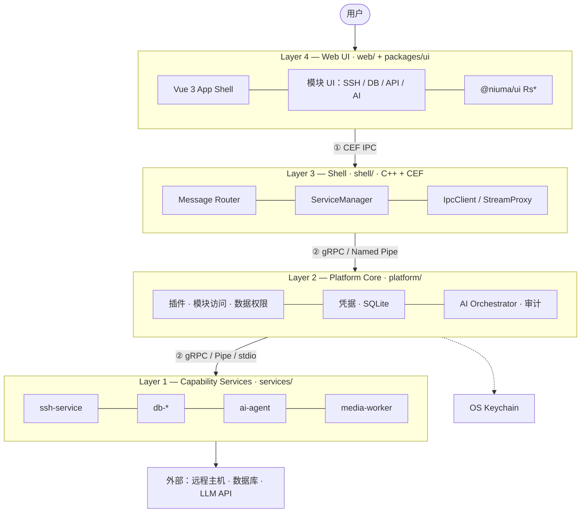

与 §4 ASCII 栈等价，便于在 Markdown 预览里直接看图。

### 2.2 进程分布（层 ↔ 进程）

> 这张图回答「**哪层代码跑在哪个进程**」。  
> **Browser = 宿主主进程**；**Renderer = 子进程**（只跑 Web，不是宿主）。

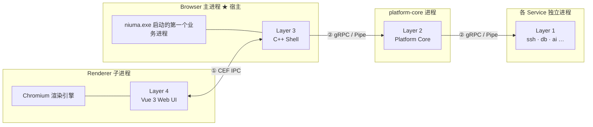

| 进程 | 主/子 | 承载的层 | 仓库目录 | 关键能力 |
|------|-------|----------|----------|----------|
| **Browser** | **主进程** | Layer 3 | `shell/` | 窗口、CEF 路由、起停服务、应用 IPC 客户端 |
| **Renderer** | 子进程 | Layer 4 | `web/` | 页面渲染、Pinia、`cefQuery` 委托 Browser |
| **platform-core** | 独立进程 | Layer 2 | `platform/` | **权限/凭据/数据/审计**、插件注册、AI 编排 |
| **各 service** | 独立进程 | Layer 1 | `services/` | SSH、DB、AI 等具体能力 |

**常见误解**

| 误解 | 实际 |
|------|------|
| Renderer 是宿主主进程 | **Browser** 才是主进程 |
| Layer 3 = Renderer | Layer 3 是 C++ 代码，跑在 **Browser**；Layer 4 跑在 **Renderer** |
| Web 可以直接 gRPC 连后端 | Web 只能走 ① → Browser 再走 ② |

### 2.3 CEF 进程树（Chromium 内置）

CEF 在 Browser 主进程之外，还会拉起 GPU / Utility 等**辅助子进程**（一般无需改业务代码）。  
与 Electron 对照：`main` ≈ **Browser**，`renderer` ≈ **Renderer**。

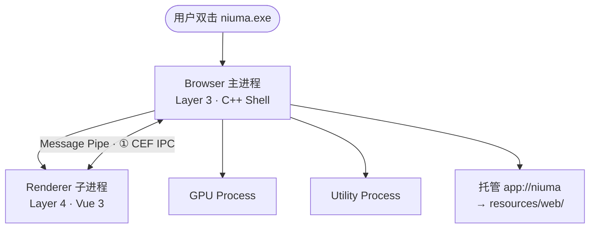

| 进程 | 主/子 | 是否写业务代码 | 职责 |
|------|-------|----------------|------|
| Browser | **主** | 是（`shell/`） | 窗口、IPC 桥接、资源协议、连 Platform |
| Renderer | 子 | 是（`web/`） | UI 渲染与交互 |
| GPU / Utility | 子 | 否 | 图形加速、网络栈等（CEF 默认） |

### 2.4 两层 IPC

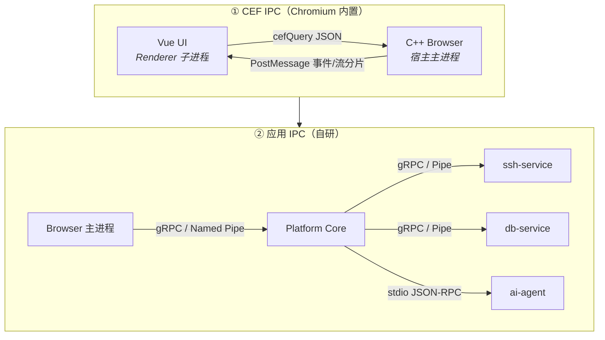

| 层级 | 范围 | 协议 | 是否需要 proto |
|------|------|------|----------------|
| ① CEF IPC | Renderer ↔ Browser | JSON + cefQuery / PostMessage | 否 |
| ② 应用 IPC | Browser ↔ Platform ↔ Services | gRPC over Pipe/UDS；轻量 stdio | 是（`proto/`） |

### 2.5 典型请求链路（SSH 执行命令）

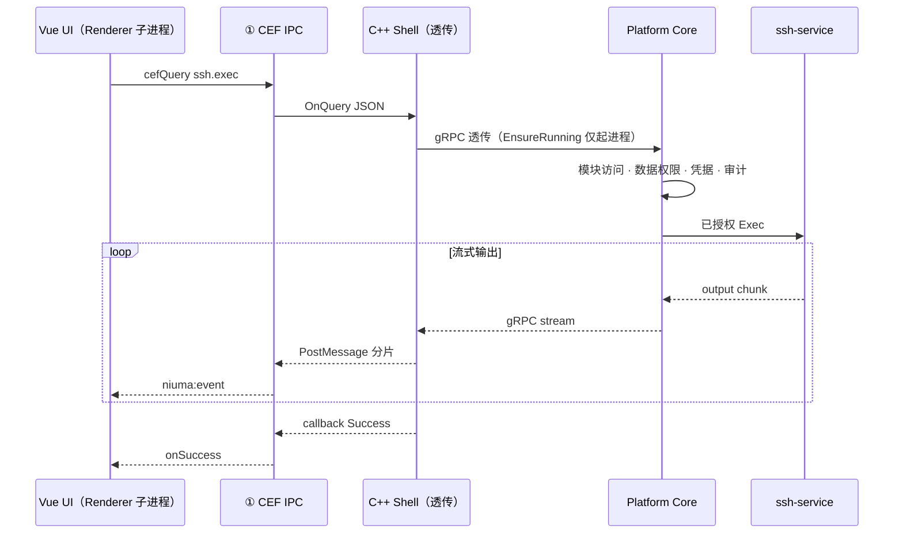

### 2.6 插件扩展模型

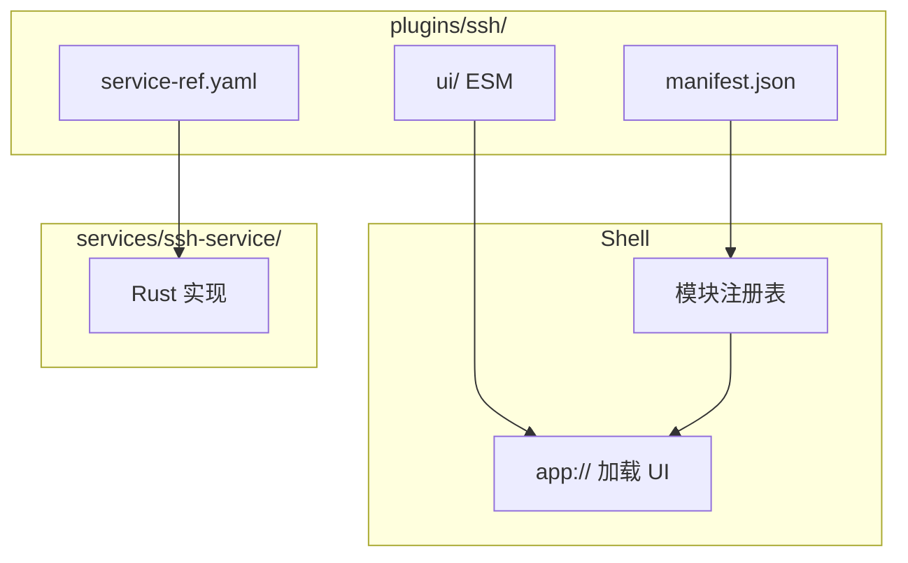

| 级别 | Web UI | 后端 | 示例 |
|------|--------|------|------|
| L1 | 有 | 无 | 格式化、计算器 |
| L2 | 有 | 独立进程 + gRPC | SSH、MySQL |
| L3 | 有 | Native / 重量级进程 | Oracle、FFmpeg |

### 2.7 构建与发布包布局

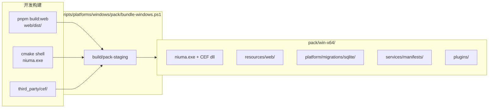

### 2.8 运行时目录（安装包 vs 用户数据）

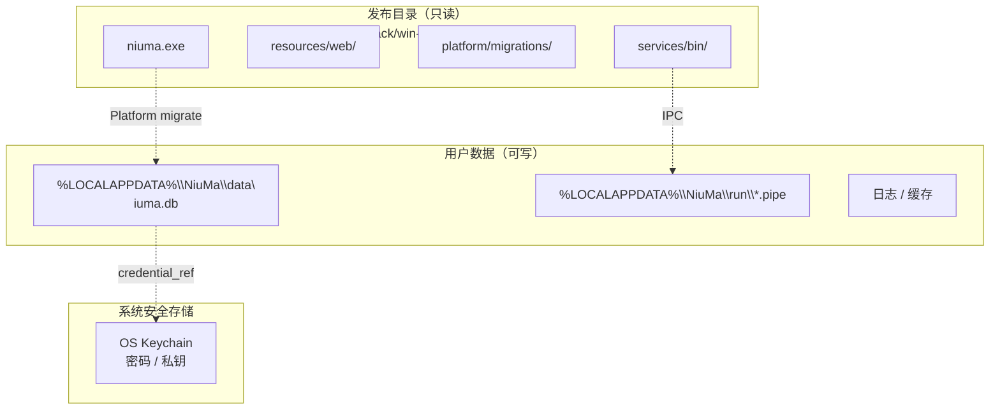

### 2.9 数据与超大报文流

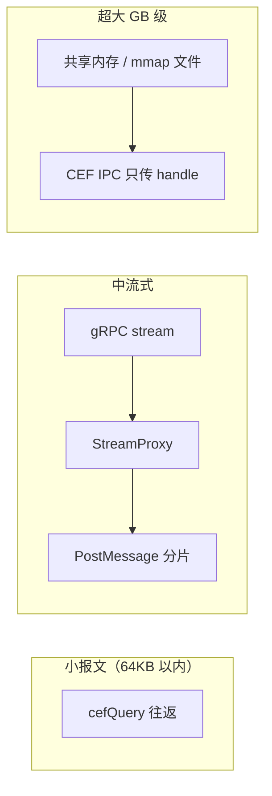

---

## 3. 设计原则

| 原则 | 说明 |
|------|------|
| **壳薄后端厚** | C++ 壳只负责 CEF、窗口、桥接、服务管理，**不含任何业务逻辑与权限判断** |
| **权限在 Platform** | 数据权限、模块访问、凭据、审计等**唯一裁决点在 Layer 2** |
| **协议先行** | 跨语言通信用 Protobuf/gRPC 契约，语言只是实现 |
| **两层 IPC** | CEF IPC 管 UI↔宿主；应用 IPC 管宿主↔多语言后端 |
| **进程隔离** | 重模块独立进程，崩溃不拖垮 UI |
| **壳层语言固定** | 壳层长期稳定用 C++；后端按模块选语言 |

### 3.1 业务边界：壳层零业务

> **外层 C++ CEF（Layer 3）只管壳**：窗口、Web 加载、IPC 透传、进程启停。  
> **不与业务逻辑交互**：不读 SQLite、不做权限、不解析连接/凭据/模块策略。

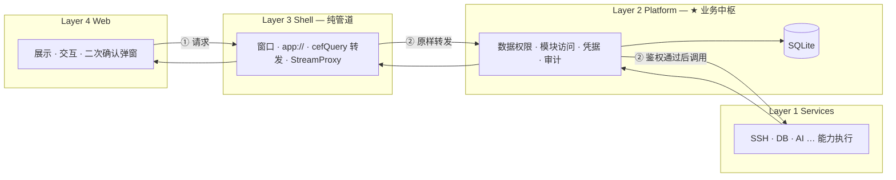

#### 各层「做 / 不做」

| 能力 | Layer 4 Web | Layer 3 Shell | Layer 2 Platform | Layer 1 Service |
|------|-------------|---------------|------------------|-----------------|
| **数据权限**（能否读某 profile/表） | 按 Platform 返回结果展示；可隐藏菜单（**非安全边界**） | ❌ | ✅ **裁决** | 仅执行 Platform 已授权的调用 |
| **模块访问**（插件是否启用/可见） | 读 registry 渲染 SideNav | ❌ | ✅ manifest + 用户授权 + `nm_plugin_*` | ❌ |
| **凭据** | 只持 `credential_id` | ❌ 不见明文 | ✅ Keychain 读写 | 接收 Platform 注入的短期令牌 |
| **连接/配置 CRUD** | 表单与列表 UI | ❌ | ✅ 写 SQLite + 校验 | ❌ |
| **危险操作确认** | ✅ UI 二次确认 | ❌ | ✅ 记录审计、可强制拒绝 | 执行命令 |
| **审计日志** | 展示 | ❌ | ✅ 写入 `nm_audit_*` | 可选上报细节 |
| **窗口 / Tab / 托盘** | App Shell 布局 | ✅ | ❌ | ❌ |
| **cefQuery / gRPC 转发** | 发起 | ✅ **透传，不解析业务** | 处理 | 被调用 |

#### Shell 允许的「路由」vs 禁止的「鉴权」

| Shell `BridgeRouter` 只做 | Shell **禁止**做 |
|---------------------------|------------------|
| 把 `cefQuery` JSON **原样**送到 Platform 的 gRPC 方法 | 判断用户能否访问某模块 |
| 按 manifest **启停**后端进程（`ServiceManager`） | 读 `niuma.db` 或做 SQL |
| 把 gRPC stream **分片**推回 Web（`StreamProxy`） | 解析/缓存凭据、连接密码 |
| 维护 Pipe 连接、背压、超时 | 替代 Platform 调用 ssh-service |

**原则**：Web 发来的请求，Shell 默认 **全部先交 Platform**；Platform 鉴权后再决定是否、如何调 Layer 1。  
例外：纯静态资源（`app://`）、ping/版本等**无业务语义**的壳层健康检查可不经 Platform。

#### 典型调用链（含权限）

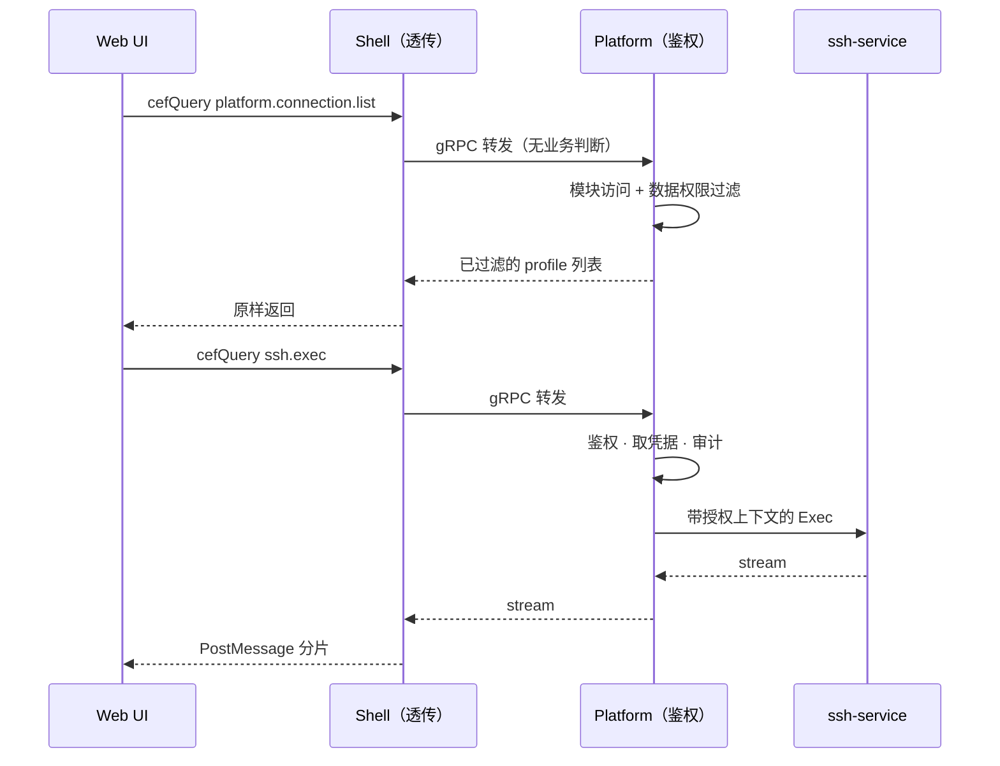

数据表与权限相关字段规划见 [database-schema.md](./database-schema.md)（`nm_plugin_*`、`nm_credential_ref` 等）。

---

## 4. 总体分层

```
┌─────────────────────────────────────────────────────────────┐
│  Layer 4 — Web UI（Vue 3 + TypeScript）                      │
│  @niuma/ui · App Shell · Pinia · 插件模块 UI                 │
└──────────────────────────┬──────────────────────────────────┘
                           │ ① CEF IPC
                           │    cefQuery（请求）/ PostMessage（事件）
┌──────────────────────────▼──────────────────────────────────┐
│  Layer 3 — Shell 壳层（C++ + CEF）              ← shell/     │
│  CEF 多进程 · Message Router · app:// · ServiceManager       │
│  IpcClient · StreamProxy（**仅透传，无业务/权限逻辑**）        │
└──────────────────────────┬──────────────────────────────────┘
                           │ ② 应用 IPC
                           │    gRPC over Named Pipe / UDS
┌──────────────────────────▼──────────────────────────────────┐
│  Layer 2 — Platform Core（Go）                ← platform/    │
│  数据权限 · 模块访问 · 凭据 · SQLite · 配置 · 审计 · AI      │
└──────────────────────────┬──────────────────────────────────┘
                           │ ② 应用 IPC
┌──────────────────────────▼──────────────────────────────────┐
│  Layer 1 — Capability Services（多语言）        ← services/  │
│  ssh(Rust) · db(Go/C++) · ai(Python) · media(C++)            │
└─────────────────────────────────────────────────────────────┘
```

> 与 **§2.1 四层职责** 等价；§2 另补充进程分布（§2.2）与 CEF 进程树（§2.3）。

---

## 5. 两层 IPC 详解

### 5.1 ① CEF IPC（Chromium 内置）

**范围**：Renderer 进程（Web UI）↔ Browser 进程（C++ 宿主）

| 特性 | 说明 |
|------|------|
| 传输 | Message Pipe / socketpair / 共享内存（Chromium 内核） |
| 格式 | 二进制帧 + JSON 字符串 |
| 封装 | `cefQuery`（异步请求）、`PostMessage`（事件推送） |
| 端口 | 不监听网络端口，仅本机 CEF 进程树内 |
| Proto | **不需要**，JSON 即可 |

**适用**：控制信令、小报文、流式分片推送（单条建议 < 64KB）

**不适用**：GB 级文件、超大 SQL 结果一次性传输

### 5.2 ② 应用 IPC（自研）

**范围**：Browser 进程 ↔ Platform Core ↔ 各后端服务

| 特性 | 说明 |
|------|------|
| 传输 | Named Pipe（Windows）/ Unix Domain Socket（Linux/macOS） |
| 协议 | gRPC（核心服务）/ JSON-RPC 2.0 over stdio（轻量脚本） |
| 契约 | `proto/` 目录 Protobuf 定义 |
| 发现 | `service.yaml` manifest + `${RUNTIME_DIR}` |

**适用**：SSH 流式输出、DB 结果集、SFTP、AI token 流、服务间调用

### 5.3 超大报文策略

| 数据量级 | 策略 |
|----------|------|
| < 64KB | CEF IPC 一次往返 |
| 64KB ~ 几十 MB | gRPC stream → Browser 分片 → PostMessage |
| 几十 MB ~ GB | 共享内存 / mmap 临时文件，CEF IPC 只传句柄 |

---

## 6. 壳层（C++）模块划分

```
shell/
├── core/cef/       # CefApp、Settings、RenderProcessHandler
├── core/window/    # 主窗口、启动 URL
├── core/runtime/   # manifest、子进程启停（不裁决权限）
├── browser/        # 主 Browser + handlers（① cefQuery）
├── bridge/         # 透传路由、StreamProxy
├── ipc/            # PlatformClient（② gRPC 透传）
└── protocol/       # app:// 资源协议
```

| 模块 | 职责 | 不做 |
|------|------|------|
| `NiuMaApp` | CEF 初始化、多进程入口 | 业务、权限 |
| `NiuMaClient` / `main_browser` | 主 Browser 实例、弹窗、下载 | 业务 |
| `MessageRouterHandler` | ① 接收 `cefQuery`，解析 JSON | 权限、业务语义 |
| `BridgeRouter` | 按 service 选目标，**透传** | 数据权限、模块访问裁决 |
| `AppSchemeHandler` | `app://` 加载 `resources/web/` | — |
| `ServiceManager` | manifest、启停进程、健康检查 | 不裁决谁能调谁 |
| `PlatformClient` | ② gRPC / Pipe 客户端，原样转发 | SQLite、凭据 |
| `StreamProxy` | stream → Web 分片 + 背压 | — |

---

## 7. 后端多语言策略

壳层与后端**不耦合**，靠协议连接。

### 7.1 Platform Core 语言决策：**Go**

| 项 | 决策 |
|----|------|
| **语言** | **Go 1.22+** |
| **进程** | 独立常驻 `platform-core` |
| **理由** | 业务中枢（权限、SQLite、gRPC 编排）迭代快；gRPC 生态成熟；与 C++ Shell、多语言 L1 通过 `proto/` 解耦 |
| **与 Rust 服务** | 仅共享 Protobuf 契约，不共享业务代码；`ssh-service` 等仍可用 Rust |

推荐技术栈：

| 能力 | 库（规划） |
|------|------------|
| gRPC | `google.golang.org/grpc` + `protobuf` |
| SQLite | `modernc.org/sqlite`（纯 Go，Windows 打包无 CGO） |
| 迁移 | 自研或 `golang-migrate`，执行 `scripts/sql/sqlite/` |
| Keychain | `github.com/zalando/go-keyring` 或平台封装 |
| ID 生成 | 进程内 Snowflake（见 database-schema.md） |
| 配置 | 环境变量 + `%LOCALAPPDATA%\NiuMa\` |

源码布局见 [platform/README.md](../platform/README.md)。

### 7.2 各模块语言

| 模块 | 语言 | 进程类型 |
|------|------|----------|
| **Platform Core** | **Go** | 常驻 |
| SSH / SFTP | Rust | 按需 |
| MySQL / PG | Rust / Go | 按需 |
| Oracle | C++ / Java | 按需 |
| FFmpeg 媒体 | C++ | 按需 |
| AI Agent | Python | 按需（stdio JSON-RPC） |
| API 测试 / 格式化 | Go | 轻量 |

每个服务提供 `service.yaml`：

```yaml
id: com.niuma.ssh
runtime:
  executable: services/ssh-service/ssh-service.exe
  lang: rust
ipc:
  transport: named_pipe          # named_pipe | uds | stdio
  address: "${RUNTIME_DIR}/ssh.pipe"
  protocol: grpc
  proto: proto/ssh.proto
lifecycle:
  startup: on_demand
  idle_timeout: 300s
permissions:
  - network
  - credential:read
```

---

## 8. 插件模型

```
plugins/<name>/
├── manifest.json       # 插件元数据、权限、路由
├── ui/                 # Web UI（ES Module，壳经 app:// 加载）
└── service-ref.yaml    # 指向 services/ 下对应后端（可选）
```

| 级别 | Web UI | Native 后端 | 示例 |
|------|--------|-------------|------|
| L1 轻量 | 有 | 无 | API 测试、格式化 |
| L2 标准 | 有 | IPC Worker | SSH、MySQL |
| L3 重量 | 有 | Native DLL/独立进程 | Oracle、FFmpeg |

---

## 9. CEF IPC 消息约定（Web ↔ 壳）

### 9.1 请求（cefQuery）

```json
{
  "method": "com.niuma.ssh.exec",
  "params": { "sessionId": "xxx", "command": "ls -la" },
  "id": "req-001"
}
```

### 9.2 响应

```json
{
  "id": "req-001",
  "ok": true,
  "result": { "sessionId": "xxx" }
}
```

### 9.3 事件推送（PostMessage / CustomEvent）

```json
{
  "type": "ssh.output",
  "sessionId": "xxx",
  "data": "line output...\n",
  "eof": false
}
```

### 9.4 超大流句柄

```json
{
  "type": "stream.handle",
  "handleId": "shm://abc123",
  "size": 1073741824,
  "mimeType": "application/octet-stream"
}
```

---

## 10. 运行时目录

| 平台 | `${RUNTIME_DIR}` |
|------|------------------|
| Windows | `%LOCALAPPDATA%\NiuMa\run\` |
| macOS | `~/Library/Application Support/NiuMa/run/` |
| Linux | `$XDG_RUNTIME_DIR/niuma/` 或 `~/.local/share/niuma/run/` |

Named Pipe 示例（Windows）：`\\.\pipe\niuma.ssh`

---

## 11. 仓库与发布目录结构

### 11.1 源码仓库

```
NiuMa/
├── docs/                      # 设计文档
├── scripts/
│   ├── pack/                  # 打包脚本
│   └── sql/sqlite/            # SQL 迁移源
├── pack/                      # ★ 打包输出（pack/win-x64/）
├── shell/                     # C++ CEF 壳层
├── web/                       # Vue 3 主应用
├── packages/ui/               # @niuma/ui 组件库
├── platform/                  # Platform Core（Go）
├── services/manifests/        # service.yaml
├── plugins/                   # 可插拔插件包
├── proto/                     # Protobuf 契约
└── third_party/cef/           # CEF 预编译包（脚本下载）
```

### 11.2 发布包（`pack/win-x64/`）

```
pack/win-x64/
├── niuma.exe                  # + CEF 运行时 dll
├── resources/web/             # ← web/dist
├── platform/migrations/sqlite/  # ← scripts/sql/sqlite
├── services/manifests/ + bin/
└── plugins/
```

详见 [pack-output-layout.md](./pack-output-layout.md)。

---

## 12. 开发环境（壳层 C++）

| 组件 | 要求 |
|------|------|
| 编译器 | Visual Studio 2022（「使用 C++ 的桌面开发」） |
| 构建 | CMake 3.20+ |
| CEF | [CEF Builds](https://cef-builds.spotifycdn.com/index.html) 预编译包 |
| 前端 | Node.js 20+ / pnpm（仅构建 web，非壳层必须） |

> **最终用户无需安装任何开发环境**，仅安装打包后的安装包。

---

## 13. 分阶段落地路线

| 阶段 | 目标 | 产出 |
|------|------|------|
| **P0** | C++ 壳 + CEF 窗口 + app:// 加载空 Web 页 | 可运行空壳 |
| **P1** | Message Router + Bridge 转发 + 第一个 gRPC 后端 | SSH 或 echo 服务打通 |
| **P2** | Platform Core + 插件 manifest 加载 | 插件机制跑通 |
| **P3** | SSH 终端 + MySQL + AI Tool Registry | MVP 可用 |
| **P4** | 更多 DB / SFTP / 媒体 / 插件市场 | 完整平台 |

---

## 14. 参考架构

| 产品 | 可借鉴点 |
|------|----------|
| 微信 PC | C++ 壳 + mmmojo IPC + Protobuf + 父进程 broker |
| VS Code | Extension API、Command Palette、进程隔离 |
| DBeaver | 数据库 Driver 插件化 |

---

## 15. 修订记录

| 版本 | 日期 | 说明 |
|------|------|------|
| v0.2.5 | 2026-07-03 | Platform Core 语言定为 **Go**（§7.1） |
| v0.2.3 | 2026-07-03 | §2 拆为「四层职责 / 进程分布 / CEF 进程树」三张图，避免一图混杂 |
| v0.2.2 | 2026-07-03 | §2.1–2.3 厘清 Browser（主进程）与 Renderer（子进程） |
| v0.2.1 | 2026-07-03 | scripts/pack + scripts/sql 分工；pack/ 改为打包输出目录 |
| v0.1 | 2026-07-03 | 初版：CEF 自封装 + C++ 壳 + 两层 IPC + 多语言后端 |
